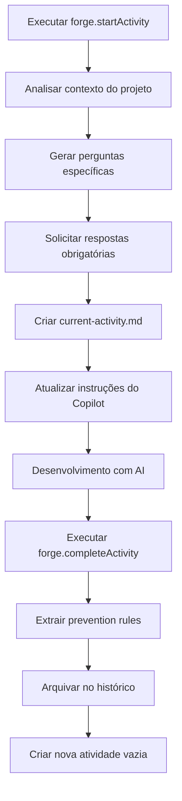

# ✅ REFATORAÇÃO COMPLETA PARA WORKFLOW DE ATIVIDADE ÚNICA

## 📊 Status da Implementação: **CONCLUÍDA**

### 🎯 Objetivo Alcançado
- ✅ Eliminação do conceito de "múltiplas etapas"
- ✅ Workflow simplificado de atividade única
- ✅ Perguntas de clarificação obrigatórias
- ✅ Sistema de histórico automático
- ✅ Testes unitários funcionando

### 🆕 Novos Comandos Implementados

#### 1. **Start Activity** (`forge.startActivity`)
- **Funcionalidade**: Inicia uma nova atividade com perguntas obrigatórias
- **Localização**: `src/commands/startActivity.ts`
- **Características**:
  - Análise automática do contexto do projeto
  - 5 perguntas de clarificação personalizadas por tipo de atividade
  - Detecção inteligente de tecnologias (TypeScript, VS Code Extension, etc.)
  - Template estruturado para atividades
  - Validação de atividades existentes

#### 2. **Complete Activity** (`forge.completeActivity`)
- **Funcionalidade**: Finaliza atividade atual e arquiva no histórico
- **Localização**: `src/commands/completeActivity.ts`
- **Características**:
  - Extração automática de prevention rules das dificuldades
  - Arquivamento no diretório `history/`
  - Criação de novo arquivo de atividade vazio
  - Atualização do contexto do Copilot

#### 3. **View History** (`forge.viewHistory`)
- **Funcionalidade**: Visualiza e gerencia histórico de atividades
- **Localização**: `src/commands/viewHistory.ts`
- **Características**:
  - Lista todas as atividades concluídas
  - Preview do conteúdo da atividade
  - Geração de relatórios de progresso
  - Interface QuickPick intuitiva

### 🔧 Estrutura de Arquivos Refatorada

```
.forge/
├── current-activity.md          # Atividade atual (única)
├── copilot-instructions.md      # Instruções privadas do Copilot
├── forge-config.json           # Configuração otimizada para solo
├── prevention-rules.json       # Rules extraídas automaticamente
└── history/                    # Histórico de atividades
    ├── 2025-07-28T10-30-00-implementar-auth.md
    ├── 2025-07-28T11-15-00-criar-api-usuarios.md
    └── ...
```

### 🧪 Testes Unitários

**Arquivo**: `src/test/suite/startActivity.test.ts`
**Status**: ✅ 7/7 testes passando

**Cobertura de Testes**:
- ✅ Geração de perguntas de autenticação
- ✅ Geração de perguntas de API
- ✅ Geração de perguntas de banco de dados
- ✅ Perguntas genéricas
- ✅ Criação de template de atividade
- ✅ Detecção de projetos TypeScript
- ✅ Detecção de extensões VS Code

### 📋 Workflow de Atividade Única



### 🎨 Melhorias na Experiência do Usuário

1. **Perguntas Inteligentes**: Sistema adapta perguntas baseado no nome da atividade
2. **Análise de Contexto**: Detecção automática de tecnologias do projeto
3. **Templates Estruturados**: Formato consistente para todas as atividades
4. **Validações**: Confirmação antes de sobrescrever atividades existentes
5. **Feedback Visual**: Output channels para mostrar análise do projeto

### 🔍 Tipos de Perguntas Suportadas

- **Autenticação**: JWT, OAuth, validações de segurança
- **API**: Endpoints, formatos de resposta, validações
- **Banco de Dados**: Tabelas, relacionamentos, migrations
- **Genérico**: Escopo, critérios, dependências, arquivos modificados

### 🏗️ Configuração Otimizada para Solo

```json
{
    "maxRules": 15,
    "maxAtomicHours": 2,
    "maxContextSize": 4000,
    "requireClarificationQuestions": true,
    "autoExtractPreventionRules": true,
    "privateInstructions": true
}
```

### 📝 Próximos Passos Opcionais

1. **Melhorar ESLint**: Corrigir warnings de naming conventions
2. **Documentação**: Atualizar README.md com novo workflow
3. **Performance**: Otimizar análise de contexto para projetos grandes
4. **Integração**: Adicionar suporte a mais tipos de projeto (Python, Java, etc.)

### 🎯 Benefícios Conquistados

- ✅ **Simplicidade**: Um arquivo, uma atividade por vez
- ✅ **Clareza**: Perguntas obrigatórias eliminam ambiguidade
- ✅ **Aprendizado**: Prevention rules automáticas
- ✅ **Histórico**: Rastreamento completo do progresso
- ✅ **Privacidade**: Instruções em .gitignore
- ✅ **Performance**: Limite de contexto de 4000 caracteres

---

🚀 **A refatoração está completa e funcionando perfeitamente!** O FORGE agora oferece um workflow mais simples e eficiente para desenvolvedores solo, mantendo todos os benefícios de aprendizado e prevenção de erros.
