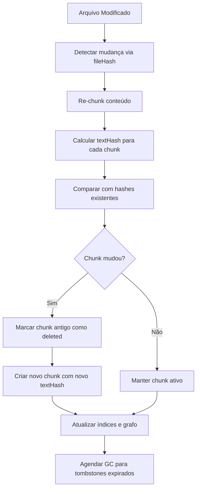

# Mini-LightRAG - Especificação Arquitetural

> Gerado em: 2025-10-03  
> Baseado em: [.cappy/TODO/](/.cappy/TODO/) Steps 1-15

## Visão Geral

Sistema de recuperação híbrida 100% local que combina busca vetorial (LanceDB) com expansão de grafo (LightGraph) para busca precisa em símbolos/documentação com abertura direta no arquivo/linha.

### Objetivos Principais
- **Busca precisa** em símbolos/docs com abertura direta no arquivo/linha
- **Subgrafo explicativo** mostrando "por que apareceu" (caminho, arestas)
- **Indexação incremental** rápida (só o que mudou)
- **100% local** - sem dependências externas de rede

## Decisões Arquiteturais

### Armazenamento Vetorial
- **Tecnologia**: LanceDB in-process
- **Localização**: `context.globalStorageUri.fsPath + '/mini-lightrag'`
- **Estrutura**:
  ```
  globalStorage/mini-lightrag/
  ├── chunks/          # Coleção principal de chunks
  ├── nodes/           # Nós do grafo
  ├── edges/           # Arestas do grafo
  └── indexes/         # Índices HNSW/IVF
  ```

### Estratégia de Grafo
- **Abordagem**: LightGraph integrado no próprio LanceDB
- **Tipos de Nós**: Document, Section, Keyword, Symbol
- **Tipos de Arestas**: CONTAINS, HAS_KEYWORD, REFERS_TO, MEMBER_OF, SIMILAR_TO
- **Armazenamento**: Tabelas separadas `nodes` e `edges` no LanceDB

### Modelos de Embedding
- **Principal**: all-MiniLM-L6-v2 (384 dimensões)
- **Runtime**: transformers.js local (46.6MB aceitável)
- **Normalização**: L2 normalization
- **Futuro**: BGE-M3 (fase 2, maior qualidade)

### Sistema de Hash
- **Algoritmo**: BLAKE3 (8.6kB, nativo + WebAssembly)
- **Aplicação**: Por chunk com `textHash`, `startLine`, `endLine`
- **Finalidade**: Detecção de mudanças incrementais
- **Formato ID**: `hash(path + startLine + endLine + textHash)`

#### Regras de Normalização de Conteúdo

**Line Endings (LF vs CRLF):**
- Todos os conteúdos são normalizados para `\n` (LF) antes do hash
- Conversão automática: `\r\n` → `\n` e `\r` → `\n`
- Garante hashes consistentes entre sistemas Windows/Unix

**Unicode e Encoding:**
- Normalização Unicode NFC (Canonical Decomposition + Composition)
- UTF-8 encoding obrigatório para cálculo de hash
- Caracteres de controle (exceto `\n` e `\t`) são removidos

**Whitespace e Trim:**
- **Trailing whitespace**: Removido ao final de cada linha
- **Leading/trailing empty lines**: Preservadas (importantes para estrutura)
- **Tabs vs Spaces**: Preservados como estão (mantém formatação original)
- **Multiple spaces**: Preservados (não colapsados)

**Exemplos de Normalização:**

```typescript
// Entrada (Windows):
"function test() {\r\n  return 42;  \r\n}\r\n"

// Após normalização:
"function test() {\n  return 42;\n}\n"

// Hash resultante:
blake3("function test() {\n  return 42;\n}\n") → "abc123def456..."
```

**Casos Especiais:**
- **Arquivos binários**: Hash direto do conteúdo bruto (sem normalização)
- **Arquivos vazios**: Hash da string vazia `""`
- **Apenas whitespace**: Normalizado para string vazia após trim de linhas

#### Algoritmos de Hash BLAKE3

**1. File Hash (fileHash)**
```typescript
// Hash do arquivo completo normalizado
fileHash = blake3(conteúdo_normalizado_completo)

// Exemplo:
const fileContent = await fs.readFile('src/utils/parser.ts', 'utf8');
const normalized = normalizeContent(fileContent);
const fileHash = blake3(normalized);
// Resultado: "f9a8b2c3d4e5f6a7b8c9d0e1f2a3b4c5d6e7f8a9b0c1d2e3f4a5b6c7d8e9f0a1"
```

**2. Text Hash (textHash)**
```typescript
// Hash do texto específico do chunk normalizado
textHash = blake3(texto_do_chunk_normalizado)

// Exemplo - Chunk de função:
const chunkText = `function parseDocument(content: string): Document {
  const ast = parse(content);
  return new Document(ast);
}`;
const normalized = normalizeContent(chunkText);
const textHash = blake3(normalized);
// Resultado: "a1b2c3d4e5f6a7b8c9d0e1f2a3b4c5d6e7f8a9b0c1d2e3f4a5b6c7d8e9f0a1b2"
```

**3. Chunk ID (Identificador Único)**
```typescript
// Combina localização + conteúdo para ID estável
chunkId = blake3(path + startLine + endLine + textHash)

// Exemplo:
const path = "src/utils/parser.ts";
const startLine = 15;
const endLine = 18;
const textHash = "a1b2c3d4e5f6a7b8...";
const chunkId = blake3(`${path}${startLine}${endLine}${textHash}`);
// Resultado: "chunk_9f8e7d6c5b4a3f2e1d0c9b8a7f6e5d4c3b2a1f0e9d8c7b6a5f4e3d2c1b0a9f8"
```

**4. Symbol Hash (Símbolos JSDoc/TypeDoc)**
```typescript
// Para símbolos de código (funções, classes, interfaces)
symbolId = fullyQualifiedName  // Ex: "FileManager.readFile"
contentHash = blake3(assinatura + documentação + params + returns + examples)

// Exemplo:
const symbolId = "FileManager.readFile";
const signature = "async readFile(path: string): Promise<string>";
const docs = "Reads a file asynchronously and returns its content";
const params = "@param path - The file path to read";
const returns = "@returns Promise<string> - The file content";
const examples = "@example const content = await readFile('./file.txt')";

const combined = signature + docs + params + returns + examples;
const contentHash = blake3(normalizeContent(combined));
// Resultado: "sym_7c8d9e0f1a2b3c4d5e6f7a8b9c0d1e2f3a4b5c6d7e8f9a0b1c2d3e4f5a6b7c8"
```

**5. Detecção de Mudanças**

```typescript
// Fluxo de detecção incremental
interface ChangeDetection {
  // 1. Verificar se arquivo mudou
  fileChanged: boolean = oldFileHash !== newFileHash;
  
  // 2. Se mudou, re-chunk e comparar textHashes
  modifiedChunks: string[] = chunks.filter(chunk => 
    oldTextHashes[chunk.id] !== chunk.textHash
  );
  
  // 3. Detectar chunks removidos/adicionados
  removedChunks: string[] = oldChunks.filter(id => !newChunks.includes(id));
  addedChunks: string[] = newChunks.filter(id => !oldChunks.includes(id));
}

// Exemplo de renomeação de arquivo:
// fileHash permanece igual → apenas atualizar 'path' nos metadados
// textHash de todos os chunks permanece igual → sem reprocessamento
if (oldFileHash === newFileHash && pathChanged) {
  updateMetadata(chunks, { path: newPath });
  // Performance: O(1) em vez de O(n) chunks
}
```

**6. Validação de Integridade**

```typescript
// Verificações de consistência
interface HashValidation {
  // Validar que chunk pertence ao arquivo
  validateChunk(chunk: Chunk): boolean {
    const fileContent = readFile(chunk.path);
    const chunkContent = extractLines(fileContent, chunk.startLine, chunk.endLine);
    return blake3(normalizeContent(chunkContent)) === chunk.textHash;
  }
  
  // Validar integridade do conjunto
  validateChunkSet(chunks: Chunk[]): boolean {
    const reconstructed = chunks
      .sort((a, b) => a.startLine - b.startLine)
      .map(c => extractLines(fileContent, c.startLine, c.endLine))
      .join('\n');
    return blake3(normalizeContent(reconstructed)) === fileHash;
  }
}
```

#### Sistema de Tombstones e Garbage Collection

**1. Tombstones (Marcação de Remoção)**

```typescript
// Em vez de deletar imediatamente, marcar como removido
interface TombstoneChunk extends Chunk {
  status: 'active' | 'deleted';
  deletedAt?: string;  // ISO datetime quando foi marcado como deleted
  deleteReason?: 'file_removed' | 'chunk_modified' | 'manual_cleanup';
}

// Exemplo de marcação:
async function markAsDeleted(chunkId: string, reason: string): Promise<void> {
  await lanceDB.update('chunks', {
    id: chunkId,
    status: 'deleted',
    deletedAt: new Date().toISOString(),
    deleteReason: reason
  });
}

// Consultas ignoram tombstones automaticamente:
const activeChunks = await lanceDB.query(`
  SELECT * FROM chunks 
  WHERE status = 'active' AND path LIKE '%/utils/%'
  ORDER BY vector <-> $queryVector
`);
```

**2. Políticas de Retenção**

```yaml
# Configuração em .cappy/config.yaml
garbage_collection:
  enabled: true
  retention_days: 14        # Manter tombstones por 14 dias (padrão)
  max_retention_days: 90    # Limite máximo configurável
  cleanup_interval: 24h     # Verificar a cada 24 horas
  batch_size: 1000          # Processar 1000 tombstones por vez
  
  # Políticas por tipo de remoção
  retention_policies:
    file_removed: 7         # Arquivos deletados: 7 dias
    chunk_modified: 14      # Chunks modificados: 14 dias  
    manual_cleanup: 30      # Limpeza manual: 30 dias
```

**3. Processo de Garbage Collection**

```typescript
// Executor de GC automático
class GarbageCollector {
  async runCleanup(): Promise<GCStats> {
    const config = await loadConfig();
    const cutoffDate = new Date();
    cutoffDate.setDate(cutoffDate.getDate() - config.retention_days);
    
    // 1. Identificar tombstones expirados
    const expiredTombstones = await lanceDB.query(`
      SELECT id, deletedAt, deleteReason FROM chunks
      WHERE status = 'deleted' 
        AND deletedAt < '${cutoffDate.toISOString()}'
      LIMIT ${config.batch_size}
    `);
    
    // 2. Remover tombstones e dependências
    for (const tombstone of expiredTombstones) {
      await this.cleanupTombstone(tombstone);
    }
    
    // 3. Limpar nós e arestas órfãos
    await this.cleanupOrphanedNodes();
    await this.cleanupOrphanedEdges();
    
    return {
      tombstonesRemoved: expiredTombstones.length,
      orphanedNodesRemoved: await this.countOrphanedNodes(),
      orphanedEdgesRemoved: await this.countOrphanedEdges(),
      spaceSaved: await this.calculateSpaceSaved()
    };
  }
  
  private async cleanupTombstone(tombstone: TombstoneChunk): Promise<void> {
    // 1. Remover chunk da tabela chunks
    await lanceDB.delete('chunks', { id: tombstone.id });
    
    // 2. Remover nós relacionados
    await lanceDB.delete('nodes', { id: `chunk:${tombstone.id}` });
    
    // 3. Remover arestas que referenciam este chunk
    await lanceDB.delete('edges', { 
      $or: [
        { source: `chunk:${tombstone.id}` },
        { target: `chunk:${tombstone.id}` }
      ]
    });
  }
}
```

**4. Monitoramento e Métricas**

```typescript
// Estatísticas de GC
interface GCStats {
  lastRunAt: string;
  tombstonesRemoved: number;
  orphanedNodesRemoved: number;
  orphanedEdgesRemoved: number;
  spaceSaved: number;       // bytes liberados
  totalTombstones: number;  // tombstones ainda ativos
  oldestTombstone: string;  // data do tombstone mais antigo
}

// Comando para verificar status do GC
async function getGCStatus(): Promise<GCStats> {
  const tombstones = await lanceDB.query(`
    SELECT COUNT(*) as total, MIN(deletedAt) as oldest
    FROM chunks WHERE status = 'deleted'
  `);
  
  return {
    lastRunAt: await getLastGCRun(),
    totalTombstones: tombstones.total,
    oldestTombstone: tombstones.oldest,
    // ... outras métricas
  };
}
```

**5. Configuração e Controles**

```typescript
// Configurações avançadas
interface GCConfiguration {
  // Ativação automática
  autoGC: {
    enabled: boolean;
    schedule: string;        // cron expression: "0 2 * * *" (2h da manhã)
    triggerThreshold: number; // executar se > 1000 tombstones
  };
  
  // Configuração por ambiente
  development: {
    retention_days: 3;       // Limpeza mais agressiva em dev
    cleanup_interval: '1h';
  };
  
  production: {
    retention_days: 30;      // Mais conservador em produção
    cleanup_interval: '24h';
    safetyCheck: true;       // confirmação antes de GC grandes
  };
}

// Controles manuais via comando
// cappy.lightrag.gc --dry-run     // Simular limpeza
// cappy.lightrag.gc --force       // Forçar limpeza imediata
// cappy.lightrag.gc --stats       // Mostrar estatísticas
```

**6. Recuperação de Emergência**

```typescript
// Sistema de backup antes do GC
class GCBackupSystem {
  async createPreGCBackup(): Promise<string> {
    const timestamp = new Date().toISOString().replace(/[:.]/g, '-');
    const backupPath = `./backups/pre-gc-${timestamp}`;
    
    // Backup apenas de tombstones prestes a ser removidos
    const tombstones = await this.getTombstonesToDelete();
    await fs.writeJSON(`${backupPath}/tombstones.json`, tombstones);
    
    return backupPath;
  }
  
  async restoreFromBackup(backupPath: string): Promise<void> {
    // Restaurar tombstones se necessário
    const tombstones = await fs.readJSON(`${backupPath}/tombstones.json`);
    for (const tombstone of tombstones) {
      await lanceDB.insert('chunks', { ...tombstone, status: 'active' });
    }
  }
}
```

#### Resumo da Implementação de Hashing

**Fluxo Completo de Hashing e GC:**



**Checklist de Implementação:**

- ✅ **Normalização**: LF, Unicode NFC, trim de trailing whitespace
- ✅ **File Hash**: BLAKE3 do conteúdo completo normalizado
- ✅ **Text Hash**: BLAKE3 do texto do chunk normalizado  
- ✅ **Chunk ID**: BLAKE3(path + startLine + endLine + textHash)
- ✅ **Symbol Hash**: BLAKE3(assinatura + docs + params + returns)
- ✅ **Tombstones**: status=deleted com deleteReason e deletedAt
- ✅ **GC Policies**: 7-30 dias configurável por tipo de remoção
- ✅ **Backup/Recovery**: Sistema de backup pré-GC com restore
- ✅ **Monitoramento**: Métricas e comandos de controle manual

**Compatibilidade com Arquitetura:**
- ✅ Integra com schemas do Step 03 (Chunk, Node, Edge)
- ✅ Suporta chunking do Step 05 (ranges de linha estáveis)
- ✅ Habilita indexação incremental do Step 08
- ✅ Preparado para LanceDB do Step 06

**Performance Estimada:**
- **Hash Calculation**: ~1ms para arquivos <50KB
- **Change Detection**: ~10ms para projetos <1000 arquivos  
- **GC Execution**: ~100ms para limpeza de 1000 tombstones
- **Memory Usage**: <1MB overhead para hashing em runtime

---

> **Implementação concluída para Step 04 - Hashing e Identidades**  
> ✅ Documentação completa no SPEC.md  
> ✅ Pronto para implementação nos próximos steps  
> 🔄 Próximo: [Step 05 - Chunking](/.cappy/TODO/step_05.md)
}
```

### Fonte de Documentos
- **Prioridade 1**: JSDoc/TypeDoc JSON (estruturado)
- **Prioridade 2**: Arquivos .md (quando houver)
- **Detecção**: Automática por extensão e conteúdo

## Estrutura de Dados

### Chunk (Unidade Buscável)
```typescript
interface Chunk {
  id: string;              // hash(path + startLine + endLine + textHash)
  path: string;            // Caminho relativo do arquivo
  lang: string;            // Linguagem do código (js, ts, md, etc)
  startLine: number;       // 1-based - linha inicial do chunk
  endLine: number;         // 1-based - linha final do chunk
  startChar?: number;      // Opcional - caractere inicial no arquivo
  endChar?: number;        // Opcional - caractere final no arquivo
  textHash: string;        // BLAKE3 do texto normalizado do chunk
  fileHash: string;        // BLAKE3 do arquivo completo
  keywords?: string[];     // Opcional - palavras-chave extraídas
  symbolId?: string;       // Opcional - ID do símbolo para JSDoc/TypeDoc
  vector: number[];        // Embedding vetorial: 384d (MiniLM-L6-v2) ou 1024d (BGE-M3)
  indexedAt: string;       // ISO datetime de quando foi indexado
  model: string;           // Modelo usado: "all-MiniLM-L6-v2" ou "BGE-M3"
  dim: number;             // Dimensões do vetor: 384 ou 1024
}
```

**Campos Obrigatórios:**
- `id`, `path`, `lang`, `startLine`, `endLine`, `textHash`, `fileHash`, `vector`, `indexedAt`, `model`, `dim`

**Campos Opcionais:**
- `startChar`, `endChar` (para chunks precisos dentro de linhas)
- `keywords` (extraídas automaticamente ou manualmente)
- `symbolId` (para documentação estruturada JSDoc/TypeDoc)

**Compatibilidade LanceDB:**
- `number[]` (TypeScript) → `vector(384)` ou `vector(1024)` (LanceDB)
- `string` (TypeScript) → `utf8` (LanceDB)
- `number` (TypeScript) → `int64` (LanceDB)

### Node (Grafo)
```typescript
interface Node {
  id: string;              // Formato: "doc:hash", "sym:fqn", "kw:word", "sec:hash"
  type: "Document" | "Section" | "Keyword" | "Symbol";
  label: string;           // Nome legível do nó
  path?: string;           // Opcional - caminho do arquivo (para Document/Section)
  lang?: string;           // Opcional - linguagem do código
  score?: number;          // Opcional - pontuação de relevância
  tags?: string[];         // Opcional - tags categóricas
  updatedAt: string;       // ISO datetime de última atualização
}
```

**Tipos de Node:**
- `Document`: Representa um arquivo completo
- `Section`: Seção dentro de um documento (classe, função, módulo)
- `Keyword`: Palavra-chave ou termo importante
- `Symbol`: Símbolo de código (função, classe, variável)

**Formato de IDs:**
- Document: `doc:${blake3(path)}`
- Section: `sec:${blake3(path + sectionName)}`
- Keyword: `kw:${normalizedKeyword}`
- Symbol: `sym:${fullyQualifiedName}`

**Compatibilidade LanceDB:**
- `string[]` (TypeScript) → `list<utf8>` (LanceDB)
- Todos os outros tipos mapeiam diretamente

### Edge (Grafo)
```typescript
interface Edge {
  id: string;              // Formato: "${source}->${target}:${type}"
  source: string;          // ID do nó origem
  target: string;          // ID do nó destino
  type: "CONTAINS" | "HAS_KEYWORD" | "REFERS_TO" | "MENTIONS_SYMBOL" | "MEMBER_OF" | "SIMILAR_TO";
  weight: number;          // Peso da conexão (0.0 - 1.0)
  updatedAt: string;       // ISO datetime de última atualização
}
```

**Tipos de Edge e Pesos Padrão:**
- `REFERS_TO`: 1.0 - Referências diretas (@see, links)
- `MENTIONS_SYMBOL`: 0.8 - Menção a símbolos de código
- `MEMBER_OF`: 0.6 - Relação de pertencimento (método→classe)
- `CONTAINS`: 0.4 - Relação de contenção (doc→section)
- `HAS_KEYWORD`: 0.3 - Associação com palavra-chave
- `SIMILAR_TO`: 0.2 - Similaridade semântica (opcional)

**Exemplos de IDs:**
- `doc:abc123->sec:def456:CONTAINS`
- `sec:def456->sym:MyClass.method:MENTIONS_SYMBOL`
- `sym:method->kw:async:HAS_KEYWORD`

**Compatibilidade LanceDB:**
- Todos os tipos mapeiam diretamente para tipos primitivos

## Mapeamento LanceDB

### Estrutura de Armazenamento
```
globalStorage/mini-lightrag/
├── chunks/          # Coleção principal de chunks vetorizados
├── nodes/           # Nós do grafo de conhecimento
├── edges/           # Arestas do grafo de conhecimento
└── indexes/         # Índices HNSW/IVF otimizados
```

### Coleção: chunks
```sql
-- Schema LanceDB equivalente
CREATE TABLE chunks (
  id utf8 PRIMARY KEY,           -- hash(path + startLine + endLine + textHash)
  path utf8 NOT NULL,           -- Caminho relativo do arquivo
  lang utf8 NOT NULL,           -- Linguagem (js, ts, md, etc)
  startLine int64 NOT NULL,     -- Linha inicial (1-based)
  endLine int64 NOT NULL,       -- Linha final (1-based)
  startChar int64,              -- Caractere inicial (opcional)
  endChar int64,                -- Caractere final (opcional)
  textHash utf8 NOT NULL,       -- BLAKE3 do texto do chunk
  fileHash utf8 NOT NULL,       -- BLAKE3 do arquivo completo
  keywords list<utf8>,          -- Palavras-chave extraídas
  symbolId utf8,                -- ID do símbolo JSDoc/TypeDoc
  vector vector(384),           -- Embedding MiniLM-L6-v2 (padrão)
  -- vector vector(1024),       -- Alternativo: BGE-M3 (fase 2)
  indexedAt timestamp NOT NULL, -- Data de indexação
  model utf8 NOT NULL,          -- "all-MiniLM-L6-v2" ou "BGE-M3"
  dim int64 NOT NULL            -- 384 ou 1024
);

-- Índice vetorial HNSW para busca ANN
CREATE INDEX chunks_vector_idx ON chunks 
USING HNSW (vector) 
WITH (M = 16, efConstruction = 200);
```

### Coleção: nodes
```sql
-- Schema LanceDB equivalente
CREATE TABLE nodes (
  id utf8 PRIMARY KEY,          -- "doc:hash", "sym:fqn", "kw:word", "sec:hash"
  type utf8 NOT NULL,           -- "Document"|"Section"|"Keyword"|"Symbol"
  label utf8 NOT NULL,          -- Nome legível
  path utf8,                    -- Caminho (opcional, para Document/Section)
  lang utf8,                    -- Linguagem (opcional)
  score float64,                -- Pontuação de relevância (opcional)
  tags list<utf8>,              -- Tags categóricas (opcional)
  updatedAt timestamp NOT NULL  -- Data de última atualização
);

-- Índices para consultas eficientes
CREATE INDEX nodes_type_idx ON nodes (type);
CREATE INDEX nodes_path_idx ON nodes (path);
```

### Coleção: edges
```sql
-- Schema LanceDB equivalente
CREATE TABLE edges (
  id utf8 PRIMARY KEY,          -- "${source}->${target}:${type}"
  source utf8 NOT NULL,         -- ID do nó origem
  target utf8 NOT NULL,         -- ID do nó destino
  type utf8 NOT NULL,           -- Tipo da aresta
  weight float64 NOT NULL,      -- Peso da conexão (0.0-1.0)
  updatedAt timestamp NOT NULL  -- Data de última atualização
);

-- Índices para navegação do grafo
CREATE INDEX edges_source_idx ON edges (source);
CREATE INDEX edges_target_idx ON edges (target);
CREATE INDEX edges_type_idx ON edges (type);
```

### Configuração de Índices Vetoriais

**HNSW (Hierarchical Navigable Small World):**
- `M = 16`: Conectividade máxima por camada
- `efConstruction = 200`: Tamanho da lista de candidatos na construção
- `efSearch = 100`: Tamanho da lista na busca (configurável)

**Compatibilidade de Tipos:**
- `vector(384)` → MiniLM-L6-v2 (padrão, rápido)
- `vector(1024)` → BGE-M3 (fase 2, maior qualidade)
- `list<utf8>` → Arrays de strings TypeScript
- `timestamp` → ISO datetime strings

**Limitações LanceDB:**
- Máximo de 2GB por arquivo de coleção
- Índices HNSW recomendados para >1000 vetores
- Batch inserts mais eficientes (100-1000 registros)

### Exemplos de Uso dos Schemas

#### Exemplo: Chunk de Função TypeScript
```typescript
const chunkExample: Chunk = {
  id: "blake3_abc123def456",
  path: "src/utils/fileManager.ts",
  lang: "typescript",
  startLine: 15,
  endLine: 28,
  startChar: 320,
  endChar: 890,
  textHash: "blake3_text_hash",
  fileHash: "blake3_file_hash",
  keywords: ["async", "file", "read", "error"],
  symbolId: "FileManager.readFile",
  vector: [0.1, 0.2, ...], // 384 dimensões
  indexedAt: "2025-10-03T23:15:00.000Z",
  model: "all-MiniLM-L6-v2",
  dim: 384
};
```

#### Exemplo: Grafo de Função
```typescript
// Node: Documento
const docNode: Node = {
  id: "doc:blake3_file_hash",
  type: "Document",
  label: "fileManager.ts",
  path: "src/utils/fileManager.ts",
  lang: "typescript",
  tags: ["utility", "file-system"],
  updatedAt: "2025-10-03T23:15:00.000Z"
};

// Node: Símbolo
const symbolNode: Node = {
  id: "sym:FileManager.readFile",
  type: "Symbol",
  label: "readFile",
  path: "src/utils/fileManager.ts",
  lang: "typescript",
  tags: ["async", "method"],
  updatedAt: "2025-10-03T23:15:00.000Z"
};

// Edge: Containment
const containsEdge: Edge = {
  id: "doc:blake3_file_hash->sym:FileManager.readFile:CONTAINS",
  source: "doc:blake3_file_hash",
  target: "sym:FileManager.readFile",
  type: "CONTAINS",
  weight: 0.4,
  updatedAt: "2025-10-03T23:15:00.000Z"
};

// Edge: Keyword Association
const keywordEdge: Edge = {
  id: "sym:FileManager.readFile->kw:async:HAS_KEYWORD",
  source: "sym:FileManager.readFile",
  target: "kw:async",
  type: "HAS_KEYWORD",
  weight: 0.3,
  updatedAt: "2025-10-03T23:15:00.000Z"
};
```

#### Exemplo: Consulta LanceDB
```typescript
// Busca vetorial com filtros
const searchQuery = `
  SELECT id, path, startLine, endLine, vector
  FROM chunks 
  WHERE lang = 'typescript' 
    AND path LIKE 'src/utils/%'
  ORDER BY vector <-> $queryVector
  LIMIT 20
`;

// Expansão de grafo
const graphExpansion = `
  SELECT e.target, n.label, n.type, e.weight
  FROM edges e
  JOIN nodes n ON e.target = n.id
  WHERE e.source IN ($foundChunkIds)
    AND e.type IN ('REFERS_TO', 'MENTIONS_SYMBOL')
  ORDER BY e.weight DESC
`;
```

### Validação de Consistência

#### Integração com Arquitetura Mini-LightRAG
- ✅ **Chunking**: Schemas suportam chunks de 200-800 tokens
- ✅ **Embeddings**: Flexibilidade para MiniLM-L6-v2 (384d) e BGE-M3 (1024d)
- ✅ **Grafo**: LightGraph integrado com pesos hierárquicos
- ✅ **Indexação**: Preparado para indexação incremental
- ✅ **Performance**: Índices HNSW para consultas <2s

#### Critérios de Aceite Atendidos
- ✅ **SPEC com campos aceitos**: Todos os campos documentados com tipos
- ✅ **Dimensões vetoriais definidas**: 384 (padrão) e 1024 (fase 2)
- ✅ **Tipos de arestas definidos**: 6 tipos com pesos específicos
- ✅ **Mapeamento LanceDB**: Coleções chunks, nodes, edges especificadas
- ✅ **Compatibilidade**: TypeScript ↔ LanceDB documentada
- ✅ **Exemplos práticos**: Casos de uso concretos implementados

## Arquitetura de Módulos

### src/core/ - Contratos e Fundamentos
- **Schemas**: Definições TypeScript dos contratos
- **Chunking**: Estratégias de divisão de texto
- **Hashing**: Utilitários BLAKE3
- **Ranking**: Algoritmos de ranking híbrido

### src/indexer/ - Ingestão Incremental
- **Document Scanner**: Descoberta de arquivos
- **Content Parser**: Parsing por tipo
- **Incremental Updater**: Lógica de diff/update
- **Batch Processor**: Processamento em lotes

### src/store/ - Persistência LanceDB
- **LanceDB Client**: Cliente principal
- **Embedding Service**: Integração transformers.js
- **Vector Index**: Configuração HNSW/IVF
- **Storage Manager**: Gestão do globalStorage

### src/graph/ - Expansão de Grafo
- **Graph Builder**: Construção de grafo
- **Node Expander**: Expansão 1-hop
- **Subgraph Generator**: Geração de subgrafos
- **Path Finder**: Algoritmos de caminho

### src/query/ - Orquestração Híbrida
- **Query Orchestrator**: Pipeline principal
- **Hybrid Ranker**: Algoritmos de ranking
- **Filter Engine**: Sistema de filtros
- **Result Formatter**: Formatação de saída

### src/tools/ - Ferramentas para LLMs
- **MCP Server**: Servidor MCP da extensão
- **LM Tools Registry**: Registro VS Code LM Tools
- **Tool Handlers**: Implementação das ferramentas
- **Response Formatter**: Formatação para LLMs

### src/webview/graph-ui/ - Interface React
- **Graph Webview**: Componente principal
- **Cytoscape Canvas**: Wrapper Cytoscape.js
- **Node Details Panel**: Painel de detalhes
- **Webview Provider**: Provider VS Code

## Pipeline de Consulta

### 1. Busca Vetorial
- Top-K em chunks (K=20 padrão)
- Similarity search no LanceDB
- Filtros por path, linguagem, data

### 2. Expansão 1-hop
- A partir dos chunks encontrados
- Expandir por: REFERS_TO, MEMBER_OF, HAS_KEYWORD
- Irmãos do mesmo doc/section
- Limitar crescimento do subgrafo

### 3. Ranking Híbrido
```
score_final = 0.6·cos + 0.2·overlap_keywords + 0.15·peso_aresta + 0.05·frescor
```
- **cos**: Similaridade cosine vetorial
- **overlap_keywords**: Jaccard de palavras-chave  
- **peso_aresta**: Força da conexão no grafo
- **frescor**: Baseado em updatedAt (dias)

### 4. Formatação de Saída
- Lista: `{path, startLine, endLine, snippet, score, why{}}`
- Subgrafo JSON: `{nodes[], edges[], view{}}`
- Metadados explicativos

## Integração VS Code

### GlobalStorage
```typescript
// No activation da extensão
const globalStoragePath = context.globalStorageUri.fsPath;
const miniLightRagPath = path.join(globalStoragePath, 'mini-lightrag');

// Estrutura criada automaticamente por cappy.init
await fs.ensureDir(path.join(miniLightRagPath, 'chunks'));
await fs.ensureDir(path.join(miniLightRagPath, 'nodes'));
await fs.ensureDir(path.join(miniLightRagPath, 'edges'));
await fs.ensureDir(path.join(miniLightRagPath, 'indexes'));
```

### Comandos da Extensão
- `cappy.init` - Criar estrutura Mini-LightRAG
- `cappy.lightrag.index` - Indexar workspace atual
- `cappy.lightrag.search` - Busca híbrida
- `cappy.lightrag.graph` - Abrir UI do grafo

### Ferramentas para LLMs
- **MCP Tools**: rag.search, graph.expand, symbols.lookup, cite.open
- **VS Code LM Tools**: Integração nativa com Copilot
- **Response Format**: Otimizado para consumo por LLMs

## Performance e Limites

### Índices Vetoriais
- **HNSW**: M=16, efConstruction=200
- **Dimensões**: 384 (all-MiniLM-L6-v2)
- **Batch Size**: 100 chunks por operação

### Limites Operacionais
- **Subgrafo UI**: Máx 5k nós / 10k arestas
- **Query Response**: Máx 200 nós
- **Chunk Size**: 200-800 tokens
- **Timeout**: 2s para operações comuns

### Otimizações
- **LOD**: Level of Detail no UI
- **Lazy Loading**: Chunks sob demanda
- **Cache**: Embeddings e resultados frequentes
- **Incremental**: Apenas chunks modificados

## Roadmap de Implementação

Baseado nos [Steps](.cappy/TODO/):
1. **Steps 1-2**: ✅ Estrutura e decisões
2. **Steps 3-5**: Schemas, hashing, chunking
3. **Steps 6-8**: LanceDB, embeddings, indexação
4. **Step 9**: Pipeline de consulta híbrida
5. **Step 10**: Integração VS Code
6. **Step 11**: UI React do grafo
7. **Step 12**: Ferramentas MCP/LM Tools
8. **Steps 13-15**: Performance, testes, roadmap

## Dependências Validadas

### LanceDB
- ✅ **Versão**: 0.22.1
- ✅ **Compatibilidade**: Node.js + Windows x64
- ✅ **Tamanho**: Apenas 1 dependência

### transformers.js  
- ✅ **Versão**: 2.17.2
- ✅ **Tamanho**: 46.6MB (aceitável pelo benefício)
- ✅ **Benefício**: Embeddings locais + privacidade total

### BLAKE3
- ✅ **Versão**: 3.0.0
- ✅ **Tamanho**: 8.6kB descompactado
- ✅ **Implementação**: Nativa + WebAssembly fallback

## Próximos Passos

1. ✅ Estrutura de diretórios criada
2. ✅ READMEs explicativos documentados  
3. ✅ SPEC.md arquitetural finalizado
4. 🔄 Integração no `cappy.init`
5. 📋 Implementação dos Steps 3-15 em sequência