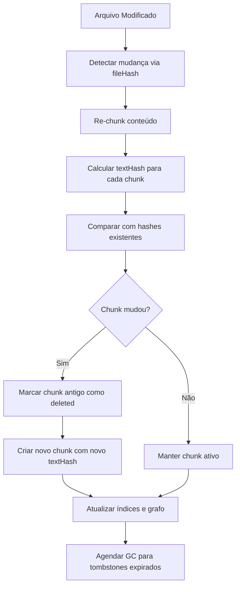

# Mini-LightRAG - Especificação Arquitetural

> Gerado em: 2025-10-03  
> Baseado em: [.cappy/TODO/](/.cappy/TODO/) Steps 1-15

## Visão Geral

Sistema RAG baseado em grafo 100% local que implementa a arquitetura LightRAG para recuperação de informação contextual. Combina extração de entidades/relacionamentos via LLM com dual-level retrieval (específico + abstrato) para respostas precisas e abrangentes.

### Objetivos Principais
- **Dual-Level Retrieval** para queries específicas (entidades) e abstratas (temas/conceitos)
- **Graph-Enhanced Indexing** com extração automática de entidades e relacionamentos via LLM
- **Inserção Manual Controlada** de documentos um por vez para máxima qualidade
- **Interface LightRAG-compatível** para visualização e exploração do grafo
- **100% local** - sem dependências externas de rede

## Decisões Arquiteturais

### Armazenamento LightRAG
- **Tecnologia**: LanceDB in-process (compatível com LightRAG)
- **Localização**: `context.globalStorageUri.fsPath + '/mini-lightrag'`
- **Estrutura**:
  ```
  globalStorage/mini-lightrag/
  ├── entities/        # Entidades extraídas via LLM
  ├── relationships/   # Relacionamentos extraídas via LLM
  ├── key_values/      # Key-value pairs para busca eficiente
  ├── documents/       # Texto original dos documentos
  └── indexes/         # Índices HNSW/IVF
  ```

### Estratégia LightRAG Graph-Enhanced
- **Abordagem**: Graph-based indexing como estrutura principal
- **Extração**: LLM identifica entidades e relacionamentos automaticamente
- **Profiling**: Key-value pairs gerados via LLM para busca eficiente
- **Deduplicação**: Merge automático de entidades/relacionamentos idênticos
- **Dual-Level**: Low-level (entidades específicas) + High-level (temas abstratos)

### Modelos LightRAG
- **LLM para Extração**: Configurável (Ollama local, OpenAI, etc.)
- **Embedding**: all-MiniLM-L6-v2 (384 dimensões) via transformers.js
- **Runtime**: 100% local - transformers.js (46.6MB aceitável)
- **Normalização**: L2 normalization
- **Upgrade Path**: BGE-M3 (1024d) para maior qualidade quando necessário

## Arquitetura LightRAG Detalhada

### 1. Graph-Enhanced Entity and Relationship Extraction

O sistema segue o paradigma LightRAG de indexação baseada em grafo:

#### Função R(·): Extração de Entidades e Relacionamentos
```typescript
interface ExtractionFunction {
  extractEntitiesAndRelationships(text: string): Promise<{
    entities: Entity[];
    relationships: Relationship[];
  }>;
}

interface Entity {
  id: string;              // Nome único da entidade
  name: string;            // Nome legível
  type: string;            // Tipo: "Person", "Organization", "Concept", etc.
  description: string;     // Descrição extraída do texto
  sourceChunks: string[];  // Chunks de onde foi extraída
}

interface Relationship {
  id: string;              // ID único do relacionamento
  source: string;          // ID da entidade origem
  target: string;          // ID da entidade destino
  type: string;            // Tipo: "WORKS_FOR", "PART_OF", "SIMILAR_TO", etc.
  description: string;     // Descrição do relacionamento
  weight: number;          // Força do relacionamento (0-1)
  sourceChunks: string[];  // Chunks de onde foi extraída
}
```

#### Função P(·): LLM Profiling para Key-Value Pairs
```typescript
interface ProfilingFunction {
  generateKeyValuePairs(entity: Entity | Relationship): Promise<KeyValuePair[]>;
}

interface KeyValuePair {
  key: string;             // Palavra-chave para busca eficiente
  value: string;           // Parágrafo resumindo informações relevantes
  type: 'entity' | 'relationship';
  sourceId: string;        // ID da entidade/relacionamento origem
  themes?: string[];       // Temas globais conectados (para relationships)
}
```

#### Função D(·): Deduplicação para Otimizar Operações
```typescript
interface DeduplicationFunction {
  mergeIdenticalEntities(entities: Entity[]): Promise<Entity[]>;
  mergeIdenticalRelationships(relationships: Relationship[]): Promise<Relationship[]>;
}

// Critérios de merge:
// - Entidades: mesmo nome normalizado + tipo similar
// - Relacionamentos: mesmo source + target + tipo similar
// - Algoritmo: similarity > 0.85 via embedding
```

### 2. Fast Adaptation to Incremental Knowledge Base

#### Integração Seamless de Novos Dados
```typescript
interface IncrementalUpdate {
  processNewDocument(document: Document): Promise<{
    newEntities: Entity[];
    newRelationships: Relationship[];
    mergedEntities: Entity[];
    mergedRelationships: Relationship[];
  }>;
}

// Estratégia:
// 1. Extrair entidades/relacionamentos do novo documento
// 2. Comparar com grafo existente via embeddings
// 3. Merge automático quando similarity > threshold
// 4. Preservar integridade do grafo existente
```

#### Redução de Overhead Computacional
- **Processamento**: Só novos documentos passam por extração LLM
- **Merge**: Algoritmo O(log n) via índices vetoriais
- **Preservação**: Grafo existente permanece intacto
- **Cache**: Key-value pairs reutilizadas quando possível

### 3. Dual-Level Retrieval Paradigm

#### Low-Level Retrieval (Queries Específicas)
```typescript
interface LowLevelRetrieval {
  // Para queries específicas como "Quem escreveu Pride and Prejudice?"
  retrieveSpecificEntities(query: string): Promise<{
    entities: Entity[];
    relationships: Relationship[];
    confidence: number;
  }>;
}

// Estratégia:
// - Identificar entidades mencionadas na query
// - Buscar nós específicos no grafo
// - Retornar atributos e relacionamentos diretos
```

#### High-Level Retrieval (Queries Abstratas)
```typescript
interface HighLevelRetrieval {
  // Para queries conceituais como "Como IA influencia educação moderna?"
  retrieveAbstractConcepts(query: string): Promise<{
    concepts: Entity[];
    relationships: Relationship[];
    themes: string[];
    confidence: number;
  }>;
}

// Estratégia:
// - Agregar informações de múltiples entidades relacionadas
// - Identificar temas e conceitos overarching
// - Subgrafos multi-hop para insights globais
```

### 4. Retrieval-Augmented Answer Generation

```typescript
interface AnswerGeneration {
  generateAnswer(query: string, context: RetrievalContext): Promise<{
    answer: string;
    sources: Source[];
    confidence: number;
    usedEntities: string[];
    usedRelationships: string[];
  }>;
}

interface RetrievalContext {
  lowLevelResults: LowLevelRetrievalResult;
  highLevelResults: HighLevelRetrievalResult;
  keyValuePairs: KeyValuePair[];
  originalText: string[];
}
```

### Sistema de Hash
- **Algoritmo**: BLAKE3 (8.6kB, nativo + WebAssembly)
- **Aplicação**: Por chunk com `textHash`, `startLine`, `endLine`
- **Finalidade**: Detecção de mudanças incrementais
- **Formato ID**: `hash(path + startLine + endLine + textHash)`

#### Regras de Normalização de Conteúdo

**Line Endings (LF vs CRLF):**
- Todos os conteúdos são normalizados para `\n` (LF) antes do hash
- Conversão automática: `\r\n` → `\n` e `\r` → `\n`
- Garante hashes consistentes entre sistemas Windows/Unix

**Unicode e Encoding:**
- Normalização Unicode NFC (Canonical Decomposition + Composition)
- UTF-8 encoding obrigatório para cálculo de hash
- Caracteres de controle (exceto `\n` e `\t`) são removidos

**Whitespace e Trim:**
- **Trailing whitespace**: Removido ao final de cada linha
- **Leading/trailing empty lines**: Preservadas (importantes para estrutura)
- **Tabs vs Spaces**: Preservados como estão (mantém formatação original)
- **Multiple spaces**: Preservados (não colapsados)

**Exemplos de Normalização:**

```typescript
// Entrada (Windows):
"function test() {\r\n  return 42;  \r\n}\r\n"

// Após normalização:
"function test() {\n  return 42;\n}\n"

// Hash resultante:
blake3("function test() {\n  return 42;\n}\n") → "abc123def456..."
```

**Casos Especiais:**
- **Arquivos binários**: Hash direto do conteúdo bruto (sem normalização)
- **Arquivos vazios**: Hash da string vazia `""`
- **Apenas whitespace**: Normalizado para string vazia após trim de linhas

#### Algoritmos de Hash BLAKE3

**1. File Hash (fileHash)**
```typescript
// Hash do arquivo completo normalizado
fileHash = blake3(conteúdo_normalizado_completo)

// Exemplo:
const fileContent = await fs.readFile('src/utils/parser.ts', 'utf8');
const normalized = normalizeContent(fileContent);
const fileHash = blake3(normalized);
// Resultado: "f9a8b2c3d4e5f6a7b8c9d0e1f2a3b4c5d6e7f8a9b0c1d2e3f4a5b6c7d8e9f0a1"
```

**2. Text Hash (textHash)**
```typescript
// Hash do texto específico do chunk normalizado
textHash = blake3(texto_do_chunk_normalizado)

// Exemplo - Chunk de função:
const chunkText = `function parseDocument(content: string): Document {
  const ast = parse(content);
  return new Document(ast);
}`;
const normalized = normalizeContent(chunkText);
const textHash = blake3(normalized);
// Resultado: "a1b2c3d4e5f6a7b8c9d0e1f2a3b4c5d6e7f8a9b0c1d2e3f4a5b6c7d8e9f0a1b2"
```

**3. Chunk ID (Identificador Único)**
```typescript
// Combina localização + conteúdo para ID estável
chunkId = blake3(path + startLine + endLine + textHash)

// Exemplo:
const path = "src/utils/parser.ts";
const startLine = 15;
const endLine = 18;
const textHash = "a1b2c3d4e5f6a7b8...";
const chunkId = blake3(`${path}${startLine}${endLine}${textHash}`);
// Resultado: "chunk_9f8e7d6c5b4a3f2e1d0c9b8a7f6e5d4c3b2a1f0e9d8c7b6a5f4e3d2c1b0a9f8"
```

**4. Symbol Hash (Símbolos JSDoc/TypeDoc)**
```typescript
// Para símbolos de código (funções, classes, interfaces)
symbolId = fullyQualifiedName  // Ex: "FileManager.readFile"
contentHash = blake3(assinatura + documentação + params + returns + examples)

// Exemplo:
const symbolId = "FileManager.readFile";
const signature = "async readFile(path: string): Promise<string>";
const docs = "Reads a file asynchronously and returns its content";
const params = "@param path - The file path to read";
const returns = "@returns Promise<string> - The file content";
const examples = "@example const content = await readFile('./file.txt')";

const combined = signature + docs + params + returns + examples;
const contentHash = blake3(normalizeContent(combined));
// Resultado: "sym_7c8d9e0f1a2b3c4d5e6f7a8b9c0d1e2f3a4b5c6d7e8f9a0b1c2d3e4f5a6b7c8"
```

**5. Detecção de Mudanças**

```typescript
// Fluxo de detecção incremental
interface ChangeDetection {
  // 1. Verificar se arquivo mudou
  fileChanged: boolean = oldFileHash !== newFileHash;
  
  // 2. Se mudou, re-chunk e comparar textHashes
  modifiedChunks: string[] = chunks.filter(chunk => 
    oldTextHashes[chunk.id] !== chunk.textHash
  );
  
  // 3. Detectar chunks removidos/adicionados
  removedChunks: string[] = oldChunks.filter(id => !newChunks.includes(id));
  addedChunks: string[] = newChunks.filter(id => !oldChunks.includes(id));
}

// Exemplo de renomeação de arquivo:
// fileHash permanece igual → apenas atualizar 'path' nos metadados
// textHash de todos os chunks permanece igual → sem reprocessamento
if (oldFileHash === newFileHash && pathChanged) {
  updateMetadata(chunks, { path: newPath });
  // Performance: O(1) em vez de O(n) chunks
}
```

**6. Validação de Integridade**

```typescript
// Verificações de consistência
interface HashValidation {
  // Validar que chunk pertence ao arquivo
  validateChunk(chunk: Chunk): boolean {
    const fileContent = readFile(chunk.path);
    const chunkContent = extractLines(fileContent, chunk.startLine, chunk.endLine);
    return blake3(normalizeContent(chunkContent)) === chunk.textHash;
  }
  
  // Validar integridade do conjunto
  validateChunkSet(chunks: Chunk[]): boolean {
    const reconstructed = chunks
      .sort((a, b) => a.startLine - b.startLine)
      .map(c => extractLines(fileContent, c.startLine, c.endLine))
      .join('\n');
    return blake3(normalizeContent(reconstructed)) === fileHash;
  }
}
```

#### Sistema de Tombstones e Garbage Collection

**1. Tombstones (Marcação de Remoção)**

```typescript
// Em vez de deletar imediatamente, marcar como removido
interface TombstoneChunk extends Chunk {
  status: 'active' | 'deleted';
  deletedAt?: string;  // ISO datetime quando foi marcado como deleted
  deleteReason?: 'file_removed' | 'chunk_modified' | 'manual_cleanup';
}

// Exemplo de marcação:
async function markAsDeleted(chunkId: string, reason: string): Promise<void> {
  await lanceDB.update('chunks', {
    id: chunkId,
    status: 'deleted',
    deletedAt: new Date().toISOString(),
    deleteReason: reason
  });
}

// Consultas ignoram tombstones automaticamente:
const activeChunks = await lanceDB.query(`
  SELECT * FROM chunks 
  WHERE status = 'active' AND path LIKE '%/utils/%'
  ORDER BY vector <-> $queryVector
`);
```

**2. Políticas de Retenção**

```yaml
# Configuração em .cappy/config.yaml
garbage_collection:
  enabled: true
  retention_days: 14        # Manter tombstones por 14 dias (padrão)
  max_retention_days: 90    # Limite máximo configurável
  cleanup_interval: 24h     # Verificar a cada 24 horas
  batch_size: 1000          # Processar 1000 tombstones por vez
  
  # Políticas por tipo de remoção
  retention_policies:
    file_removed: 7         # Arquivos deletados: 7 dias
    chunk_modified: 14      # Chunks modificados: 14 dias  
    manual_cleanup: 30      # Limpeza manual: 30 dias
```

**3. Processo de Garbage Collection**

```typescript
// Executor de GC automático
class GarbageCollector {
  async runCleanup(): Promise<GCStats> {
    const config = await loadConfig();
    const cutoffDate = new Date();
    cutoffDate.setDate(cutoffDate.getDate() - config.retention_days);
    
    // 1. Identificar tombstones expirados
    const expiredTombstones = await lanceDB.query(`
      SELECT id, deletedAt, deleteReason FROM chunks
      WHERE status = 'deleted' 
        AND deletedAt < '${cutoffDate.toISOString()}'
      LIMIT ${config.batch_size}
    `);
    
    // 2. Remover tombstones e dependências
    for (const tombstone of expiredTombstones) {
      await this.cleanupTombstone(tombstone);
    }
    
    // 3. Limpar nós e arestas órfãos
    await this.cleanupOrphanedNodes();
    await this.cleanupOrphanedEdges();
    
    return {
      tombstonesRemoved: expiredTombstones.length,
      orphanedNodesRemoved: await this.countOrphanedNodes(),
      orphanedEdgesRemoved: await this.countOrphanedEdges(),
      spaceSaved: await this.calculateSpaceSaved()
    };
  }
  
  private async cleanupTombstone(tombstone: TombstoneChunk): Promise<void> {
    // 1. Remover chunk da tabela chunks
    await lanceDB.delete('chunks', { id: tombstone.id });
    
    // 2. Remover nós relacionados
    await lanceDB.delete('nodes', { id: `chunk:${tombstone.id}` });
    
    // 3. Remover arestas que referenciam este chunk
    await lanceDB.delete('edges', { 
      $or: [
        { source: `chunk:${tombstone.id}` },
        { target: `chunk:${tombstone.id}` }
      ]
    });
  }
}
```

**4. Monitoramento e Métricas**

```typescript
// Estatísticas de GC
interface GCStats {
  lastRunAt: string;
  tombstonesRemoved: number;
  orphanedNodesRemoved: number;
  orphanedEdgesRemoved: number;
  spaceSaved: number;       // bytes liberados
  totalTombstones: number;  // tombstones ainda ativos
  oldestTombstone: string;  // data do tombstone mais antigo
}

// Comando para verificar status do GC
async function getGCStatus(): Promise<GCStats> {
  const tombstones = await lanceDB.query(`
    SELECT COUNT(*) as total, MIN(deletedAt) as oldest
    FROM chunks WHERE status = 'deleted'
  `);
  
  return {
    lastRunAt: await getLastGCRun(),
    totalTombstones: tombstones.total,
    oldestTombstone: tombstones.oldest,
    // ... outras métricas
  };
}
```

**5. Configuração e Controles**

```typescript
// Configurações avançadas
interface GCConfiguration {
  // Ativação automática
  autoGC: {
    enabled: boolean;
    schedule: string;        // cron expression: "0 2 * * *" (2h da manhã)
    triggerThreshold: number; // executar se > 1000 tombstones
  };
  
  // Configuração por ambiente
  development: {
    retention_days: 3;       // Limpeza mais agressiva em dev
    cleanup_interval: '1h';
  };
  
  production: {
    retention_days: 30;      // Mais conservador em produção
    cleanup_interval: '24h';
    safetyCheck: true;       // confirmação antes de GC grandes
  };
}

// Controles manuais via comando
// cappy.lightrag.gc --dry-run     // Simular limpeza
// cappy.lightrag.gc --force       // Forçar limpeza imediata
// cappy.lightrag.gc --stats       // Mostrar estatísticas
```

**6. Recuperação de Emergência**

```typescript
// Sistema de backup antes do GC
class GCBackupSystem {
  async createPreGCBackup(): Promise<string> {
    const timestamp = new Date().toISOString().replace(/[:.]/g, '-');
    const backupPath = `./backups/pre-gc-${timestamp}`;
    
    // Backup apenas de tombstones prestes a ser removidos
    const tombstones = await this.getTombstonesToDelete();
    await fs.writeJSON(`${backupPath}/tombstones.json`, tombstones);
    
    return backupPath;
  }
  
  async restoreFromBackup(backupPath: string): Promise<void> {
    // Restaurar tombstones se necessário
    const tombstones = await fs.readJSON(`${backupPath}/tombstones.json`);
    for (const tombstone of tombstones) {
      await lanceDB.insert('chunks', { ...tombstone, status: 'active' });
    }
  }
}
```

#### Resumo da Implementação de Hashing

**Fluxo Completo de Hashing e GC:**



**Checklist de Implementação:**

- ✅ **Normalização**: LF, Unicode NFC, trim de trailing whitespace
- ✅ **File Hash**: BLAKE3 do conteúdo completo normalizado
- ✅ **Text Hash**: BLAKE3 do texto do chunk normalizado  
- ✅ **Chunk ID**: BLAKE3(path + startLine + endLine + textHash)
- ✅ **Symbol Hash**: BLAKE3(assinatura + docs + params + returns)
- ✅ **Tombstones**: status=deleted com deleteReason e deletedAt
- ✅ **GC Policies**: 7-30 dias configurável por tipo de remoção
- ✅ **Backup/Recovery**: Sistema de backup pré-GC com restore
- ✅ **Monitoramento**: Métricas e comandos de controle manual

**Compatibilidade com Arquitetura:**
- ✅ Integra com schemas do Step 03 (Chunk, Node, Edge)
- ✅ Suporta chunking do Step 05 (ranges de linha estáveis)
- ✅ Habilita indexação incremental do Step 08
- ✅ Preparado para LanceDB do Step 06

**Performance Estimada:**
- **Hash Calculation**: ~1ms para arquivos <50KB
- **Change Detection**: ~10ms para projetos <1000 arquivos  
- **GC Execution**: ~100ms para limpeza de 1000 tombstones
- **Memory Usage**: <1MB overhead para hashing em runtime

---

> **Implementação concluída para Step 04 - Hashing e Identidades**  
> ✅ Documentação completa no SPEC.md  
> ✅ Pronto para implementação nos próximos steps  
> 🔄 Próximo: [Step 05 - Chunking](/.cappy/TODO/step_05.md)
}
```

### Fonte de Documentos (Inserção Manual)
- **Estratégia**: Inserção controlada um documento por vez
- **Interface**: Upload manual com validação de qualidade
- **Processamento**: LLM extrai entidades/relacionamentos + validação humana
- **Feedback**: Progress real-time + sumário de entidades descobertas

## Estrutura de Dados LightRAG

### Entity (Entidade Principal)
```typescript
interface Entity {
  id: string;              // Nome único normalizado (ex: "python_programming")
  name: string;            // Nome legível (ex: "Python Programming")
  type: string;            // Tipo: "Person", "Technology", "Concept", "Organization"
  description: string;     // Descrição extraída via LLM
  properties: Record<string, any>; // Propriedades específicas do tipo
  vector: number[];        // Embedding vetorial (384d MiniLM ou 1024d BGE-M3)
  keyValuePairs: KeyValuePair[]; // Pares chave-valor para busca eficiente
  sourceDocuments: string[]; // IDs dos documentos fonte
  sourceChunks: string[];  // Chunks específicos de onde foi extraída
  confidence: number;      // Confiança da extração (0-1)
  createdAt: string;       // ISO datetime de criação
  updatedAt: string;       // ISO datetime de última atualização
  mergedFrom?: string[];   // IDs de entidades que foram merged nesta
}
```

### Relationship (Relacionamento)
```typescript
interface Relationship {
  id: string;              // ID único hash(source + target + type)
  source: string;          // ID da entidade origem
  target: string;          // ID da entidade destino
  type: string;            // Tipo: "WORKS_FOR", "PART_OF", "INFLUENCES", etc.
  description: string;     // Descrição do relacionamento extraída via LLM
  properties: Record<string, any>; // Propriedades específicas
  weight: number;          // Força do relacionamento (0-1)
  bidirectional: boolean;  // Se o relacionamento é bidirecional
  keyValuePairs: KeyValuePair[]; // Pares para busca (com temas globais)
  sourceDocuments: string[]; // IDs dos documentos fonte
  sourceChunks: string[];  // Chunks específicos de onde foi extraída
  confidence: number;      // Confiança da extração (0-1)
  createdAt: string;       // ISO datetime de criação
  updatedAt: string;       // ISO datetime de última atualização
  mergedFrom?: string[];   // IDs de relacionamentos que foram merged
}
```

### KeyValuePair (Busca Eficiente)
```typescript
interface KeyValuePair {
  key: string;             // Palavra-chave para busca (indexada)
  value: string;           // Parágrafo resumindo informações relevantes
  type: 'entity' | 'relationship';
  sourceId: string;        // ID da entidade/relacionamento origem
  themes?: string[];       // Temas globais conectados (para relationships)
  vector: number[];        // Embedding do valor para similarity search
  indexedAt: string;       // ISO datetime de indexação
}
```

### Document (Documento Original)
```typescript
interface Document {
  id: string;              // hash(path + content) ou UUID para uploads
  path?: string;           // Caminho original (se aplicável)
  filename: string;        // Nome do arquivo
  content: string;         // Texto completo do documento
  contentType: string;     // MIME type ou extensão
  metadata: {
    title?: string;        // Título extraído ou fornecido
    author?: string;       // Autor se identificado
    tags?: string[];       // Tags manuais ou automáticas
    language?: string;     // Idioma detectado
    size: number;          // Tamanho em bytes
  };
  chunks: DocumentChunk[]; // Chunks para processamento
  entities: string[];      // IDs das entidades extraídas
  relationships: string[]; // IDs dos relacionamentos extraídos
  status: 'processing' | 'completed' | 'error'; // Status do processamento
  processingLog?: ProcessingLogEntry[]; // Log de processamento
  uploadedAt: string;      // ISO datetime de upload
  processedAt?: string;    // ISO datetime de conclusão
}
```

### DocumentChunk (Unidade de Processamento)
```typescript
interface DocumentChunk {
  id: string;              // hash(documentId + startChar + endChar)
  documentId: string;      // ID do documento pai
  startChar: number;       // Posição inicial no documento
  endChar: number;         // Posição final no documento
  text: string;            // Texto do chunk
  entities: string[];      // IDs das entidades extraídas deste chunk
  relationships: string[]; // IDs dos relacionamentos extraídos
  vector: number[];        // Embedding do chunk
  processingStatus: 'pending' | 'completed' | 'error';
  extractedAt?: string;    // ISO datetime de extração
}
```

### ProcessingLogEntry (Auditoria)
```typescript
interface ProcessingLogEntry {
  timestamp: string;       // ISO datetime
  step: 'chunking' | 'extraction' | 'deduplication' | 'indexing';
  status: 'started' | 'completed' | 'error';
  message: string;         // Mensagem descritiva
  details?: any;           // Detalhes específicos do step
  entitiesFound?: number;  // Quantas entidades foram encontradas
  relationshipsFound?: number; // Quantos relacionamentos foram encontrados
  duration?: number;       // Duração em ms
}
```

**Diferenças Principais vs. Chunk-based:**
1. **Entities como primeira classe** - não são derivadas de chunks
2. **Relationships explícitos** - com tipos e propriedades
3. **Key-Value pairs** - otimização para busca textual
4. **Deduplicação nativa** - merge automático via similarity
5. **Document-centric** - chunks são apenas para processamento
6. **Dual indexing** - entity-level + relationship-level search

**Compatibilidade LanceDB:**
- `Entity` → tabela `entities` 
- `Relationship` → tabela `relationships`
- `KeyValuePair` → tabela `key_values` (com full-text search)
- `Document` → tabela `documents`
- `DocumentChunk` → tabela `chunks` (temporária, para processamento)
## Estratégia de Inserção Manual de Documentos

### Filosofia: Qualidade sobre Quantidade

Em contraste com sistemas RAG tradicionais que processam centenas de documentos automaticamente, optamos por **inserção manual controlada** para garantir máxima qualidade:

- **Um documento por vez**: Foco total na extração precisa de entidades/relacionamentos
- **Validação humana**: Revisão das entidades extraídas antes da inserção final
- **Feedback imediato**: Progresso real-time e possibilidade de ajustes
- **Controle de qualidade**: Cada documento passa por validação antes de integrar ao grafo

### Interface de Upload de Documentos

#### 1. Document Upload Panel
```typescript
interface DocumentUploadUI {
  // Drag & Drop ou File Picker
  supportedFormats: ['.txt', '.md', '.pdf', '.docx', '.json'];
  maxFileSize: '10MB';
  preview: boolean;        // Preview do conteúdo antes do upload
  metadata: {
    title?: string;        // Título customizável
    author?: string;       // Autor (opcional)
    tags?: string[];       // Tags manuais
    language?: string;     // Idioma (auto-detectado)
  };
}
```

#### 2. Processing Progress Panel
```typescript
interface ProcessingProgressUI {
  steps: [
    { name: 'Upload', status: 'completed' | 'processing' | 'pending' },
    { name: 'Chunking', status: 'completed' | 'processing' | 'pending' },
    { name: 'Entity Extraction', status: 'completed' | 'processing' | 'pending' },
    { name: 'Relationship Extraction', status: 'completed' | 'processing' | 'pending' },
    { name: 'Deduplication', status: 'completed' | 'processing' | 'pending' },
    { name: 'Indexing', status: 'completed' | 'processing' | 'pending' }
  ];
  realTimeLog: ProcessingLogEntry[];
  estimatedTime: string;
  entitiesFound: number;
  relationshipsFound: number;
}
```

### Fluxo de Processamento Detalhado

#### Step 1: Upload e Validação
```typescript
async function uploadDocument(file: File): Promise<UploadResult> {
  // 1. Validar formato e tamanho
  if (!SUPPORTED_FORMATS.includes(getExtension(file.name))) {
    throw new Error(`Formato não suportado: ${getExtension(file.name)}`);
  }
  
  // 2. Extrair texto baseado no tipo
  const content = await extractTextContent(file);
  
  // 3. Detectar idioma e encoding
  const metadata = await analyzeDocument(content);
  
  // 4. Criar preview para o usuário
  return {
    documentId: generateUUID(),
    content,
    metadata,
    preview: content.substring(0, 1000) + '...',
    estimatedProcessingTime: estimateProcessingTime(content.length)
  };
}
```

#### Step 2: Chunking Inteligente
```typescript
async function chunkDocument(document: Document): Promise<DocumentChunk[]> {
  // Chunking específico por tipo de documento
  const strategy = selectChunkingStrategy(document.contentType);
  
  switch (strategy) {
    case 'markdown':
      return chunkByHeaders(document.content);
    case 'academic':
      return chunkByParagraphsAndSections(document.content);
    case 'code':
      return chunkByFunctions(document.content);
    default:
      return chunkBySentences(document.content, { 
        maxTokens: 512, 
        overlap: 50 
      });
  }
}
```

#### Step 3: Entity Extraction via LLM
```typescript
async function extractEntities(chunk: DocumentChunk): Promise<Entity[]> {
  const prompt = `
Analise o seguinte texto e extraia todas as entidades importantes:

TEXTO:
${chunk.text}

Identifique:
1. Pessoas (nomes, profissões, papéis)
2. Organizações (empresas, instituições)
3. Conceitos (teorias, metodologias, tecnologias)
4. Locais (países, cidades, lugares específicos)
5. Eventos (acontecimentos importantes)

Para cada entidade, forneça:
- Nome normalizado
- Tipo
- Descrição contextual
- Confiança (0-1)

Formato JSON:
{
  "entities": [
    {
      "name": "Python Programming",
      "type": "Technology",
      "description": "Linguagem de programação de alto nível...",
      "confidence": 0.95
    }
  ]
}
`;

  const response = await callLLM(prompt);
  return parseAndValidateEntities(response);
}
```

#### Step 4: Relationship Extraction via LLM
```typescript
async function extractRelationships(
  chunk: DocumentChunk, 
  entities: Entity[]
): Promise<Relationship[]> {
  const prompt = `
Baseado no texto e nas entidades identificadas, extraia os relacionamentos:

TEXTO:
${chunk.text}

ENTIDADES ENCONTRADAS:
${entities.map(e => `- ${e.name} (${e.type})`).join('\n')}

Identifique relacionamentos como:
- WORKS_FOR, PART_OF, INFLUENCES, CREATED_BY
- LOCATED_IN, HAPPENED_AT, CAUSED_BY
- SIMILAR_TO, OPPOSITE_OF, DEPENDS_ON

Para cada relacionamento, forneça:
- Entidade origem
- Entidade destino  
- Tipo de relacionamento
- Descrição contextual
- Peso/força (0-1)
- Se é bidirecional

Formato JSON:
{
  "relationships": [
    {
      "source": "Python Programming",
      "target": "Data Science",
      "type": "ENABLES",
      "description": "Python é amplamente usado em Data Science...",
      "weight": 0.9,
      "bidirectional": false
    }
  ]
}
`;

  const response = await callLLM(prompt);
  return parseAndValidateRelationships(response, entities);
}
```

### Validação e Feedback Humano

#### Entity Validation Panel
```typescript
interface EntityValidationUI {
  extractedEntities: Entity[];
  actions: {
    approve: (entityId: string) => void;
    edit: (entityId: string, changes: Partial<Entity>) => void;
    reject: (entityId: string, reason: string) => void;
    merge: (entityIds: string[], into: string) => void;
  };
  
  similarEntitiesWarning: {
    entity: Entity;
    similarTo: Entity[];
    suggestedAction: 'merge' | 'keep_separate';
  }[];
  
  qualityMetrics: {
    confidenceAverage: number;
    lowConfidenceCount: number;
    duplicatePotential: number;
  };
}
```

#### Relationship Validation Panel
```typescript
interface RelationshipValidationUI {
  extractedRelationships: Relationship[];
  actions: {
    approve: (relationshipId: string) => void;
    edit: (relationshipId: string, changes: Partial<Relationship>) => void;
    reject: (relationshipId: string, reason: string) => void;
    adjustWeight: (relationshipId: string, newWeight: number) => void;
  };
  
  graphPreview: {
    nodes: Entity[];
    edges: Relationship[];
    layout: 'force' | 'hierarchical' | 'circular';
  };
  
  qualityMetrics: {
    relationshipDensity: number;
    isolatedEntities: number;
    strongConnections: number; // weight > 0.7
  };
}
```

### Integração ao Grafo Existente

#### Step 5: Deduplication Intelligence
```typescript
async function deduplicateWithExistingGraph(
  newEntities: Entity[],
  newRelationships: Relationship[]
): Promise<DeduplicationResult> {
  const results = {
    entitiesToMerge: [],
    relationshipsToMerge: [],
    newEntities: [],
    newRelationships: []
  };
  
  // Para cada nova entidade
  for (const newEntity of newEntities) {
    // Buscar similares no grafo existente
    const similarEntities = await findSimilarEntities(newEntity, 0.85);
    
    if (similarEntities.length > 0) {
      // Sugerir merge com mais similar
      results.entitiesToMerge.push({
        newEntity,
        mergeWith: similarEntities[0],
        confidence: similarEntities[0].similarity
      });
    } else {
      results.newEntities.push(newEntity);
    }
  }
  
  // Lógica similar para relacionamentos
  return results;
}
```

### Finalização e Indexação

#### Step 6: Graph Integration
```typescript
async function integrateToGraph(
  document: Document,
  validatedEntities: Entity[],
  validatedRelationships: Relationship[]
): Promise<IntegrationResult> {
  
  // 1. Inserir no LanceDB
  await insertEntities(validatedEntities);
  await insertRelationships(validatedRelationships);
  
  // 2. Gerar key-value pairs
  const keyValuePairs = await generateKeyValuePairs([
    ...validatedEntities,
    ...validatedRelationships
  ]);
  await insertKeyValuePairs(keyValuePairs);
  
  // 3. Atualizar índices vetoriais
  await rebuildVectorIndexes();
  
  // 4. Atualizar métricas do grafo
  const graphMetrics = await calculateGraphMetrics();
  
  return {
    entitiesAdded: validatedEntities.length,
    relationshipsAdded: validatedRelationships.length,
    graphSize: graphMetrics.totalNodes,
    avgConnectivity: graphMetrics.avgConnectivity,
    processingTime: Date.now() - document.uploadedAt
  };
}
```

### Monitoramento de Qualidade

```typescript
interface QualityMetrics {
  documentQuality: {
    extractionAccuracy: number;    // % entidades aprovadas vs extraídas
    relationshipAccuracy: number;  // % relacionamentos aprovados
    processingTime: number;        // ms total
    humanReviewTime: number;       // ms gastos em validação
  };
  
  graphQuality: {
    entityDiversity: number;       // Tipos únicos de entidades
    relationshipDiversity: number; // Tipos únicos de relacionamentos
    connectivityIndex: number;     // Quão bem conectado está o grafo
    isolatedNodes: number;         // Entidades sem relacionamentos
  };
  
  userSatisfaction: {
    rejectionRate: number;         // % entidades/relacionamentos rejeitados
    editRate: number;             // % que precisaram edição
    overallRating?: number;       // 1-5 rating opcional do usuário
  };
}
```

**Benefícios da Inserção Manual:**
1. **Qualidade garantida**: Validação humana em cada etapa
2. **Controle total**: Usuário decide o que entra no grafo
3. **Aprendizado**: Sistema aprende com as correções do usuário
4. **Transparência**: Processo completamente auditável
5. **Flexibilidade**: Diferentes estratégias por tipo de documento

## Interface de Visualização LightRAG-Compatible

### Arquitetura da WebUI

Seguindo o padrão **LightRAG WebUI**, implementamos uma interface **React + Sigma.js** totalmente compatível:

#### Main Application Structure
```typescript
// Estrutura principal baseada em LightRAG WebUI
interface CappyWebUI {
  components: {
    GraphViewer: React.FC;           // Visualizador principal do grafo
    DocumentManager: React.FC;       // Gerenciador de uploads
    RetrievalTesting: React.FC;      // Interface de teste de queries
    ApiSite: React.FC;              // Documentação da API
  };
  
  layout: {
    TabsLayout: 'graph' | 'documents' | 'retrieval' | 'api';
    SidePanel: 'properties' | 'search' | 'settings' | 'legend';
    MainArea: 'graph-canvas' | 'upload-interface' | 'query-interface';
  };
}
```

### Graph Viewer (Painel Principal)

#### 1. Graph Canvas com Sigma.js
```typescript
interface GraphCanvas {
  // Baseado em @react-sigma/core
  sigmaInstance: Sigma;
  graphData: {
    nodes: SigmaNode[];
    edges: SigmaEdge[];
  };
  
  // Layouts interativos (igual LightRAG)
  layouts: {
    'force': ForceAtlas2;
    'circular': CircularLayout;
    'hierarchical': HierarchicalLayout;
    'noverlap': NoverlapLayout;
    'random': RandomLayout;
  };
  
  // Controles de visualização
  controls: {
    zoomToFit: () => void;
    resetCamera: () => void;
    toggleFullscreen: () => void;
    exportImage: (format: 'png' | 'svg') => void;
  };
}

interface SigmaNode {
  id: string;                    // Entity ID
  label: string;                 // Entity name
  type: string;                  // Entity type
  size: number;                  // Node size (based on connections)
  color: string;                 // Color by type
  x?: number;                    // Position X
  y?: number;                    // Position Y
  highlighted: boolean;          // Search highlight state
  selected: boolean;             // Selection state
  properties: Record<string, any>; // Entity properties for detail panel
}

interface SigmaEdge {
  id: string;                    // Relationship ID
  source: string;                // Source entity ID
  target: string;                // Target entity ID
  label: string;                 // Relationship type
  size: number;                  // Edge weight visualization
  color: string;                 // Color by relationship type
  curvature?: number;            // Curve for better visualization
  properties: Record<string, any>; // Relationship properties
}
```

#### 2. Graph Search Interface
```typescript
interface GraphSearch {
  // Dual-level search (como LightRAG)
  searchTypes: {
    'entity': EntitySearch;      // Low-level: busca entidades específicas
    'concept': ConceptSearch;    // High-level: busca conceitos abstratos
    'full-text': FullTextSearch; // Busca em key-value pairs
  };
  
  searchBar: {
    placeholder: "Search entities, concepts, or content...";
    autocomplete: EntitySuggestion[];
    filters: {
      entityType: string[];      // Filtrar por tipo de entidade
      relationshipType: string[]; // Filtrar por tipo de relacionamento
      confidence: [number, number]; // Range de confiança
    };
  };
  
  results: {
    entities: SearchResultEntity[];
    relationships: SearchResultRelationship[];
    subgraph: SubgraphResult;    // Subgrafo relevante
    explanation: string;         // Por que esses resultados apareceram
  };
}

interface EntitySearch {
  query: string;
  maxResults: number;
  similarityThreshold: number;
  includeRelated: boolean;       // Incluir entidades relacionadas
}

interface ConceptSearch {
  query: string;
  maxDepth: number;             // Profundidade do subgrafo
  maxNodes: number;             // Máximo de nós retornados
  aggregationLevel: 'local' | 'global'; // Escopo da busca
}
```

#### 3. Properties Panel (Inspeção Detalhada)
```typescript
interface PropertiesPanel {
  selectedItem: Entity | Relationship | null;
  
  // Para Entity selecionada
  entityView: {
    basicInfo: {
      name: string;
      type: string;
      description: string;
      confidence: number;
    };
    
    properties: Record<string, any>;  // Propriedades customizáveis
    
    connections: {
      incoming: RelationshipSummary[];
      outgoing: RelationshipSummary[];
      count: number;
    };
    
    sources: {
      documents: DocumentReference[];
      chunks: ChunkReference[];
    };
    
    // Edição inline (como LightRAG WebUI)
    editMode: boolean;
    actions: {
      edit: () => void;
      delete: () => void;
      merge: (targetEntityId: string) => void;
      addProperty: (key: string, value: any) => void;
    };
  };
  
  // Para Relationship selecionado
  relationshipView: {
    basicInfo: {
      type: string;
      source: EntitySummary;
      target: EntitySummary;
      description: string;
      weight: number;
      bidirectional: boolean;
    };
    
    context: {
      sourceDocuments: DocumentReference[];
      sourceChunks: ChunkReference[];
      extractionContext: string; // Texto original onde foi extraído
    };
    
    actions: {
      edit: () => void;
      delete: () => void;
      adjustWeight: (newWeight: number) => void;
      toggleDirection: () => void;
    };
  };
}
```

#### 4. Settings Panel (Configurações Avançadas)
```typescript
interface SettingsPanel {
  // Visualização do grafo
  graphSettings: {
    showNodeLabels: boolean;
    showEdgeLabels: boolean;
    nodeSize: {
      min: number;
      max: number;
      scaleBy: 'degree' | 'betweenness' | 'pagerank' | 'fixed';
    };
    edgeSize: {
      min: number;
      max: number;
      scaleBy: 'weight' | 'fixed';
    };
    colors: {
      nodeColorBy: 'type' | 'cluster' | 'centrality';
      edgeColorBy: 'type' | 'weight' | 'fixed';
      theme: 'light' | 'dark' | 'auto';
    };
  };
  
  // Query e retrieval
  querySettings: {
    maxQueryDepth: number;        // Profundidade máxima do subgrafo
    maxNodes: number;            // Máximo de nós retornados
    similarityThreshold: number;  // Threshold para similaridade
    enableLowLevel: boolean;     // Habilitar low-level retrieval
    enableHighLevel: boolean;    // Habilitar high-level retrieval
  };
  
  // Performance
  performanceSettings: {
    renderOnlyVisible: boolean;   // Render só nós visíveis (performance)
    labelCullingDistance: number; // Distância de culling para labels
    enableClustering: boolean;    // Clustering para grafos grandes
    maxRenderNodes: number;      // Máximo de nós renderizados
  };
}
```

#### 5. Legend e Filtros
```typescript
interface LegendPanel {
  // Legend de tipos de entidades
  entityTypes: {
    type: string;
    color: string;
    count: number;
    visible: boolean;
    icon?: string;
  }[];
  
  // Legend de tipos de relacionamentos
  relationshipTypes: {
    type: string;
    color: string;
    count: number;
    visible: boolean;
    lineStyle: 'solid' | 'dashed' | 'dotted';
  }[];
  
  // Filtros interativos
  filters: {
    entityTypeFilter: string[];
    relationshipTypeFilter: string[];
    confidenceRange: [number, number];
    dateRange?: [Date, Date];
    sourceDocument?: string[];
  };
  
  actions: {
    toggleEntityType: (type: string) => void;
    toggleRelationshipType: (type: string) => void;
    resetFilters: () => void;
    saveFilterPreset: (name: string) => void;
    loadFilterPreset: (name: string) => void;
  };
}
```

### Layout System (Baseado em LightRAG WebUI)

#### 1. Tab-based Navigation
```typescript
interface TabLayout {
  tabs: {
    'graph': {
      component: GraphViewer;
      label: "Knowledge Graph";
      icon: "🕸️";
    };
    'documents': {
      component: DocumentManager;
      label: "Document Upload";
      icon: "📄";
    };
    'retrieval': {
      component: RetrievalTesting;
      label: "Query Testing";
      icon: "🔍";
    };
    'api': {
      component: ApiDocs;
      label: "API Reference";
      icon: "⚙️";
    };
  };
  
  activeTab: keyof typeof tabs;
  tabSwitching: {
    preserveState: boolean;      // Manter estado ao trocar tabs
    lazyLoading: boolean;        // Carregar tabs sob demanda
  };
}
```

#### 2. Responsive Panels
```typescript
interface PanelLayout {
  // Layout principal (igual LightRAG)
  structure: {
    leftSidebar: {
      width: number;             // 300px padrão
      collapsible: boolean;
      panels: ['search', 'legend', 'filters'];
    };
    
    mainArea: {
      flexGrow: 1;
      component: 'graph-canvas' | 'document-upload' | 'query-interface';
    };
    
    rightSidebar: {
      width: number;             // 400px padrão
      collapsible: boolean;
      panels: ['properties', 'settings', 'metrics'];
    };
  };
  
  // Responsividade
  breakpoints: {
    mobile: '< 768px';           // Stack vertical
    tablet: '768px - 1024px';    // Collapse sidebars
    desktop: '> 1024px';         // Layout completo
  };
}
```

### Integration com VS Code

#### 1. Webview Implementation
```typescript
interface CappyWebview {
  // VS Code webview integration
  webviewPanel: vscode.WebviewPanel;
  
  // Comunicação VS Code <-> WebUI
  messaging: {
    sendToWebview: (message: WebviewMessage) => void;
    receiveFromWebview: (handler: (message: WebviewMessage) => void) => void;
  };
  
  // Context integration
  vsCodeContext: {
    workspaceFolder: string;
    activeDocument?: string;
    selection?: vscode.Range;
    currentTask?: TaskContext;
  };
  
  // Actions triggered from webview
  actions: {
    openFile: (path: string, line?: number) => void;
    insertSnippet: (code: string) => void;
    showNotification: (message: string, type: 'info' | 'warning' | 'error') => void;
    runCappyCommand: (command: string, args?: any[]) => void;
  };
}

interface WebviewMessage {
  type: 'graph-node-selected' | 'entity-edited' | 'document-uploaded' | 'query-executed';
  payload: any;
  timestamp: string;
}
```

**Compatibilidade Total com LightRAG WebUI:**
- ✅ **Sigma.js Graph Viewer** com layouts idênticos
- ✅ **Dual-Level Search** (entity + concept queries)  
- ✅ **Properties Panel** com edição inline
- ✅ **Settings Panel** com controles granulares
- ✅ **Legend e Filtros** interativos
- ✅ **Responsive Layout** com sidebars colapsáveis
- ✅ **Tab Navigation** para diferentes funcionalidades
- ✅ **Theme Support** (light/dark/auto)

**Extensões específicas para VS Code:**
- 🆕 **File Integration**: Click no nó abre arquivo no editor
- 🆕 **Task Context**: Integração com sistema de tasks Cappy
- 🆕 **Selection Sync**: Seleção no editor reflete no grafo
- 🆕 **Command Integration**: Comandos Cappy via webview

## Sistema de Storage LightRAG-Compatible

### Arquitetura de Armazenamento

Mantemos **LanceDB** como base, mas ajustamos completamente a estrutura para ser compatível com LightRAG:

#### LanceDB Schema Design
```typescript
// Tabela principal: entities (substitui chunks)
interface EntitiesTable {
  id: string;                    // Primary key: entity name normalizado
  name: string;                  // Nome legível da entidade
  type: string;                  // Tipo: "Person", "Technology", etc.
  description: string;           // Descrição extraída via LLM
  properties_json: string;       // JSON serializado das propriedades
  vector: Float32Array;          // Embedding 384d (MiniLM) ou 1024d (BGE-M3)
  source_documents: string;      // JSON array dos document IDs
  source_chunks: string;         // JSON array dos chunk IDs
  confidence: number;            // Confiança da extração (0-1)
  created_at: string;           // ISO datetime
  updated_at: string;           // ISO datetime
  merged_from: string;          // JSON array de entidades merged
  status: string;               // 'active' | 'deleted' | 'merged'
}

// Tabela: relationships  
interface RelationshipsTable {
  id: string;                    // Primary key: hash(source + target + type)
  source_id: string;            // Foreign key -> entities.id
  target_id: string;            // Foreign key -> entities.id
  type: string;                 // Tipo: "WORKS_FOR", "INFLUENCES", etc.
  description: string;          // Descrição do relacionamento
  properties_json: string;      // JSON serializado das propriedades
  weight: number;               // Força do relacionamento (0-1)
  bidirectional: boolean;       // Se é bidirecional
  source_documents: string;     // JSON array dos document IDs
  source_chunks: string;        // JSON array dos chunk IDs
  confidence: number;           // Confiança da extração (0-1)
  created_at: string;          // ISO datetime
  updated_at: string;          // ISO datetime
  merged_from: string;         // JSON array de relacionamentos merged
  status: string;              // 'active' | 'deleted' | 'merged'
}

// Tabela: key_value_pairs (busca eficiente como LightRAG)
interface KeyValuePairsTable {
  id: string;                   // Primary key: hash(key + source_id)
  key: string;                  // Palavra-chave para busca (indexada)
  value: string;                // Parágrafo resumindo informações
  type: 'entity' | 'relationship'; // Tipo do objeto origem
  source_id: string;            // Foreign key -> entities.id ou relationships.id
  themes: string;               // JSON array de temas globais
  vector: Float32Array;         // Embedding do value para similarity
  indexed_at: string;           // ISO datetime
  status: string;               // 'active' | 'deleted'
}

// Tabela: documents (arquivo original)
interface DocumentsTable {
  id: string;                   // Primary key: UUID ou hash
  filename: string;             // Nome do arquivo
  path: string;                 // Caminho original (nullable)
  content: string;              // Texto completo
  content_type: string;         // MIME type
  metadata_json: string;        // JSON serializado dos metadados
  entities: string;             // JSON array de entity IDs extraídas
  relationships: string;        // JSON array de relationship IDs
  status: string;              // 'processing' | 'completed' | 'error'
  processing_log: string;       // JSON array de ProcessingLogEntry
  uploaded_at: string;         // ISO datetime
  processed_at: string;        // ISO datetime (nullable)
}

// Tabela: chunks (temporária, só para processamento)
interface ChunksTable {
  id: string;                   // Primary key: hash(document_id + position)
  document_id: string;          // Foreign key -> documents.id
  start_char: number;           // Posição inicial
  end_char: number;             // Posição final
  text: string;                 // Texto do chunk
  entities: string;             // JSON array de entity IDs extraídas
  relationships: string;        // JSON array de relationship IDs
  vector: Float32Array;         // Embedding do chunk
  processing_status: string;    // 'pending' | 'completed' | 'error'
  extracted_at: string;        // ISO datetime (nullable)
}
```

### LanceDB Operations

#### 1. Entity Storage & Retrieval
```typescript
class EntityStorage {
  private table: LanceTable;
  
  async insertEntity(entity: Entity): Promise<void> {
    await this.table.add([{
      id: entity.id,
      name: entity.name,
      type: entity.type,
      description: entity.description,
      properties_json: JSON.stringify(entity.properties),
      vector: entity.vector,
      source_documents: JSON.stringify(entity.sourceDocuments),
      source_chunks: JSON.stringify(entity.sourceChunks),
      confidence: entity.confidence,
      created_at: entity.createdAt,
      updated_at: entity.updatedAt,
      merged_from: JSON.stringify(entity.mergedFrom || []),
      status: 'active'
    }]);
  }
  
  async findSimilarEntities(
    entity: Entity, 
    threshold: number = 0.85
  ): Promise<EntityWithSimilarity[]> {
    // Vector similarity search
    const results = await this.table
      .search(entity.vector)
      .limit(10)
      .where(`status = 'active' AND type = '${entity.type}'`)
      .toArray();
    
    return results
      .filter(r => r.distance < (1 - threshold))
      .map(r => ({
        entity: this.parseEntityFromRow(r),
        similarity: 1 - r.distance
      }));
  }
  
  async searchEntitiesByText(
    query: string,
    filters?: EntityFilters
  ): Promise<Entity[]> {
    let sqlWhere = "status = 'active'";
    
    if (filters?.types?.length) {
      const typeList = filters.types.map(t => `'${t}'`).join(',');
      sqlWhere += ` AND type IN (${typeList})`;
    }
    
    if (filters?.confidenceRange) {
      const [min, max] = filters.confidenceRange;
      sqlWhere += ` AND confidence BETWEEN ${min} AND ${max}`;
    }
    
    // FTS search em name e description
    sqlWhere += ` AND (name LIKE '%${query}%' OR description LIKE '%${query}%')`;
    
    const results = await this.table
      .filter(sqlWhere)
      .limit(filters?.maxResults || 50)
      .toArray();
    
    return results.map(r => this.parseEntityFromRow(r));
  }
}
```

#### 2. Relationship Storage & Graph Operations
```typescript
class RelationshipStorage {
  private table: LanceTable;
  
  async insertRelationship(relationship: Relationship): Promise<void> {
    await this.table.add([{
      id: relationship.id,
      source_id: relationship.source,
      target_id: relationship.target,
      type: relationship.type,
      description: relationship.description,
      properties_json: JSON.stringify(relationship.properties),
      weight: relationship.weight,
      bidirectional: relationship.bidirectional,
      source_documents: JSON.stringify(relationship.sourceDocuments),
      source_chunks: JSON.stringify(relationship.sourceChunks),
      confidence: relationship.confidence,
      created_at: relationship.createdAt,
      updated_at: relationship.updatedAt,
      merged_from: JSON.stringify(relationship.mergedFrom || []),
      status: 'active'
    }]);
  }
  
  async getSubgraph(
    startingEntityId: string,
    maxDepth: number = 3,
    maxNodes: number = 1000
  ): Promise<SubgraphResult> {
    // Implementa busca BFS no grafo
    const visited = new Set<string>();
    const queue: Array<{entityId: string, depth: number}> = 
      [{entityId: startingEntityId, depth: 0}];
    
    const entities: Entity[] = [];
    const relationships: Relationship[] = [];
    
    while (queue.length > 0 && entities.length < maxNodes) {
      const {entityId, depth} = queue.shift()!;
      
      if (visited.has(entityId) || depth > maxDepth) continue;
      visited.add(entityId);
      
      // Buscar entidade
      const entity = await this.getEntityById(entityId);
      if (entity) entities.push(entity);
      
      if (depth < maxDepth) {
        // Buscar relacionamentos conectados
        const connectedRels = await this.table
          .filter(`(source_id = '${entityId}' OR target_id = '${entityId}') AND status = 'active'`)
          .toArray();
        
        for (const relRow of connectedRels) {
          const rel = this.parseRelationshipFromRow(relRow);
          relationships.push(rel);
          
          // Adicionar entidades conectadas à queue
          const nextEntityId = rel.source === entityId ? rel.target : rel.source;
          if (!visited.has(nextEntityId)) {
            queue.push({entityId: nextEntityId, depth: depth + 1});
          }
        }
      }
    }
    
    return {
      entities,
      relationships,
      startingEntity: startingEntityId,
      maxDepth,
      actualDepth: Math.max(...entities.map(e => this.calculateDepthFromStart(e.id, startingEntityId))),
      isTruncated: entities.length >= maxNodes
    };
  }
}
```

#### 3. Key-Value Storage (LightRAG Profile System)
```typescript
class KeyValueStorage {
  private table: LanceTable;
  
  async generateKeyValuePairs(
    entities: Entity[],
    relationships: Relationship[]
  ): Promise<KeyValuePair[]> {
    const pairs: KeyValuePair[] = [];
    
    // Gerar pairs para entidades
    for (const entity of entities) {
      const entityPairs = await this.generateEntityKeyValuePairs(entity);
      pairs.push(...entityPairs);
    }
    
    // Gerar pairs para relacionamentos (com temas globais)
    for (const relationship of relationships) {
      const relPairs = await this.generateRelationshipKeyValuePairs(relationship);
      pairs.push(...relPairs);
    }
    
    return pairs;
  }
  
  private async generateEntityKeyValuePairs(entity: Entity): Promise<KeyValuePair[]> {
    // Implementa o profiling P(·) do LightRAG
    const prompt = `
Gere palavras-chave e resumos para busca eficiente da entidade:

ENTIDADE: ${entity.name}
TIPO: ${entity.type}
DESCRIÇÃO: ${entity.description}

Gere 3-5 pares chave-valor onde:
- Chave: palavra ou frase curta para busca
- Valor: parágrafo resumindo informações relevantes

Formato JSON:
{
  "pairs": [
    {
      "key": "python programming",
      "value": "Python é uma linguagem de programação de alto nível..."
    }
  ]
}
`;
    
    const llmResponse = await this.callLLM(prompt);
    const parsed = JSON.parse(llmResponse);
    
    return parsed.pairs.map((pair: any) => ({
      id: this.generatePairId(pair.key, entity.id),
      key: pair.key.toLowerCase(),
      value: pair.value,
      type: 'entity' as const,
      sourceId: entity.id,
      themes: [],
      vector: this.generateEmbedding(pair.value),
      indexedAt: new Date().toISOString(),
      status: 'active'
    }));
  }
  
  async searchByKeyValue(query: string): Promise<KeyValueSearchResult[]> {
    // Busca híbrida: FTS + vector similarity
    const queryVector = await this.generateEmbedding(query);
    
    // Vector search
    const vectorResults = await this.table
      .search(queryVector)
      .where("status = 'active'")
      .limit(20)
      .toArray();
    
    // FTS search
    const ftsResults = await this.table
      .filter(`status = 'active' AND (key LIKE '%${query}%' OR value LIKE '%${query}%')`)
      .limit(20)
      .toArray();
    
    // Combinar e deduplificar resultados
    const combined = this.combineAndRankResults(vectorResults, ftsResults, query);
    
    return combined.map(row => ({
      keyValuePair: this.parseKeyValuePairFromRow(row),
      relevanceScore: row.score,
      matchType: row.matchType
    }));
  }
}
```

#### 4. Deduplication Engine
```typescript
class DeduplicationEngine {
  async deduplicateEntities(newEntities: Entity[]): Promise<DeduplicationResult> {
    const results: DeduplicationResult = {
      entitiesToMerge: [],
      newEntities: [],
      mergeConfidences: []
    };
    
    for (const newEntity of newEntities) {
      // Buscar entidades similares
      const similarEntities = await this.entityStorage.findSimilarEntities(
        newEntity, 
        0.85 // threshold de similaridade
      );
      
      if (similarEntities.length > 0) {
        const bestMatch = similarEntities[0];
        
        if (bestMatch.similarity > 0.95) {
          // Merge automático (alta confiança)
          await this.mergeEntities(newEntity, bestMatch.entity);
        } else {
          // Sugerir merge (confiança média)
          results.entitiesToMerge.push({
            newEntity,
            targetEntity: bestMatch.entity,
            confidence: bestMatch.similarity,
            suggestedAction: 'merge'
          });
        }
      } else {
        results.newEntities.push(newEntity);
      }
    }
    
    return results;
  }
  
  private async mergeEntities(source: Entity, target: Entity): Promise<Entity> {
    // Implementa merge inteligente
    const mergedEntity: Entity = {
      ...target,
      description: this.mergeTe,xts(target.description, source.description),
      properties: { ...target.properties, ...source.properties },
      sourceDocuments: [...new Set([...target.sourceDocuments, ...source.sourceDocuments])],
      sourceChunks: [...new Set([...target.sourceChunks, ...source.sourceChunks])],
      confidence: Math.max(target.confidence, source.confidence),
      updatedAt: new Date().toISOString(),
      mergedFrom: [...(target.mergedFrom || []), source.id]
    };
    
    // Atualizar entity
    await this.entityStorage.updateEntity(mergedEntity);
    
    // Marcar source como merged
    await this.entityStorage.markAsMerged(source.id, target.id);
    
    // Atualizar relacionamentos que referenciam source
    await this.relationshipStorage.updateEntityReferences(source.id, target.id);
    
    return mergedEntity;
  }
}
```

### Performance Optimizations

#### 1. Indexing Strategy
```sql
-- Índices LanceDB para performance otimizada
CREATE INDEX entities_vector_idx ON entities USING HNSW (vector);
CREATE INDEX entities_type_idx ON entities (type);
CREATE INDEX entities_status_idx ON entities (status);
CREATE INDEX entities_name_fts ON entities USING FTS (name, description);

CREATE INDEX relationships_vector_idx ON relationships USING HNSW (vector);
CREATE INDEX relationships_source_idx ON relationships (source_id);
CREATE INDEX relationships_target_idx ON relationships (target_id);
CREATE INDEX relationships_type_idx ON relationships (type);

CREATE INDEX kv_vector_idx ON key_value_pairs USING HNSW (vector);
CREATE INDEX kv_key_fts ON key_value_pairs USING FTS (key, value);
CREATE INDEX kv_type_idx ON key_value_pairs (type);
```

#### 2. Caching Strategy
```typescript
interface CacheStrategy {
  // Entity cache (LRU)
  entityCache: LRUCache<string, Entity>;
  
  // Subgraph cache (comum para queries repetidas)
  subgraphCache: LRUCache<string, SubgraphResult>;
  
  // Vector embedding cache
  embeddingCache: LRUCache<string, Float32Array>;
  
  // Key-value search cache
  searchCache: LRUCache<string, KeyValueSearchResult[]>;
  
  // Cache invalidation
  invalidation: {
    onEntityUpdate: (entityId: string) => void;
    onRelationshipUpdate: (relationshipId: string) => void;
    onDocumentProcessed: (documentId: string) => void;
  };
}
```

**Benefícios da Arquitetura LightRAG-Compatible:**
- ✅ **Entity-First**: Entidades como primeira classe, não chunks
- ✅ **Graph Native**: Relacionamentos explícitos com propriedades
- ✅ **Key-Value Optimization**: Busca textual eficiente como LightRAG
- ✅ **Automatic Deduplication**: Merge inteligente via similarity
- ✅ **Dual-Level Ready**: Estrutura preparada para low/high-level retrieval
- ✅ **Performance Optimized**: Índices vetoriais e FTS combinados
- ✅ **Incremental Updates**: Inserção eficiente de novos documentos
- ✅ **LanceDB Native**: Aproveitamento máximo das capacidades do LanceDB

**Compatibilidade LanceDB:**
- `string[]` (TypeScript) → `list<utf8>` (LanceDB)
- Todos os outros tipos mapeiam diretamente

### Edge (Grafo)
```typescript
interface Edge {
  id: string;              // Formato: "${source}->${target}:${type}"
  source: string;          // ID do nó origem
  target: string;          // ID do nó destino
  type: "CONTAINS" | "HAS_KEYWORD" | "REFERS_TO" | "MENTIONS_SYMBOL" | "MEMBER_OF" | "SIMILAR_TO";
  weight: number;          // Peso da conexão (0.0 - 1.0)
  updatedAt: string;       // ISO datetime de última atualização
}
```

**Tipos de Edge e Pesos Padrão:**
- `REFERS_TO`: 1.0 - Referências diretas (@see, links)
- `MENTIONS_SYMBOL`: 0.8 - Menção a símbolos de código
- `MEMBER_OF`: 0.6 - Relação de pertencimento (método→classe)
- `CONTAINS`: 0.4 - Relação de contenção (doc→section)
- `HAS_KEYWORD`: 0.3 - Associação com palavra-chave
- `SIMILAR_TO`: 0.2 - Similaridade semântica (opcional)

**Exemplos de IDs:**
- `doc:abc123->sec:def456:CONTAINS`
- `sec:def456->sym:MyClass.method:MENTIONS_SYMBOL`
- `sym:method->kw:async:HAS_KEYWORD`

**Compatibilidade LanceDB:**
- Todos os tipos mapeiam diretamente para tipos primitivos

## Mapeamento LanceDB

### Estrutura de Armazenamento
```
globalStorage/mini-lightrag/
├── chunks/          # Coleção principal de chunks vetorizados
├── nodes/           # Nós do grafo de conhecimento
├── edges/           # Arestas do grafo de conhecimento
└── indexes/         # Índices HNSW/IVF otimizados
```

### Coleção: chunks
```sql
-- Schema LanceDB equivalente
CREATE TABLE chunks (
  id utf8 PRIMARY KEY,           -- hash(path + startLine + endLine + textHash)
  path utf8 NOT NULL,           -- Caminho relativo do arquivo
  lang utf8 NOT NULL,           -- Linguagem (js, ts, md, etc)
  startLine int64 NOT NULL,     -- Linha inicial (1-based)
  endLine int64 NOT NULL,       -- Linha final (1-based)
  startChar int64,              -- Caractere inicial (opcional)
  endChar int64,                -- Caractere final (opcional)
  textHash utf8 NOT NULL,       -- BLAKE3 do texto do chunk
  fileHash utf8 NOT NULL,       -- BLAKE3 do arquivo completo
  keywords list<utf8>,          -- Palavras-chave extraídas
  symbolId utf8,                -- ID do símbolo JSDoc/TypeDoc
  vector vector(384),           -- Embedding MiniLM-L6-v2 (padrão)
  -- vector vector(1024),       -- Alternativo: BGE-M3 (fase 2)
  indexedAt timestamp NOT NULL, -- Data de indexação
  model utf8 NOT NULL,          -- "all-MiniLM-L6-v2" ou "BGE-M3"
  dim int64 NOT NULL            -- 384 ou 1024
);

-- Índice vetorial HNSW para busca ANN
CREATE INDEX chunks_vector_idx ON chunks 
USING HNSW (vector) 
WITH (M = 16, efConstruction = 200);
```

### Coleção: nodes
```sql
-- Schema LanceDB equivalente
CREATE TABLE nodes (
  id utf8 PRIMARY KEY,          -- "doc:hash", "sym:fqn", "kw:word", "sec:hash"
  type utf8 NOT NULL,           -- "Document"|"Section"|"Keyword"|"Symbol"
  label utf8 NOT NULL,          -- Nome legível
  path utf8,                    -- Caminho (opcional, para Document/Section)
  lang utf8,                    -- Linguagem (opcional)
  score float64,                -- Pontuação de relevância (opcional)
  tags list<utf8>,              -- Tags categóricas (opcional)
  updatedAt timestamp NOT NULL  -- Data de última atualização
);

-- Índices para consultas eficientes
CREATE INDEX nodes_type_idx ON nodes (type);
CREATE INDEX nodes_path_idx ON nodes (path);
```

### Coleção: edges
```sql
-- Schema LanceDB equivalente
CREATE TABLE edges (
  id utf8 PRIMARY KEY,          -- "${source}->${target}:${type}"
  source utf8 NOT NULL,         -- ID do nó origem
  target utf8 NOT NULL,         -- ID do nó destino
  type utf8 NOT NULL,           -- Tipo da aresta
  weight float64 NOT NULL,      -- Peso da conexão (0.0-1.0)
  updatedAt timestamp NOT NULL  -- Data de última atualização
);

-- Índices para navegação do grafo
CREATE INDEX edges_source_idx ON edges (source);
CREATE INDEX edges_target_idx ON edges (target);
CREATE INDEX edges_type_idx ON edges (type);
```

### Configuração de Índices Vetoriais

**HNSW (Hierarchical Navigable Small World):**
- `M = 16`: Conectividade máxima por camada
- `efConstruction = 200`: Tamanho da lista de candidatos na construção
- `efSearch = 100`: Tamanho da lista na busca (configurável)

**Compatibilidade de Tipos:**
- `vector(384)` → MiniLM-L6-v2 (padrão, rápido)
- `vector(1024)` → BGE-M3 (fase 2, maior qualidade)
- `list<utf8>` → Arrays de strings TypeScript
- `timestamp` → ISO datetime strings

**Limitações LanceDB:**
- Máximo de 2GB por arquivo de coleção
- Índices HNSW recomendados para >1000 vetores
- Batch inserts mais eficientes (100-1000 registros)

### Exemplos de Uso dos Schemas

#### Exemplo: Chunk de Função TypeScript
```typescript
const chunkExample: Chunk = {
  id: "blake3_abc123def456",
  path: "src/utils/fileManager.ts",
  lang: "typescript",
  startLine: 15,
  endLine: 28,
  startChar: 320,
  endChar: 890,
  textHash: "blake3_text_hash",
  fileHash: "blake3_file_hash",
  keywords: ["async", "file", "read", "error"],
  symbolId: "FileManager.readFile",
  vector: [0.1, 0.2, ...], // 384 dimensões
  indexedAt: "2025-10-03T23:15:00.000Z",
  model: "all-MiniLM-L6-v2",
  dim: 384
};
```

#### Exemplo: Grafo de Função
```typescript
// Node: Documento
const docNode: Node = {
  id: "doc:blake3_file_hash",
  type: "Document",
  label: "fileManager.ts",
  path: "src/utils/fileManager.ts",
  lang: "typescript",
  tags: ["utility", "file-system"],
  updatedAt: "2025-10-03T23:15:00.000Z"
};

// Node: Símbolo
const symbolNode: Node = {
  id: "sym:FileManager.readFile",
  type: "Symbol",
  label: "readFile",
  path: "src/utils/fileManager.ts",
  lang: "typescript",
  tags: ["async", "method"],
  updatedAt: "2025-10-03T23:15:00.000Z"
};

// Edge: Containment
const containsEdge: Edge = {
  id: "doc:blake3_file_hash->sym:FileManager.readFile:CONTAINS",
  source: "doc:blake3_file_hash",
  target: "sym:FileManager.readFile",
  type: "CONTAINS",
  weight: 0.4,
  updatedAt: "2025-10-03T23:15:00.000Z"
};

// Edge: Keyword Association
const keywordEdge: Edge = {
  id: "sym:FileManager.readFile->kw:async:HAS_KEYWORD",
  source: "sym:FileManager.readFile",
  target: "kw:async",
  type: "HAS_KEYWORD",
  weight: 0.3,
  updatedAt: "2025-10-03T23:15:00.000Z"
};
```

#### Exemplo: Consulta LanceDB
```typescript
// Busca vetorial com filtros
const searchQuery = `
  SELECT id, path, startLine, endLine, vector
  FROM chunks 
  WHERE lang = 'typescript' 
    AND path LIKE 'src/utils/%'
  ORDER BY vector <-> $queryVector
  LIMIT 20
`;

// Expansão de grafo
const graphExpansion = `
  SELECT e.target, n.label, n.type, e.weight
  FROM edges e
  JOIN nodes n ON e.target = n.id
  WHERE e.source IN ($foundChunkIds)
    AND e.type IN ('REFERS_TO', 'MENTIONS_SYMBOL')
  ORDER BY e.weight DESC
`;
```

### Validação de Consistência

#### Integração com Arquitetura Mini-LightRAG
- ✅ **Chunking**: Schemas suportam chunks de 200-800 tokens
- ✅ **Embeddings**: Flexibilidade para MiniLM-L6-v2 (384d) e BGE-M3 (1024d)
- ✅ **Grafo**: LightGraph integrado com pesos hierárquicos
- ✅ **Indexação**: Preparado para indexação incremental
- ✅ **Performance**: Índices HNSW para consultas <2s

#### Critérios de Aceite Atendidos
- ✅ **SPEC com campos aceitos**: Todos os campos documentados com tipos
- ✅ **Dimensões vetoriais definidas**: 384 (padrão) e 1024 (fase 2)
- ✅ **Tipos de arestas definidos**: 6 tipos com pesos específicos
- ✅ **Mapeamento LanceDB**: Coleções chunks, nodes, edges especificadas
- ✅ **Compatibilidade**: TypeScript ↔ LanceDB documentada
- ✅ **Exemplos práticos**: Casos de uso concretos implementados

## Arquitetura de Módulos

### src/core/ - Contratos e Fundamentos
- **Schemas**: Definições TypeScript dos contratos
- **Chunking**: Estratégias de divisão de texto
- **Hashing**: Utilitários BLAKE3
- **Ranking**: Algoritmos de ranking híbrido

### src/indexer/ - Ingestão Incremental
- **Document Scanner**: Descoberta de arquivos
- **Content Parser**: Parsing por tipo
- **Incremental Updater**: Lógica de diff/update
- **Batch Processor**: Processamento em lotes

### src/store/ - Persistência LanceDB
- **LanceDB Client**: Cliente principal
- **Embedding Service**: Integração transformers.js
- **Vector Index**: Configuração HNSW/IVF
- **Storage Manager**: Gestão do globalStorage

### src/graph/ - Expansão de Grafo
- **Graph Builder**: Construção de grafo
- **Node Expander**: Expansão 1-hop
- **Subgraph Generator**: Geração de subgrafos
- **Path Finder**: Algoritmos de caminho

### src/query/ - Orquestração Híbrida
- **Query Orchestrator**: Pipeline principal
- **Hybrid Ranker**: Algoritmos de ranking
- **Filter Engine**: Sistema de filtros
- **Result Formatter**: Formatação de saída

### src/tools/ - Ferramentas para LLMs
- **MCP Server**: Servidor MCP da extensão
- **LM Tools Registry**: Registro VS Code LM Tools
- **Tool Handlers**: Implementação das ferramentas
- **Response Formatter**: Formatação para LLMs

### src/webview/graph-ui/ - Interface React
- **Graph Webview**: Componente principal
- **Cytoscape Canvas**: Wrapper Cytoscape.js
- **Node Details Panel**: Painel de detalhes
- **Webview Provider**: Provider VS Code

## Pipeline de Consulta

### 1. Busca Vetorial
- Top-K em chunks (K=20 padrão)
- Similarity search no LanceDB
- Filtros por path, linguagem, data

### 2. Expansão 1-hop
- A partir dos chunks encontrados
- Expandir por: REFERS_TO, MEMBER_OF, HAS_KEYWORD
- Irmãos do mesmo doc/section
- Limitar crescimento do subgrafo

### 3. Ranking Híbrido
```
score_final = 0.6·cos + 0.2·overlap_keywords + 0.15·peso_aresta + 0.05·frescor
```
- **cos**: Similaridade cosine vetorial
- **overlap_keywords**: Jaccard de palavras-chave  
- **peso_aresta**: Força da conexão no grafo
- **frescor**: Baseado em updatedAt (dias)

### 4. Formatação de Saída
- Lista: `{path, startLine, endLine, snippet, score, why{}}`
- Subgrafo JSON: `{nodes[], edges[], view{}}`
- Metadados explicativos

## Integração VS Code

### GlobalStorage
```typescript
// No activation da extensão
const globalStoragePath = context.globalStorageUri.fsPath;
const miniLightRagPath = path.join(globalStoragePath, 'mini-lightrag');

// Estrutura criada automaticamente por cappy.init
await fs.ensureDir(path.join(miniLightRagPath, 'chunks'));
await fs.ensureDir(path.join(miniLightRagPath, 'nodes'));
await fs.ensureDir(path.join(miniLightRagPath, 'edges'));
await fs.ensureDir(path.join(miniLightRagPath, 'indexes'));
```

### Comandos da Extensão
- `cappy.init` - Criar estrutura Mini-LightRAG
- `cappy.lightrag.index` - Indexar workspace atual
- `cappy.lightrag.search` - Busca híbrida
- `cappy.lightrag.graph` - Abrir UI do grafo

### Ferramentas para LLMs
- **MCP Tools**: rag.search, graph.expand, symbols.lookup, cite.open
- **VS Code LM Tools**: Integração nativa com Copilot
- **Response Format**: Otimizado para consumo por LLMs

## Performance e Limites

### Índices Vetoriais
- **HNSW**: M=16, efConstruction=200
- **Dimensões**: 384 (all-MiniLM-L6-v2)
- **Batch Size**: 100 chunks por operação

### Limites Operacionais
- **Subgrafo UI**: Máx 5k nós / 10k arestas
- **Query Response**: Máx 200 nós
- **Chunk Size**: 200-800 tokens
- **Timeout**: 2s para operações comuns

### Otimizações
- **LOD**: Level of Detail no UI
- **Lazy Loading**: Chunks sob demanda
- **Cache**: Embeddings e resultados frequentes
- **Incremental**: Apenas chunks modificados

## Roadmap de Implementação

Baseado nos [Steps](.cappy/TODO/):
1. **Steps 1-2**: ✅ Estrutura e decisões
2. **Steps 3-5**: Schemas, hashing, chunking
3. **Steps 6-8**: LanceDB, embeddings, indexação
4. **Step 9**: Pipeline de consulta híbrida
5. **Step 10**: Integração VS Code
6. **Step 11**: UI React do grafo
7. **Step 12**: Ferramentas MCP/LM Tools
8. **Steps 13-15**: Performance, testes, roadmap

## Dependências Validadas

### LanceDB
- ✅ **Versão**: 0.22.1
- ✅ **Compatibilidade**: Node.js + Windows x64
- ✅ **Tamanho**: Apenas 1 dependência

### transformers.js  
- ✅ **Versão**: 2.17.2
- ✅ **Tamanho**: 46.6MB (aceitável pelo benefício)
- ✅ **Benefício**: Embeddings locais + privacidade total

### BLAKE3
- ✅ **Versão**: 3.0.0
- ✅ **Tamanho**: 8.6kB descompactado
- ✅ **Implementação**: Nativa + WebAssembly fallback

## Próximos Passos

1. ✅ Estrutura de diretórios criada
2. ✅ READMEs explicativos documentados  
3. ✅ SPEC.md arquitetural finalizado
4. 🔄 Integração no `cappy.init`
5. 📋 Implementação dos Steps 3-15 em sequência