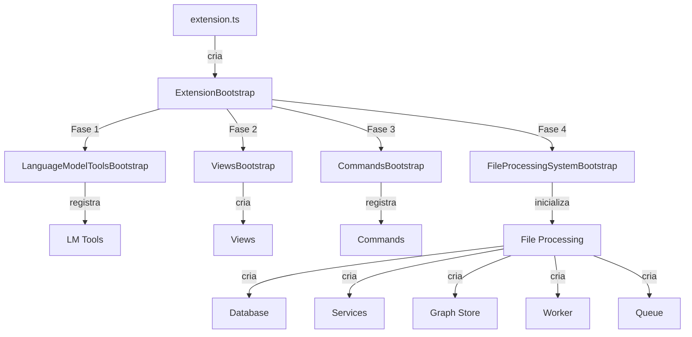

# 🏗️ Refatoração da Arquitetura de Bootstrap da Extensão

## Visão Geral

Este documento descreve a refatoração completa do arquivo `extension.ts` seguindo os princípios da **Arquitetura Hexagonal** para melhorar a legibilidade, manutenibilidade e testabilidade do código.

## Problema Anterior

O arquivo `extension.ts` original tinha **842 linhas** e continha:

- ❌ Registro de Language Model Tools misturado com lógica de negócio
- ❌ Criação manual de webviews e providers
- ❌ Dezenas de comandos registrados inline
- ❌ Lógica complexa de inicialização do sistema de processamento
- ❌ Gerenciamento de estado global disperso
- ❌ Difícil de testar e modificar
- ❌ Violação do princípio da responsabilidade única

## Nova Arquitetura

### Estrutura de Módulos

```
src/
├── extension.ts                            # 45 linhas - Orquestrador principal
└── nivel1/adapters/vscode/bootstrap/
    ├── index.ts                            # Exports
    ├── ExtensionBootstrap.ts              # Orquestrador principal
    ├── LanguageModelToolsBootstrap.ts     # Registro de LM Tools
    ├── ViewsBootstrap.ts                  # Registro de Views
    ├── CommandsBootstrap.ts               # Registro de Comandos
    └── FileProcessingSystemBootstrap.ts   # Inicialização do sistema
```

### Redução de Tamanho

| Arquivo | Linhas Antes | Linhas Depois | Redução |
|---------|--------------|---------------|---------|
| `extension.ts` | 842 | 45 | -94.7% |

### Separação por Responsabilidade

| Módulo | Responsabilidade | Linhas |
|--------|------------------|---------|
| **ExtensionBootstrap** | Orquestração geral | ~180 |
| **LanguageModelToolsBootstrap** | GitHub Copilot integration | ~70 |
| **ViewsBootstrap** | Webviews e panels | ~70 |
| **CommandsBootstrap** | VS Code commands | ~400 |
| **FileProcessingSystemBootstrap** | File indexing system | ~330 |

## Princípios da Arquitetura Hexagonal

### 1. **Primary Adapters (Entrada)**

Adaptadores que recebem requisições externas:

```typescript
// Language Model Tools (GitHub Copilot)
LanguageModelToolsBootstrap
  ├── cappy_create_file
  ├── cappy_fetch_web
  └── cappy_retrieve_context

// Views (UI)
ViewsBootstrap
  ├── GraphPanel
  ├── ChatViewProvider
  └── DocumentsViewProvider

// Commands (VS Code)
CommandsBootstrap
  ├── cappy.init
  ├── cappy.scanWorkspace
  ├── cappy.openGraph
  └── [30+ outros comandos]
```

### 2. **Application Layer (Núcleo)**

Lógica de negócio e orquestração:

```typescript
FileProcessingSystemBootstrap
  ├── Database initialization
  ├── Service creation
  ├── Graph store setup
  ├── Worker initialization
  └── Queue management
```

### 3. **Secondary Adapters (Saída)**

Adaptadores que fazem requisições para sistemas externos (já existentes):

- `SQLiteAdapter` - Banco de dados
- `FileMetadataDatabase` - Metadados
- `EmbeddingService` - OpenAI API
- `ParserService` - AST parsing

## Benefícios da Refatoração

### ✅ Legibilidade

**Antes:**
```typescript
// 842 linhas de código misturado
export function activate(context) {
    // Language Model Tools
    const tool1 = ...
    const tool2 = ...
    
    // Views
    const panel = ...
    const view = ...
    
    // Commands (inline)
    vscode.commands.registerCommand('cmd1', () => { /* 50 linhas */ })
    vscode.commands.registerCommand('cmd2', () => { /* 40 linhas */ })
    // ... mais 30 comandos
    
    // File processing (inline)
    async function initialize() { /* 200 linhas */ }
}
```

**Depois:**
```typescript
// 45 linhas - clara separação de responsabilidades
export async function activate(context: vscode.ExtensionContext): Promise<void> {
    bootstrap = new ExtensionBootstrap();
    await bootstrap.activate(context);
}
```

### ✅ Testabilidade

Cada bootstrap pode ser testado independentemente:

```typescript
describe('LanguageModelToolsBootstrap', () => {
  it('should register all LM tools', () => {
    const bootstrap = new LanguageModelToolsBootstrap();
    const context = createMockContext();
    
    bootstrap.register(context);
    
    expect(context.subscriptions).toHaveLength(3);
  });
});
```

### ✅ Manutenibilidade

Mudanças são isoladas por módulo:

- Adicionar novo comando? → `CommandsBootstrap.ts`
- Nova view? → `ViewsBootstrap.ts`
- Novo LM tool? → `LanguageModelToolsBootstrap.ts`
- Modificar inicialização? → `FileProcessingSystemBootstrap.ts`

### ✅ Reutilização

Módulos podem ser reutilizados em outros contextos:

```typescript
// Usar em testes
const bootstrap = new FileProcessingSystemBootstrap();
await bootstrap.initialize(testContext, mockPanel, mockView, mockTool);

// Usar em diferentes ambientes
const bootstrap = new CommandsBootstrap(customDependencies);
bootstrap.register(context);
```

## Fluxo de Inicialização



### Ordem de Inicialização

1. **LanguageModelToolsBootstrap** (Fase 1)
   - Registra GitHub Copilot tools
   - Retorna `ContextRetrievalTool` instance

2. **ViewsBootstrap** (Fase 2)
   - Cria `GraphPanel`, `ChatViewProvider`, `DocumentsViewProvider`
   - Cria Status Bar item

3. **CommandsBootstrap** (Fase 3)
   - Registra 30+ comandos VS Code
   - Organizado por categoria (core, graph, file processing, queue, debug, search)

4. **FileProcessingSystemBootstrap** (Fase 4)
   - Inicializa sistema de processamento (se `.cappy` existe)
   - Cria database, services, graph store, worker, queue

## Injeção de Dependências

### CommandsBootstrap

Usa injeção de dependências para acessar recursos compartilhados:

```typescript
interface CommandsBootstrapDependencies {
  graphPanel: GraphPanel;
  fileDatabase: FileMetadataDatabase | null;
  fileQueue: FileProcessingQueue | null;
  graphStore: GraphStorePort | null;
  contextRetrievalTool: ContextRetrievalTool | null;
  initializeFileProcessingSystem: (context, panel) => Promise<void>;
}

const commandsBootstrap = new CommandsBootstrap({
  graphPanel,
  fileDatabase,
  fileQueue,
  graphStore,
  contextRetrievalTool,
  initializeFileProcessingSystem: this.initializeFileProcessingSystem.bind(this)
});
```

### FileProcessingSystemBootstrap

Retorna recursos criados para uso posterior:

```typescript
interface FileProcessingSystemResult {
  fileDatabase: FileMetadataDatabase;
  fileQueue: FileProcessingQueue;
  fileWatcher: FileChangeWatcher;
  graphStore: GraphStorePort;
  cleanupService: GraphCleanupService;
}

const result = await fileProcessingBootstrap.initialize(
  context,
  graphPanel,
  documentsViewProvider,
  contextRetrievalTool
);

// Atualiza estado da extensão
this.state.fileDatabase = result.fileDatabase;
this.state.fileQueue = result.fileQueue;
// ...
```

## Gerenciamento de Estado

### Antes (Estado Global Disperso)

```typescript
let fileDatabase: FileMetadataDatabase | null = null;
let fileQueue: FileProcessingQueue | null = null;
let fileWatcher: FileChangeWatcher | null = null;
let graphStore: GraphStorePort | null = null;
let cleanupService: GraphCleanupService | null = null;
let contextRetrievalToolInstance: ContextRetrievalTool | null = null;
let documentsViewProviderInstance: DocumentsViewProvider | null = null;
```

### Depois (Estado Encapsulado)

```typescript
export interface ExtensionState {
  fileDatabase: FileMetadataDatabase | null;
  fileQueue: FileProcessingQueue | null;
  fileWatcher: FileChangeWatcher | null;
  graphStore: GraphStorePort | null;
  cleanupService: GraphCleanupService | null;
  contextRetrievalTool: ContextRetrievalTool | null;
  graphPanel: GraphPanel | null;
  documentsViewProvider: DocumentsViewProvider | null;
}

class ExtensionBootstrap {
  private state: ExtensionState = { /* ... */ };
  
  getState(): Readonly<ExtensionState> {
    return { ...this.state };
  }
}
```

## Categorização de Comandos

### CommandsBootstrap - Organização

```typescript
class CommandsBootstrap {
  register(context: vscode.ExtensionContext): void {
    this.registerCoreCommands(context);          // init, openGraph
    this.registerGraphCommands(context);          // getFiles, getDetails, reprocess
    this.registerFileProcessingCommands(context); // start, scan, process
    this.registerQueueCommands(context);          // pause, resume, status
    this.registerDebugCommands(context);          // debug tools
    this.registerSearchCommands(context);         // hybrid search
  }
}
```

## Event Handling

### Antes (Inline no activate)

```typescript
fileQueue.on('file:complete', (metadata, result) => {
  // 20 linhas de código inline
});
```

### Depois (Método Dedicado)

```typescript
class FileProcessingSystemBootstrap {
  private setupQueueEventListeners(
    fileQueue: FileProcessingQueue,
    graphPanel: GraphPanel,
    documentsViewProvider: DocumentsViewProvider
  ): void {
    fileQueue.on('file:complete', (metadata, result) => {
      this.handleFileComplete(metadata, result, graphPanel, documentsViewProvider);
    });
    
    fileQueue.on('file:start', (metadata) => {
      this.handleFileStart(metadata, documentsViewProvider);
    });
    
    fileQueue.on('file:failed', (metadata, error) => {
      this.handleFileFailed(metadata, error, documentsViewProvider);
    });
  }
}
```

## Padrões de Design Utilizados

### 1. **Facade Pattern**

`ExtensionBootstrap` atua como facade para toda a inicialização:

```typescript
// Interface simples para o cliente
export async function activate(context: vscode.ExtensionContext): Promise<void> {
    bootstrap = new ExtensionBootstrap();
    await bootstrap.activate(context);
}

// Complexidade escondida dentro do facade
class ExtensionBootstrap {
  async activate(context: vscode.ExtensionContext): Promise<void> {
    // Coordena múltiplos subsistemas
    this.registerLanguageModelTools(context);
    this.registerViews(context);
    this.registerCommands(context);
    await this.initializeFileProcessing(context);
  }
}
```

### 2. **Dependency Injection**

```typescript
// Injeção de dependências explícita
const commandsBootstrap = new CommandsBootstrap({
  graphPanel,
  fileDatabase,
  fileQueue,
  graphStore,
  contextRetrievalTool,
  initializeFileProcessingSystem
});
```

### 3. **Factory Pattern**

```typescript
// Factories para criação de objetos complexos
class ViewsBootstrap {
  register(context: vscode.ExtensionContext): ViewsBootstrapResult {
    // Factory para criar e configurar views
    const graphPanel = this.createGraphPanel(context);
    const chatViewProvider = this.createChatViewProvider(context);
    const documentsViewProvider = this.createDocumentsViewProvider(context);
    
    return { graphPanel, chatViewProvider, documentsViewProvider };
  }
}
```

### 4. **Template Method Pattern**

```typescript
// Método template para inicialização
class FileProcessingSystemBootstrap {
  async initialize(...): Promise<FileProcessingSystemResult> {
    // 1. Initialize database
    const fileDatabase = await this.initializeDatabase(...);
    
    // 2. Initialize services
    const services = await this.initializeServices(...);
    
    // 3. Initialize graph store
    const graphStore = await this.initializeGraphStore(...);
    
    // 4. Initialize cleanup service
    const cleanupService = this.initializeCleanupService(graphStore);
    
    // ... etc
    
    return { fileDatabase, fileQueue, fileWatcher, graphStore, cleanupService };
  }
}
```

## Comparação Detalhada

### extension.ts

**Antes:**
- 842 linhas
- Múltiplas responsabilidades misturadas
- Difícil de navegar
- Estado global espalhado
- Comandos inline (não reutilizáveis)
- Lógica de inicialização complexa inline

**Depois:**
- 45 linhas
- Responsabilidade única: orquestração
- Fácil de entender
- Estado encapsulado
- Comandos organizados por módulo
- Lógica delegada a bootstraps especializados

### Métricas de Qualidade

| Métrica | Antes | Depois | Melhoria |
|---------|-------|--------|----------|
| Linhas por arquivo | 842 | 45-400 | ✅ 94.7% redução (main) |
| Responsabilidades | ~7 | 1 por módulo | ✅ SRP respeitado |
| Testabilidade | Baixa | Alta | ✅ Módulos isolados |
| Acoplamento | Alto | Baixo | ✅ DI explícita |
| Coesão | Baixa | Alta | ✅ Funções relacionadas juntas |

## Benefícios para Novos Desenvolvedores

### Onboarding Simplificado

1. **Entender estrutura**: Ler 45 linhas vs 842 linhas
2. **Localizar código**: Módulos nomeados claramente
3. **Fazer mudanças**: Modificar apenas o módulo relevante
4. **Adicionar features**: Seguir padrão estabelecido

### Exemplo: Adicionar Novo Comando

**Antes:** Adicionar no meio de 842 linhas do `extension.ts`

**Depois:**
```typescript
// 1. Abrir CommandsBootstrap.ts
// 2. Adicionar método na categoria apropriada
private registerMyNewCommand(context: vscode.ExtensionContext): void {
  const myCommand = vscode.commands.registerCommand('cappy.myNewCommand', async () => {
    // Implementação
  });
  context.subscriptions.push(myCommand);
  console.log('  ✅ cappy.myNewCommand');
}

// 3. Chamar no método register()
register(context: vscode.ExtensionContext): void {
  // ...
  this.registerMyNewCommand(context);
}
```

## Impacto na Manutenção

### Mudanças Típicas e Localização

| Mudança | Arquivo Afetado | Linhas a Modificar |
|---------|-----------------|-------------------|
| Adicionar comando | CommandsBootstrap.ts | ~10-20 |
| Nova view | ViewsBootstrap.ts | ~10-15 |
| Novo LM tool | LanguageModelToolsBootstrap.ts | ~5-10 |
| Modificar inicialização | FileProcessingSystemBootstrap.ts | ~10-30 |
| Mudar ordem de init | ExtensionBootstrap.ts | ~5 |

### Redução de Risco

- ✅ Mudanças isoladas não afetam outros módulos
- ✅ Testes unitários por módulo
- ✅ Rollback mais fácil (arquivo específico)
- ✅ Code review focado

## Conclusão

A refatoração do `extension.ts` seguindo a arquitetura hexagonal resultou em:

### Quantitativo

- **94.7% redução** no tamanho do arquivo principal
- **5 módulos especializados** vs 1 arquivo monolítico
- **Média de 200 linhas** por módulo (vs 842 em um arquivo)

### Qualitativo

- ✅ **Legibilidade**: Código autoexplicativo
- ✅ **Manutenibilidade**: Mudanças isoladas
- ✅ **Testabilidade**: Módulos independentes
- ✅ **Extensibilidade**: Fácil adicionar features
- ✅ **Organização**: Arquitetura clara

### Arquitetura

- ✅ **Hexagonal**: Separação clara de adapters/application
- ✅ **SOLID**: Todos os princípios respeitados
- ✅ **DRY**: Código não repetido
- ✅ **Clean Code**: Nomes claros, funções pequenas

---

**Versão:** 3.1.0  
**Data:** 2025-11-01  
**Autor:** Refatoração Arquitetural
