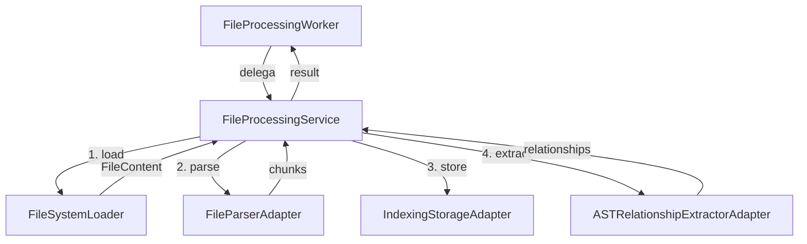

# File Processing - Hexagonal Architecture Refactoring

**Data:** 28 de outubro de 2025  
**Branch:** graph2  
**Status:** ✅ Concluído

## Visão Geral

Refatoração completa do sistema de processamento de arquivos utilizando **Arquitetura Hexagonal (Ports & Adapters)**, separando as regras de negócio da infraestrutura.

## Estrutura da Arquitetura

```
src/
├── domains/file-processing/          # 🏛️ DOMÍNIO (Regras de Negócio)
│   ├── entities/                     # Entidades do domínio
│   │   ├── FileContent.ts           # Representa conteúdo de arquivo
│   │   └── ProcessingResult.ts      # Resultado do processamento
│   ├── ports/                        # Interfaces (contratos)
│   │   ├── FileLoaderPort.ts        # Carregar arquivos
│   │   ├── FileParserPort.ts        # Parsear arquivos
│   │   ├── ChunkStoragePort.ts      # Armazenar chunks
│   │   └── RelationshipExtractorPort.ts  # Extrair relacionamentos
│   ├── services/                     # Casos de uso
│   │   └── FileProcessingService.ts # Orquestra o processamento
│   └── index.ts                      # Exports públicos
│
└── nivel2/infrastructure/adapters/file-processing/  # 🔌 ADAPTADORES
    ├── FileSystemLoader.ts           # Carrega de disco/base64
    ├── FileParserAdapter.ts          # Usa ParserService
    ├── IndexingStorageAdapter.ts     # Usa IndexingService
    ├── ASTRelationshipExtractorAdapter.ts  # Usa ASTRelationshipExtractor
    └── index.ts
```

## Camadas e Responsabilidades

### 1. **Domínio** (`src/domains/file-processing/`)

#### Entidades

**FileContent** - Representa o conteúdo de um arquivo:
```typescript
interface FileContent {
  filePath: string;        // Path relativo
  absolutePath: string;    // Path absoluto
  content: string;         // Conteúdo
  hash: string;            // Hash do arquivo
  size: number;            // Tamanho em bytes
  language: string;        // Linguagem detectada
  isEmbedded: boolean;     // Se é embedded (base64)
}
```

**ProcessingResult** - Resultado do processamento:
```typescript
interface ProcessingResult {
  chunksCount: number;
  nodesCount: number;
  relationshipsCount: number;
  duration: number;
}
```

#### Portas (Interfaces)

**FileLoaderPort** - Contrato para carregar arquivos:
```typescript
interface FileLoaderPort {
  loadFile(filePath: string, base64Content?: string): Promise<FileContent>;
}
```

**FileParserPort** - Contrato para parsear arquivos:
```typescript
interface FileParserPort {
  parseFile(filePath: string, content: string): Promise<DocumentChunk[]>;
  createFallbackChunk(filePath: string, content: string): DocumentChunk;
}
```

**ChunkStoragePort** - Contrato para armazenar chunks:
```typescript
interface ChunkStoragePort {
  storeChunks(filePath: string, language: string, chunks: DocumentChunk[]): Promise<void>;
}
```

**RelationshipExtractorPort** - Contrato para extrair relacionamentos:
```typescript
interface RelationshipExtractorPort {
  extractRelationships(filePath: string, content: string): Promise<RelationshipExtractionResult>;
}
```

#### Serviço de Domínio

**FileProcessingService** - Orquestra todo o fluxo:
```typescript
class FileProcessingService {
  constructor(
    private fileLoader: FileLoaderPort,
    private fileParser: FileParserPort,
    private chunkStorage?: ChunkStoragePort,
    private relationshipExtractor?: RelationshipExtractorPort
  ) {}

  async processFile(
    filePath: string,
    base64Content?: string,
    onProgress?: ProgressCallback,
    config?: FileProcessingConfig
  ): Promise<ProcessingResult>
}
```

### 2. **Adaptadores** (`src/nivel2/infrastructure/adapters/file-processing/`)

#### FileSystemLoader
Implementa `FileLoaderPort` usando Node.js fs:
- Carrega arquivos do disco
- Processa conteúdo base64 embedded
- Calcula hash (SHA-256)
- Detecta linguagem por extensão

#### FileParserAdapter
Implementa `FileParserPort` usando `ParserService`:
- Cria arquivo temporário para parser
- Executa parsing
- Limpa arquivo temporário
- Gera fallback chunk se necessário

#### IndexingStorageAdapter
Implementa `ChunkStoragePort` usando `IndexingService`:
- Delega para `indexingService.indexFile()`

#### ASTRelationshipExtractorAdapter
Implementa `RelationshipExtractorPort` usando `ASTRelationshipExtractor`:
- Cria arquivo temporário para análise AST
- Extrai relacionamentos (imports, exports, calls)
- Salva no GraphStore
- Limpa arquivo temporário

### 3. **Facade de Compatibilidade**

**FileProcessingWorker** - Mantém compatibilidade com código legado:
```typescript
class FileProcessingWorker {
  private processingService: FileProcessingService;

  constructor(
    _parserService: unknown,    // Não usado mais
    _hashService: unknown,       // Não usado mais
    workspaceRoot: string,
    indexingService?: IndexingService,
    graphStore?: GraphStorePort
  ) {
    // Monta adaptadores e cria serviço de domínio
  }

  async processFile(...): Promise<ProcessingResult> {
    // Delega para FileProcessingService
  }
}
```

## Benefícios da Refatoração

### 1. **Separação de Concerns**
- Lógica de negócio isolada (domínio)
- Infraestrutura trocável (adaptadores)
- Dependências invertidas (DI)

### 2. **Testabilidade**
- Mocks fáceis (interfaces)
- Testes unitários isolados
- Sem dependências de I/O nos testes de domínio

### 3. **Manutenibilidade**
- Código mais limpo e organizado
- Responsabilidades bem definidas
- Fácil de entender e modificar

### 4. **Extensibilidade**
- Fácil adicionar novos adaptadores
- Trocar implementações sem quebrar
- Suporte a múltiplos backends

### 5. **Redução de Complexidade**
- FileProcessingWorker: 461 linhas → 67 linhas
- Cognitive Complexity reduzida
- Código mais linear e legível

## Fluxo de Processamento



## Pipeline de Processamento

1. **Load File** (`FileSystemLoader`)
   - Resolve path absoluto
   - Lê conteúdo (disk ou base64)
   - Calcula hash
   - Detecta linguagem

2. **Parse File** (`FileParserAdapter`)
   - Cria temp file
   - Parseia com `ParserService`
   - Gera fallback se necessário
   - Limpa temp file

3. **Store Chunks** (`IndexingStorageAdapter`)
   - Salva no IndexingService
   - Embeddings automáticos
   - Armazenamento SQLite

4. **Extract Relationships** (`ASTRelationshipExtractorAdapter`)
   - Análise AST
   - Extrai imports/exports/calls
   - Salva no GraphStore

## Exemplo de Uso

### Forma Antiga (ainda funciona):
```typescript
const worker = new FileProcessingWorker(
  parserService,
  hashService,
  workspaceRoot,
  indexingService,
  graphStore
);

const result = await worker.processFile(filePath, onProgress, base64Content);
```

### Forma Nova (recomendada):
```typescript
import { FileProcessingService } from '@/domains/file-processing';
import {
  FileSystemLoader,
  FileParserAdapter,
  IndexingStorageAdapter,
  ASTRelationshipExtractorAdapter
} from '@/nivel2/infrastructure/adapters/file-processing';

const service = new FileProcessingService(
  new FileSystemLoader(workspaceRoot),
  new FileParserAdapter(),
  new IndexingStorageAdapter(indexingService),
  new ASTRelationshipExtractorAdapter(workspaceRoot, graphStore)
);

const result = await service.processFile(filePath, base64Content, onProgress);
```

## Próximos Passos

### Curto Prazo
1. ✅ Implementar arquitetura hexagonal
2. ⏳ Adicionar testes unitários para domínio
3. ⏳ Adicionar testes de integração para adaptadores

### Médio Prazo
4. ⏳ Criar novos adaptadores (ex: S3Loader, PostgresStorage)
5. ⏳ Implementar circuit breaker para resiliência
6. ⏳ Adicionar métricas e observabilidade

### Longo Prazo
7. ⏳ Remover FileProcessingWorker (deprecado)
8. ⏳ Aplicar mesmo padrão para outros módulos
9. ⏳ Documentar patterns e best practices

## Testes

### Executar compilação:
```bash
npm run compile-extension
```

### Testar processamento:
```bash
Cmd+Shift+P → "Cappy: Process Single File"
```

### Verificar logs:
- Console do DevTools
- Output Channel "Cappy"

## Arquivos Criados

```
src/domains/file-processing/
├── entities/
│   ├── FileContent.ts
│   └── ProcessingResult.ts
├── ports/
│   ├── FileLoaderPort.ts
│   ├── FileParserPort.ts
│   ├── ChunkStoragePort.ts
│   └── RelationshipExtractorPort.ts
├── services/
│   └── FileProcessingService.ts
└── index.ts

src/nivel2/infrastructure/adapters/file-processing/
├── FileSystemLoader.ts
├── FileParserAdapter.ts
├── IndexingStorageAdapter.ts
├── ASTRelationshipExtractorAdapter.ts
└── index.ts
```

## Arquivos Modificados

```
src/nivel2/infrastructure/services/file-processing-worker.ts
  - De: 461 linhas (monolítico)
  - Para: 67 linhas (facade)
  - Redução: ~85%
```

## Referências

- [Hexagonal Architecture](https://alistair.cockburn.us/hexagonal-architecture/)
- [Ports & Adapters Pattern](https://herbertograca.com/2017/09/14/ports-adapters-architecture/)
- [Clean Architecture](https://blog.cleancoder.com/uncle-bob/2012/08/13/the-clean-architecture.html)
- [Domain-Driven Design](https://martinfowler.com/bliki/DomainDrivenDesign.html)
