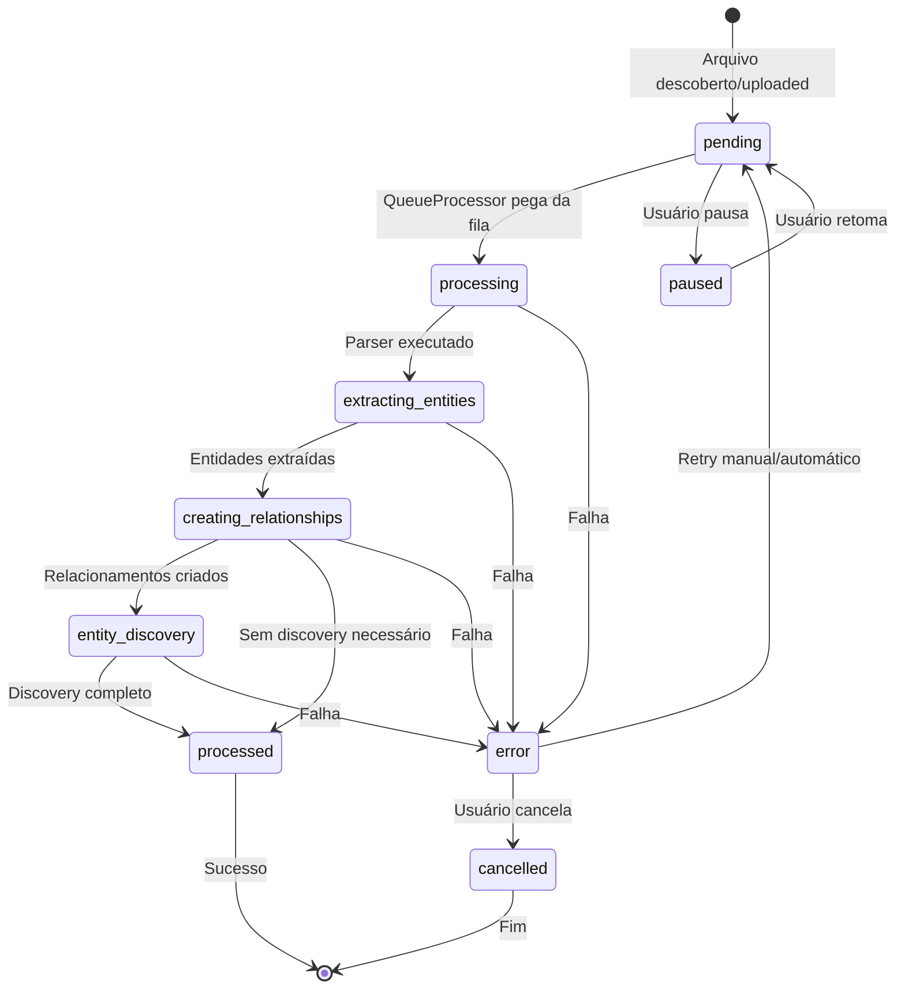

# Arquitetura de Processamento Baseada em Filas

## Visão Geral

Esta proposta refatora o sistema de processamento de arquivos para usar uma **arquitetura baseada em filas com máquina de estados**, onde cada arquivo na tabela `file_metadata` é processado incrementalmente de acordo com seu status atual.

## Problemas Atuais

### 1. **Processamento Acoplado**
- `WorkspaceScanner` faz descoberta E processamento diretamente
- Não há separação clara entre descobrir arquivos e processá-los
- Difícil pausar/retomar processamento

### 2. **Múltiplos Pontos de Entrada**
- Upload de arquivos usa `FileProcessingQueue`
- Workspace scan usa lógica própria
- Reprocessamento tem fluxo diferente

### 3. **Falta de Visibilidade**
- Não há controle centralizado do progresso
- Impossível pausar processamento
- Estado não persiste entre sessões

## Nova Arquitetura

### Estados da Fila

```typescript
export type FileProcessingStatus = 
  | 'pending'                  // Aguardando processamento inicial
  | 'processing'               // Processamento geral em andamento
  | 'extracting_entities'      // Extraindo entidades do arquivo
  | 'creating_relationships'   // Criando relacionamentos no grafo
  | 'entity_discovery'         // Descoberta de entidades via LLM
  | 'processed'                // Completamente processado
  | 'error'                    // Erro durante processamento
  | 'paused'                   // Pausado manualmente
  | 'cancelled';               // Cancelado
```

### Máquina de Estados



## Componentes

### 1. **FileMetadataDatabase** (Existente - Estender)

**Modificações:**
- ✅ Já tem tabela `file_metadata` com status
- ✅ Já tem métodos para buscar por status
- ➕ Adicionar novos estados ao tipo
- ➕ Adicionar índices para otimização

```sql
-- Índices adicionais
CREATE INDEX IF NOT EXISTS idx_status_created ON file_metadata(status, created_at);
CREATE INDEX IF NOT EXISTS idx_hash ON file_metadata(file_hash);
```

### 2. **FileProcessingQueue**

Service que processa items da fila baseado em status.

```typescript
export class FileProcessingQueue {
  private isRunning: boolean = false;
  private isPaused: boolean = false;
  
  constructor(
    private database: FileMetadataDatabase,
    private worker: FileProcessingWorker,
    private config: QueueConfig
  ) {}
  
  /**
   * Inicia processamento contínuo da fila
   */
  async start(): Promise<void> {
    if (this.isRunning) return;
    
    this.isRunning = true;
    this.isPaused = false;
    
    // Loop contínuo processando items pendentes
    this.processingInterval = setInterval(async () => {
      if (this.isPaused) return;
      
      await this.processNextBatch();
    }, this.config.pollInterval);
  }
  
  /**
   * Pausa processamento (muda status para 'paused')
   */
  pause(): void {
    this.isPaused = true;
    
    // Atualiza items em processamento para paused
    this.database.updateFilesByStatus('processing', { 
      status: 'paused' 
    });
  }
  
  /**
   * Retoma processamento (muda 'paused' para 'pending')
   */
  resume(): void {
    this.isPaused = false;
    
    // Volta items pausados para pending
    this.database.updateFilesByStatus('paused', { 
      status: 'pending' 
    });
  }
  
  /**
   * Processa próximo lote de arquivos
   */
  private async processNextBatch(): Promise<void> {
    const pendingFiles = this.database.getPendingFiles(
      this.config.batchSize
    );
    
    if (pendingFiles.length === 0) {
      return; // Fila vazia
    }
    
    // Processa em paralelo respeitando concorrência
    const promises = pendingFiles
      .slice(0, this.config.concurrency)
      .map(file => this.processFile(file));
    
    await Promise.allSettled(promises);
  }
  
  /**
   * Processa um arquivo através de seus estados
   */
  private async processFile(metadata: FileMetadata): Promise<void> {
    try {
      // Marca como processing
      this.database.updateFile(metadata.id, {
        status: 'processing',
        processingStartedAt: new Date().toISOString()
      });
      
      // Estado 1: Parse e extração de entidades
      await this.extractEntities(metadata);
      
      // Estado 2: Criação de relacionamentos
      await this.createRelationships(metadata);
      
      // Estado 3: Discovery de entidades (se necessário)
      if (this.shouldRunDiscovery(metadata)) {
        await this.runEntityDiscovery(metadata);
      }
      
      // Finaliza como processed
      this.database.updateFile(metadata.id, {
        status: 'processed',
        processingCompletedAt: new Date().toISOString(),
        progress: 100
      });
      
    } catch (error) {
      this.handleError(metadata, error);
    }
  }
  
  private async extractEntities(metadata: FileMetadata): Promise<void> {
    this.database.updateFile(metadata.id, {
      status: 'extracting_entities',
      currentStep: 'Extracting entities from file',
      progress: 25
    });
    
    // Chama worker para extrair entidades
    await this.worker.extractEntities(metadata);
  }
  
  private async createRelationships(metadata: FileMetadata): Promise<void> {
    this.database.updateFile(metadata.id, {
      status: 'creating_relationships',
      currentStep: 'Creating relationships in graph',
      progress: 50
    });
    
    // Chama worker para criar relacionamentos
    await this.worker.createRelationships(metadata);
  }
  
  private async runEntityDiscovery(metadata: FileMetadata): Promise<void> {
    this.database.updateFile(metadata.id, {
      status: 'entity_discovery',
      currentStep: 'Running LLM entity discovery',
      progress: 75
    });
    
    // Chama worker para discovery via LLM
    await this.worker.runEntityDiscovery(metadata);
  }
  
  private handleError(metadata: FileMetadata, error: unknown): void {
    const errorMessage = error instanceof Error 
      ? error.message 
      : String(error);
    
    const retryCount = metadata.retryCount + 1;
    
    if (retryCount < metadata.maxRetries) {
      // Agenda retry
      this.database.updateFile(metadata.id, {
        status: 'pending',
        retryCount,
        errorMessage,
        currentStep: `Retry ${retryCount}/${metadata.maxRetries}`
      });
    } else {
      // Marca como erro permanente
      this.database.updateFile(metadata.id, {
        status: 'error',
        retryCount,
        errorMessage,
        processingCompletedAt: new Date().toISOString()
      });
    }
  }
}
```

### 3. **FileChangeWatcher** (Novo)

Monitora mudanças em arquivos e atualiza a fila.

```typescript
export class FileChangeWatcher {
  private watcher: vscode.FileSystemWatcher | null = null;
  
  constructor(
    private database: FileMetadataDatabase,
    private hashService: FileHashService
  ) {}
  
  /**
   * Inicia monitoramento de mudanças
   */
  start(workspaceRoot: string): void {
    // Monitora mudanças em arquivos
    this.watcher = vscode.workspace.createFileSystemWatcher(
      new vscode.RelativePattern(workspaceRoot, '**/*'),
      false, // não ignora criação
      false, // não ignora mudança
      false  // não ignora deleção
    );
    
    this.watcher.onDidChange(uri => this.handleFileChange(uri));
    this.watcher.onDidCreate(uri => this.handleFileCreate(uri));
    this.watcher.onDidDelete(uri => this.handleFileDelete(uri));
  }
  
  private async handleFileChange(uri: vscode.Uri): Promise<void> {
    const filePath = uri.fsPath;
    const existing = this.database.getFileByPath(filePath);
    
    if (!existing) return; // Arquivo não está na fila
    
    // Calcula novo hash
    const newHash = await this.hashService.hashFile(filePath);
    
    if (newHash !== existing.fileHash) {
      // Arquivo mudou, marca para reprocessamento
      this.database.updateFile(existing.id, {
        status: 'pending',
        fileHash: newHash,
        retryCount: 0,
        errorMessage: undefined,
        currentStep: 'File changed, reprocessing',
        updatedAt: new Date().toISOString()
      });
      
      console.log(`🔄 File changed, marked for reprocessing: ${filePath}`);
    }
  }
  
  private async handleFileCreate(uri: vscode.Uri): Promise<void> {
    const filePath = uri.fsPath;
    
    // Adiciona novo arquivo à fila
    const hash = await this.hashService.hashFile(filePath);
    const fileName = path.basename(filePath);
    const fileSize = fs.statSync(filePath).size;
    
    this.database.insertFile({
      id: `file-${Date.now()}-${Math.random().toString(36).substring(2, 9)}`,
      filePath,
      fileName,
      fileSize,
      fileHash: hash,
      status: 'pending',
      progress: 0,
      retryCount: 0,
      maxRetries: 3
    });
    
    console.log(`➕ New file added to queue: ${filePath}`);
  }
  
  private handleFileDelete(uri: vscode.Uri): Promise<void> {
    const filePath = uri.fsPath;
    const existing = this.database.getFileByPath(filePath);
    
    if (existing) {
      this.database.deleteFile(existing.id);
      console.log(`➖ Deleted file removed from queue: ${filePath}`);
    }
  }
  
  dispose(): void {
    this.watcher?.dispose();
  }
}
```

### 4. **WorkspaceScanner** (Refatorado)

Remove responsabilidade de processamento. Apenas descobre arquivos e popula fila.

```typescript
export class WorkspaceScanner {
  /**
   * Scans workspace e adiciona arquivos à fila de metadata
   */
  async scanWorkspace(): Promise<void> {
    console.log('🚀 Starting workspace scan...');
    
    // 1. Descobre todos os arquivos
    const files = await this.discoverFiles();
    console.log(`📁 Found ${files.length} files`);
    
    // 2. Adiciona à fila de metadata se não existirem
    for (const file of files) {
      const existing = this.database.getFileByPath(file.absPath);
      
      if (!existing) {
        // Novo arquivo
        this.database.insertFile({
          id: `file-${Date.now()}-${Math.random().toString(36).substring(2, 9)}`,
          filePath: file.absPath,
          fileName: file.name,
          fileSize: file.size,
          fileHash: file.hash,
          status: 'pending',
          progress: 0,
          retryCount: 0,
          maxRetries: 3
        });
      } else if (existing.fileHash !== file.hash) {
        // Arquivo mudou
        this.database.updateFile(existing.id, {
          status: 'pending',
          fileHash: file.hash,
          retryCount: 0,
          currentStep: 'Hash changed, marked for reprocessing'
        });
      }
      // Senão: arquivo já existe e não mudou, skip
    }
    
    // 3. Cleanup de arquivos deletados
    await this.cleanupDeletedFiles(files);
    
    console.log('✅ Workspace scan completed');
    console.log('   Files will be processed by FileProcessingQueue');
  }
}
```

### 5. **Upload Flow** (Refatorado)

Upload simplesmente adiciona arquivo à tabela metadata.

```typescript
// Em file-processing-api.ts
private async handleEnqueue(req: http.IncomingMessage, res: http.ServerResponse): Promise<void> {
  const uploadRequest: FileUploadRequest = JSON.parse(body);
  const fileContent = Buffer.from(uploadRequest.content, 'base64');
  const hash = crypto.createHash('sha256').update(fileContent).digest('hex');
  
  // Virtual path para uploaded files
  const virtualPath = `uploaded:${uploadRequest.fileName}`;
  
  // Simplesmente adiciona à metadata table
  const fileId = `file-${Date.now()}-${Math.random().toString(36).substring(2, 9)}`;
  
  this.database.insertFile({
    id: fileId,
    filePath: virtualPath,
    fileName: uploadRequest.fileName,
    fileSize: fileContent.length,
    fileHash: hash,
    fileContent: uploadRequest.content, // Base64
    status: 'pending', // <- FileProcessingQueue vai pegar
    progress: 0,
    retryCount: 0,
    maxRetries: 3
  });
  
  // FileProcessingQueue vai processar automaticamente
  console.log(`📝 File added to queue: ${uploadRequest.fileName}`);
  
  res.end(JSON.stringify({ 
    fileId,
    status: 'pending',
    message: 'File added to queue'
  }));
}
```

## UI de Gerenciamento de Filas

### Queue Dashboard

```typescript
interface QueueDashboardState {
  files: FileMetadata[];
  stats: {
    total: number;
    pending: number;
    processing: number;
    extractingEntities: number;
    creatingRelationships: number;
    entityDiscovery: number;
    processed: number;
    error: number;
    paused: number;
  };
  isProcessing: boolean;
  isPaused: boolean;
}
```

### Visual Design

```
╔═══════════════════════════════════════════════════╗
║  📊 Processing Queue                [⏸ Pause]     ║
╠═══════════════════════════════════════════════════╣
║                                                    ║
║  Statistics:                                       ║
║  ● Pending: 45           ● Processing: 3          ║
║  ● Extracting: 2         ● Relationships: 1       ║
║  ● Discovery: 1          ● Processed: 123         ║
║  ● Error: 2              ● Paused: 0              ║
║                                                    ║
╠═══════════════════════════════════════════════════╣
║  Files:                                            ║
║                                                    ║
║  🔄 src/services/parser.ts                        ║
║     Status: Extracting entities (35%)             ║
║     [████████████░░░░░░░░░░░░░░░░░]              ║
║                                                    ║
║  🔄 docs/README.md                                ║
║     Status: Creating relationships (60%)          ║
║     [████████████████████░░░░░░░░░]              ║
║                                                    ║
║  🤖 src/adapters/llm.ts                           ║
║     Status: Entity discovery (85%)                ║
║     [███████████████████████████░░░]              ║
║                                                    ║
║  ⏳ src/types/index.ts                            ║
║     Status: Pending                               ║
║                                                    ║
║  ✅ src/main.ts                                   ║
║     Status: Processed                             ║
║                                                    ║
║  ❌ invalid-file.xyz                              ║
║     Status: Error - Unsupported format            ║
║     [Retry] [Cancel]                              ║
║                                                    ║
╚═══════════════════════════════════════════════════╝
```

## Persistência e Background Processing

### Persistência

- ✅ **Já implementado**: `FileMetadataDatabase` usa SQLite com `save()` após operações
- ✅ Estado persiste automaticamente no arquivo `.db`
- ✅ Ao reabrir VS Code, estado é restaurado

### Background Processing

```typescript
export function activate(context: vscode.ExtensionContext) {
  // Initialize database
  const dbPath = path.join(context.globalStorageUri.fsPath, 'file-metadata.db');
  const database = new FileMetadataDatabase(dbPath);
  await database.initialize();
  
  // Initialize queue processor
  const queueProcessor = new FileProcessingQueue(
    database,
    worker,
    { concurrency: 2, maxRetries: 3, autoStart: true }
  );
  
  // Start processing automatically (background)
  queueProcessor.start();
  
  // Start file watcher
  const watcher = new FileChangeWatcher(database, hashService);
  watcher.start(workspaceRoot);
  
  // Register commands
  context.subscriptions.push(
    vscode.commands.registerCommand('cappy.pauseQueue', () => {
      queueProcessor.pause();
      vscode.window.showInformationMessage('Queue paused');
    }),
    
    vscode.commands.registerCommand('cappy.resumeQueue', () => {
      queueProcessor.resume();
      vscode.window.showInformationMessage('Queue resumed');
    })
  );
  
  // Cleanup on deactivate
  context.subscriptions.push({
    dispose: () => {
      queueProcessor.stop();
      watcher.dispose();
    }
  });
}
```

## Vantagens da Nova Arquitetura

### ✅ Separação de Responsabilidades
- `WorkspaceScanner`: apenas descobre arquivos
- `FileProcessingQueue`: processa baseado em status
- `FileChangeWatcher`: monitora mudanças
- `FileMetadataDatabase`: fonte única da verdade

### ✅ Controle Granular
- Pause/resume em qualquer momento
- Status visual de cada arquivo
- Progresso detalhado por etapa

### ✅ Persistência Automática
- Estado persiste entre sessões
- Reprocessamento inteligente
- Recovery automático

### ✅ Background Processing
- Não bloqueia VS Code
- Continua mesmo com janela fechada
- Feedback em tempo real

### ✅ Único Ponto de Entrada
- Upload → metadata table → FileProcessingQueue
- Workspace scan → metadata table → FileProcessingQueue
- File change → metadata table → FileProcessingQueue

### ✅ Escalável
- Fácil adicionar novos estados
- Fácil adicionar steps de processamento
- Concorrência configurável

## Plano de Implementação

1. **Estender tipos** (FileProcessingStatus)
2. **Usar FileProcessingQueue**
3. **Criar FileChangeWatcher**
4. **Refatorar WorkspaceScanner**
5. **Simplificar upload flow**
6. **Criar UI de Queue Dashboard**
7. **Integrar tudo no activate()**
8. **Testes end-to-end**

## Backward Compatibility

- ✅ Tabela `file_metadata` já existe
- ✅ Novos estados são backward compatible
- ✅ Files existentes continuam funcionando
- ✅ Migration automática de schema

## Conclusão

Esta arquitetura resolve todos os problemas atuais:
- ✅ Desacopla descoberta de processamento
- ✅ Unifica pontos de entrada (upload, scan, watch)
- ✅ Fornece controle granular (pause/play)
- ✅ Persiste estado entre sessões
- ✅ Background processing elegante
- ✅ UI com feedback visual em tempo real

A implementação é incremental e não quebra código existente.
