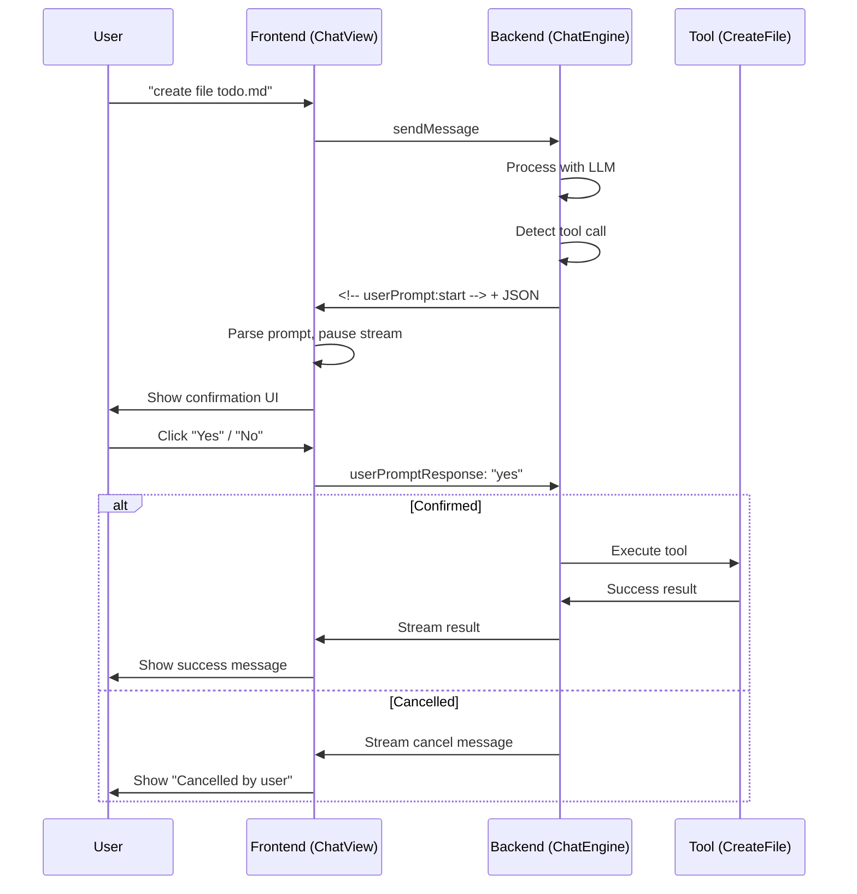

# Sistema de Confirmação no Chat Cappy

## 🎯 Objetivo

Substituir `alert()` JavaScript e dialogs nativos do VS Code por um sistema de confirmação integrado ao chat usando recursos do **@assistant-ui/react**.

## 📊 Situação Atual

### ✅ O que já funciona

1. **Language Model Tools Confirmation** (`src/adapters/secondary/tools/create-file-tool.ts`):
   ```typescript
   async prepareInvocation(...): Promise<PreparedToolInvocation> {
     return {
       invocationMessage: `Creating file: ${path}`,
       confirmationMessages: {
         title: 'Create File',
         message: new vscode.MarkdownString(`Create file \`${path}\`?`)
       }
     }
   }
   ```
   - ✅ Mostra dialog nativo do VS Code
   - ✅ Funciona com Copilot
   - ❌ Não está integrado ao chat visual

### ❌ O que precisa melhorar

- Usar recursos visuais do @assistant-ui/react
- Confirmações inline no chat (não dialogs separados)
- Experiência consistente com o fluxo de conversa

## 🎨 Solução Proposta

### Arquitetura

```
User pergunta → Backend detecta tool call → 
  Backend envia userPrompt → Frontend mostra UI inline → 
  User responde → Backend recebe resposta → 
  Backend executa tool → Continua conversa
```

### Componentes

#### 1. **Backend: Chat Engine** (`langgraph-chat-engine.ts`)

```typescript
export class LangGraphChatEngine implements ChatAgentPort {
  
  async *processMessage(message: Message, context: ChatContext): AsyncIterable<string> {
    // ... existing code ...

    // When tool call detected
    if (part instanceof vscode.LanguageModelToolCallPart) {
      const toolName = part.name.replace('cappy_', '');
      
      // Send confirmation request to frontend
      yield `<!-- userPrompt:start -->\n`;
      yield JSON.stringify({
        type: 'confirm',
        question: `🔧 A ferramenta "${toolName}" será executada. Confirmar?`,
        toolCall: {
          name: toolName,
          input: part.input
        }
      });
      yield `\n<!-- userPrompt:end -->\n`;
      
      // Wait for response (needs mechanism to pause and resume)
      const confirmed = await this.waitForUserResponse(messageId);
      
      if (!confirmed) {
        yield `\n\n❌ Operação cancelada pelo usuário\n\n`;
        continue;
      }
      
      // Execute tool
      const result = await vscode.lm.invokeTool(part.name, {
        input: part.input,
        toolInvocationToken: undefined
      }, token);
      
      yield `\n✅ ${toolName} executada com sucesso\n\n`;
    }
  }
  
  private async waitForUserResponse(messageId: string): Promise<boolean> {
    // Implement mechanism to pause and wait for frontend response
    // Could use event emitter or promise-based queue
  }
}
```

#### 2. **Frontend: Chat Adapter** (`ChatView.tsx`)

```typescript
class VSCodeChatAdapter implements ChatModelAdapter {
  private promptResolver?: (response: boolean) => void;
  
  async *run(options: ChatModelRunOptions): AsyncGenerator<ChatModelRunResult, void> {
    // ... existing code ...
    
    // Detect user prompt markers
    let promptBuffer = '';
    let inPrompt = false;
    
    for await (const chunk of generator) {
      if (chunk.includes('<!-- userPrompt:start -->')) {
        inPrompt = true;
        promptBuffer = '';
        continue;
      }
      
      if (chunk.includes('<!-- userPrompt:end -->')) {
        inPrompt = false;
        const promptData = JSON.parse(promptBuffer);
        
        // Yield prompt to UI
        yield {
          type: 'text',
          textDelta: '' // Empty delta to trigger re-render
        };
        
        // Wait for user response
        const response = await this.promptUser(promptData);
        
        // Send response back to backend
        this.vscode.postMessage({
          type: 'userPromptResponse',
          messageId: messageId,
          response: response
        });
        
        continue;
      }
      
      if (inPrompt) {
        promptBuffer += chunk;
        continue;
      }
      
      // Regular streaming
      yield {
        type: 'text',
        textDelta: chunk
      };
    }
  }
  
  private async promptUser(prompt: {
    type: 'confirm' | 'input' | 'select';
    question: string;
    options?: string[];
    toolCall?: { name: string; input: unknown };
  }): Promise<string> {
    return new Promise((resolve) => {
      this.promptResolver = (confirmed: boolean) => {
        resolve(confirmed ? 'yes' : 'no');
        this.promptResolver = undefined;
      };
      
      // Trigger UI update (state management needed)
      // Option 1: Use React state
      // Option 2: Emit custom event
      // Option 3: Use assistant-ui built-in mechanism
    });
  }
}
```

#### 3. **UI Component: Prompt Message** (`PromptMessage.tsx`)

```tsx
import { MessagePrimitive } from '@assistant-ui/react';
import { useState } from 'react';

interface PromptProps {
  type: 'confirm' | 'input' | 'select';
  question: string;
  options?: string[];
  toolCall?: {
    name: string;
    input: unknown;
  };
  onResponse: (response: string) => void;
}

export const PromptMessage = ({ type, question, toolCall, options, onResponse }: PromptProps) => {
  const [inputValue, setInputValue] = useState('');
  const [responded, setResponded] = useState(false);
  
  const handleResponse = (response: string) => {
    setResponded(true);
    onResponse(response);
  };
  
  if (responded) {
    return (
      <div className="message-prompt message-prompt--responded">
        <div className="prompt-question">{question}</div>
        <div className="prompt-response">
          ✅ Respondido
        </div>
      </div>
    );
  }
  
  return (
    <MessagePrimitive.Root className="message-prompt">
      <div className="message-content">
        <div className="prompt-question">
          ❓ {question}
        </div>
        
        {toolCall && (
          <div className="prompt-tool-details">
            <code>
              🔧 {toolCall.name}
              {JSON.stringify(toolCall.input, null, 2)}
            </code>
          </div>
        )}
        
        {type === 'confirm' && (
          <div className="prompt-actions">
            <button 
              className="prompt-button prompt-button--primary"
              onClick={() => handleResponse('yes')}
            >
              ✅ Sim
            </button>
            <button 
              className="prompt-button prompt-button--secondary"
              onClick={() => handleResponse('no')}
            >
              ❌ Não
            </button>
          </div>
        )}
        
        {type === 'input' && (
          <div className="prompt-input">
            <input
              type="text"
              value={inputValue}
              onChange={(e) => setInputValue(e.target.value)}
              placeholder="Digite sua resposta..."
              autoFocus
            />
            <button 
              className="prompt-button prompt-button--primary"
              onClick={() => handleResponse(inputValue)}
              disabled={!inputValue.trim()}
            >
              Enviar
            </button>
          </div>
        )}
        
        {type === 'select' && options && (
          <div className="prompt-select">
            {options.map((option) => (
              <button 
                key={option}
                className="prompt-option"
                onClick={() => handleResponse(option)}
              >
                {option}
              </button>
            ))}
          </div>
        )}
      </div>
    </MessagePrimitive.Root>
  );
};
```

#### 4. **Estilos CSS** (`ChatView.css`)

```css
/* Prompt Messages */
.message-prompt {
  background-color: #2a3f5f;
  border-left: 4px solid #4a90e2;
  padding: 16px;
  border-radius: 8px;
  margin: 12px 0;
}

.message-prompt--responded {
  opacity: 0.7;
  border-left-color: #10b981;
}

.prompt-question {
  font-weight: 600;
  margin-bottom: 12px;
  color: #e0e0e0;
  font-size: 14px;
}

.prompt-tool-details {
  background-color: #1a1a1a;
  padding: 12px;
  border-radius: 6px;
  margin: 8px 0 12px 0;
  font-family: 'Consolas', 'Monaco', monospace;
  font-size: 12px;
  color: #d4d4d4;
  overflow-x: auto;
}

.prompt-tool-details code {
  white-space: pre;
  display: block;
}

/* Actions */
.prompt-actions {
  display: flex;
  gap: 8px;
}

.prompt-button {
  padding: 8px 16px;
  border-radius: 6px;
  border: 1px solid transparent;
  cursor: pointer;
  font-weight: 500;
  font-size: 13px;
  transition: all 0.2s ease;
}

.prompt-button--primary {
  background-color: #10b981;
  color: #0a3d2a;
  border-color: #059669;
}

.prompt-button--primary:hover {
  background-color: #059669;
  transform: translateY(-1px);
  box-shadow: 0 4px 8px rgba(16, 185, 129, 0.3);
}

.prompt-button--primary:disabled {
  background-color: #6b7280;
  cursor: not-allowed;
  transform: none;
}

.prompt-button--secondary {
  background-color: #374151;
  color: #e5e7eb;
  border-color: #4b5563;
}

.prompt-button--secondary:hover {
  background-color: #4b5563;
  transform: translateY(-1px);
}

/* Input */
.prompt-input {
  display: flex;
  gap: 8px;
  align-items: center;
}

.prompt-input input {
  flex: 1;
  padding: 10px 12px;
  border-radius: 6px;
  border: 1px solid #4a5568;
  background-color: #1e1e1e;
  color: #e0e0e0;
  font-size: 13px;
}

.prompt-input input:focus {
  outline: none;
  border-color: #4a90e2;
  box-shadow: 0 0 0 2px rgba(74, 144, 226, 0.2);
}

/* Select */
.prompt-select {
  display: flex;
  flex-direction: column;
  gap: 8px;
}

.prompt-option {
  text-align: left;
  padding: 12px 16px;
  background-color: #2d3748;
  border: 1px solid #4a5568;
  border-radius: 6px;
  color: #e0e0e0;
  cursor: pointer;
  transition: all 0.2s ease;
  font-size: 13px;
}

.prompt-option:hover {
  background-color: #3d4758;
  border-color: #4a90e2;
  transform: translateX(4px);
}

/* Response Indicator */
.prompt-response {
  color: #10b981;
  font-size: 12px;
  font-weight: 500;
  margin-top: 8px;
}
```

## 🔄 Fluxo Completo



## 📝 Tipos TypeScript

```typescript
// Message types
interface UserPromptMessage {
  type: 'userPrompt';
  promptType: 'confirm' | 'input' | 'select';
  question: string;
  options?: string[];
  toolCall?: {
    name: string;
    input: unknown;
  };
  messageId: string;
}

interface UserPromptResponse {
  type: 'userPromptResponse';
  messageId: string;
  response: string;
  cancelled?: boolean;
}

// Chat events
type ChatEvent = 
  | { type: 'thinking'; text?: string }
  | { type: 'streamStart' }
  | { type: 'streamToken'; token: string }
  | { type: 'streamEnd' }
  | { type: 'streamError'; error: string }
  | UserPromptMessage
  | UserPromptResponse;
```

## 🎯 Casos de Uso

### 1. Tool Call Confirmation

```typescript
// User: "create file todo.md"
// Backend detects tool call
// Show: "🔧 A ferramenta 'create_file' será executada. Confirmar?"
// Details: { path: "todo.md", content: "..." }
// Buttons: [Yes] [No]
```

### 2. Destructive Operation

```typescript
// User: "delete all .log files"
// Show: "⚠️ Esta operação irá deletar 50 arquivos. Continuar?"
// Details: List of files
// Buttons: [Yes] [No]
```

### 3. Additional Input

```typescript
// User: "create a component"
// Show: "❓ Qual o nome do componente?"
// Input field: [_________]
// Button: [Submit]
```

### 4. Multiple Choice

```typescript
// User: "setup project"
// Show: "❓ Qual framework deseja usar?"
// Options:
//   [ React ]
//   [ Vue ]
//   [ Angular ]
//   [ Svelte ]
```

## 🚀 Implementação em Fases

### Phase 1: Infrastructure ✅
- [ ] Adicionar tipos TypeScript
- [ ] Criar componente `PromptMessage`
- [ ] Adicionar estilos CSS

### Phase 2: Backend Integration
- [ ] Implementar detecção de tool calls no `LangGraphChatEngine`
- [ ] Adicionar mecanismo de pause/resume no stream
- [ ] Implementar `waitForUserResponse()`

### Phase 3: Frontend Integration
- [ ] Adicionar parsing de prompts no adapter
- [ ] Implementar `promptUser()` no adapter
- [ ] Conectar componente ao fluxo de mensagens

### Phase 4: Advanced Features
- [ ] Timeout automático (30s)
- [ ] Validação de respostas
- [ ] Histórico de prompts
- [ ] Preview de mudanças
- [ ] Multi-step wizards

## 🔧 Alternativas Consideradas

### 1. ❌ Usar `window.alert()` / `window.confirm()`
- **Pros**: Simples, nativo
- **Cons**: Quebra UX, não integrado, bloqueia UI

### 2. ❌ VS Code native dialogs (`vscode.window.show*`)
- **Pros**: Nativo do VS Code
- **Cons**: Fora do chat, experiência desconectada

### 3. ✅ **Inline chat prompts (escolhida)**
- **Pros**: Integrado, fluido, mantém contexto
- **Cons**: Mais complexo de implementar

## 📚 Referências

- [USER_PROMPTS_SUPPORT.md](./USER_PROMPTS_SUPPORT.md) - Especificação detalhada
- [ADVANCED_FEATURES.md](./ADVANCED_FEATURES.md) - Roadmap geral
- [@assistant-ui/react docs](https://www.assistant-ui.com/)
- [VS Code Language Model API](https://code.visualstudio.com/api/extension-guides/language-model)

## 🎯 Próximos Passos

1. ✅ Criar este documento de especificação
2. [ ] Criar branch: `feature/inline-confirmations`
3. [ ] Implementar Phase 1 (componentes UI)
4. [ ] Implementar Phase 2 (backend)
5. [ ] Implementar Phase 3 (integração)
6. [ ] Testar com casos de uso reais
7. [ ] Documentar na wiki

---

**Status**: 📝 Planejamento  
**Prioridade**: 🔥 Alta  
**Estimativa**: 8-12h  
**Dependências**: Nenhuma
