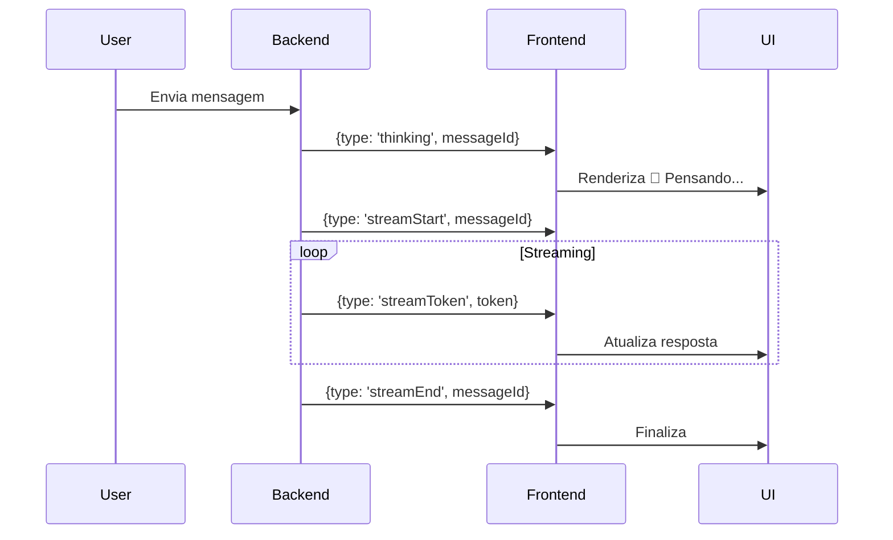

# Suporte a Reasoning/Pensamento no Chat

## 📚 O que é Reasoning?

Reasoning (ou "pensamento") é uma funcionalidade similar ao GPT-4 o1, onde o modelo de IA mostra seu processo de raciocínio antes de dar a resposta final.

## 🎯 Implementação no Cappy

### Como Funciona

1. **Backend envia evento `thinking`**:
   - Quando o backend começa a processar a mensagem
   - Antes de iniciar o streaming da resposta

2. **Adapter processa reasoning**:
   - Captura evento `thinking`
   - Cria uma `ReasoningMessagePart` 
   - Envia para assistant-ui como parte da resposta

3. **UI renderiza reasoning**:
   - Exibe em uma caixa separada com estilo diferenciado
   - Mostra ícone 🧠 para indicar processo de pensamento
   - Mantém visível junto com a resposta final

### Estrutura de Mensagem

```typescript
// Mensagem com reasoning
{
  content: [
    {
      type: 'reasoning',
      text: '🧠 Pensando...'
    },
    {
      type: 'text',
      text: 'Resposta final aqui'
    }
  ]
}
```

## 🎨 Customização do Reasoning

### Estilo Atual

```tsx
<MessagePrimitive.Parts
  components={{
    Reasoning: ({ text }) => (
      <div className="message-reasoning" style={{
        backgroundColor: '#2a2d3a',
        padding: '8px 12px',
        borderRadius: '6px',
        marginBottom: '8px',
        fontSize: '0.9em',
        fontStyle: 'italic',
        color: '#a0a0a0',
        borderLeft: '3px solid #4a90e2'
      }}>
        <span style={{ marginRight: '6px' }}>🧠</span>
        {text}
      </div>
    ),
    Text: ({ text }) => (
      <div className="message-text">{text}</div>
    )
  }}
/>
```

### Como Personalizar

Você pode modificar:
- **Cor de fundo**: `backgroundColor`
- **Bordas**: `border`, `borderRadius`
- **Ícone**: Trocar 🧠 por outro emoji ou ícone
- **Animação**: Adicionar `animation` CSS
- **Colapsável**: Envolver em `<details>` e `<summary>`

## 🔧 Modificações no Backend

Para suportar reasoning, o backend deve:

1. **Enviar evento `thinking`**:
```typescript
this._view?.webview.postMessage({ 
  type: 'thinking', 
  messageId 
})
```

2. **Antes do `streamStart`**:
```typescript
// 1. thinking
// 2. streamStart
// 3. streamToken(s)
// 4. streamEnd
```

## 📊 Fluxo de Eventos



## 💡 Exemplos de Uso

### Reasoning Simples
```
🧠 Pensando...
Vou criar o arquivo solicitado.
```

### Reasoning Detalhado
```
🧠 Analisando requisitos...
   - Verificando se arquivo existe
   - Validando caminho
   - Preparando conteúdo
```

### Reasoning com Etapas
```
🧠 Etapa 1/3: Analisando código
🧠 Etapa 2/3: Identificando problemas
🧠 Etapa 3/3: Gerando solução
```

## 🚀 Benefícios

1. **Transparência**: Usuário vê o que a IA está fazendo
2. **Confiança**: Mostra processo de raciocínio
3. **Debug**: Ajuda a entender decisões da IA
4. **UX**: Indica progresso durante processamento longo

## 📝 TODO

- [ ] Adicionar animação de "pulse" no reasoning
- [ ] Suportar múltiplos reasoning parts (etapas)
- [ ] Adicionar opção de colapsar/expandir reasoning
- [ ] Streaming progressivo do reasoning (não apenas "Pensando...")
- [ ] Tradução do texto de reasoning baseado no locale

## 🔗 Referências

- [assistant-ui Documentation](https://www.assistant-ui.com/)
- [ReasoningMessagePart Type](https://github.com/assistant-ui/assistant-ui)
- [GPT-4 o1 Reasoning](https://openai.com/index/introducing-openai-o1-preview/)
