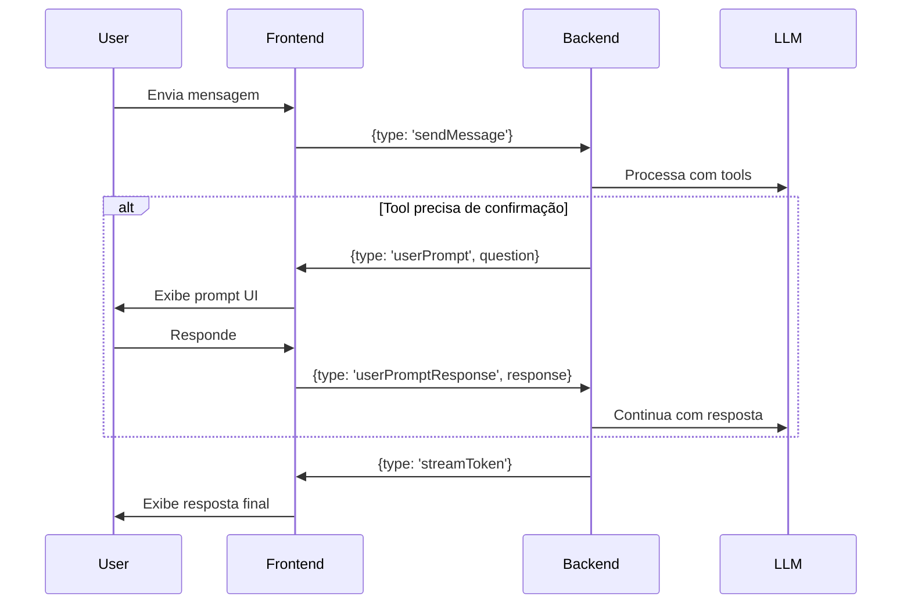

# Suporte a Perguntas ao Usuário (User Prompts)

## 🎯 O que são User Prompts?

User Prompts permitem que o **backend peça informações ao usuário** durante o processamento de uma mensagem. É como quando um tool precisa de confirmação ou informação adicional.

## 🔥 Funcionalidades da @assistant-ui/react

A biblioteca **@assistant-ui/react** tem suporte nativo para:

1. **Tool Calls Interativos**: Mostrar quando uma tool está sendo usada
2. **Confirmation Prompts**: Pedir confirmação antes de executar uma ação
3. **Input Prompts**: Solicitar informação adicional do usuário
4. **Multi-step Workflows**: Coordenar múltiplos passos com feedback

## 📦 Implementação no Cappy

### 1. Backend: Emitir Evento de Prompt

```typescript
// Em ChatViewProvider.ts ou LangGraphChatEngine.ts

// Quando precisar de input do usuário
this._view?.webview.postMessage({ 
  type: 'userPrompt',
  messageId: messageId,
  promptType: 'confirm' | 'input' | 'select',
  question: 'Deseja criar o arquivo example.ts?',
  options?: ['Sim', 'Não', 'Cancelar'] // Para select
})
```

### 2. Frontend: Processar Prompt no Adapter

```typescript
// Em ChatView.tsx - VSCodeChatAdapter

case 'userPrompt': {
  // Pause streaming
  const response = await this.promptUser(message);
  
  // Send response back to backend
  this.vscode.postMessage({
    type: 'userPromptResponse',
    messageId: message.messageId,
    response: response
  });
  break;
}

private async promptUser(prompt: {
  question: string;
  promptType: 'confirm' | 'input' | 'select';
  options?: string[];
}): Promise<string> {
  return new Promise((resolve) => {
    // Create prompt UI
    // ... render prompt in chat
    // ... wait for user interaction
    // ... resolve with user's answer
  });
}
```

### 3. UI: Componente de Prompt

```tsx
// Custom Message Component para prompts

const PromptMessage = ({ prompt }: { prompt: UserPrompt }) => {
  const [response, setResponse] = useState<string>('');
  
  return (
    <div className="message-prompt">
      <div className="prompt-question">
        ❓ {prompt.question}
      </div>
      
      {prompt.promptType === 'confirm' && (
        <div className="prompt-actions">
          <button onClick={() => handleResponse('yes')}>✅ Sim</button>
          <button onClick={() => handleResponse('no')}>❌ Não</button>
        </div>
      )}
      
      {prompt.promptType === 'input' && (
        <div className="prompt-input">
          <input
            type="text"
            value={response}
            onChange={(e) => setResponse(e.target.value)}
            placeholder="Digite sua resposta..."
          />
          <button onClick={() => handleResponse(response)}>
            Enviar
          </button>
        </div>
      )}
      
      {prompt.promptType === 'select' && (
        <div className="prompt-select">
          {prompt.options?.map(option => (
            <button key={option} onClick={() => handleResponse(option)}>
              {option}
            </button>
          ))}
        </div>
      )}
    </div>
  );
};
```

## 🎨 Exemplo de Uso

### Caso 1: Confirmação de Ação

```typescript
// Backend detecta operação perigosa
if (isDestructiveAction) {
  // Pause e pergunte ao usuário
  await askUserConfirmation(
    'Esta operação irá deletar 50 arquivos. Continuar?'
  );
}
```

### Caso 2: Input Adicional

```typescript
// Backend precisa de informação
const componentName = await askUserInput(
  'Qual o nome do componente que deseja criar?',
  'placeholder: MyComponent'
);
```

### Caso 3: Múltipla Escolha

```typescript
// Backend oferece opções
const framework = await askUserSelect(
  'Qual framework deseja usar?',
  ['React', 'Vue', 'Angular', 'Svelte']
);
```

## 🔄 Fluxo Completo



## 🛠️ Tipos TypeScript

```typescript
// Tipos para prompts

interface UserPrompt {
  messageId: string;
  question: string;
  promptType: 'confirm' | 'input' | 'select';
  options?: string[];
  defaultValue?: string;
}

interface UserPromptResponse {
  messageId: string;
  response: string;
  cancelled?: boolean;
}

// Event types
type ChatEvent = 
  | { type: 'thinking'; messageId: string; text?: string }
  | { type: 'streamStart'; messageId: string }
  | { type: 'streamToken'; messageId: string; token: string }
  | { type: 'streamEnd'; messageId: string }
  | { type: 'streamError'; messageId: string; error: string }
  | { type: 'userPrompt'; messageId: string; prompt: UserPrompt }
  | { type: 'userPromptResponse'; messageId: string; response: string };
```

## 🎯 Integração com Language Model Tools

```typescript
// Em LangGraphChatEngine.ts

// Quando tool call precisa de confirmação
if (part instanceof vscode.LanguageModelToolCallPart) {
  const toolName = part.name.replace('cappy_', '');
  
  // Check se é operação perigosa
  if (DANGEROUS_TOOLS.includes(toolName)) {
    const confirmed = await this.requestUserConfirmation(
      `A tool "${toolName}" quer executar: ${part.input}. Permitir?`
    );
    
    if (!confirmed) {
      yield `\n\n❌ Operação cancelada pelo usuário\n\n`;
      continue;
    }
  }
  
  // Execute tool
  const result = await vscode.lm.invokeTool(part.name, ...);
  yield result;
}
```

## 📊 Estados de Prompt

```typescript
type PromptState = 
  | 'pending'    // Aguardando resposta do usuário
  | 'answered'   // Usuário respondeu
  | 'cancelled'  // Usuário cancelou
  | 'timeout';   // Timeout expirou

// Timeout automático
const PROMPT_TIMEOUT = 60000; // 60 segundos

setTimeout(() => {
  if (promptState === 'pending') {
    handleTimeout();
  }
}, PROMPT_TIMEOUT);
```

## 🎨 Estilos CSS Sugeridos

```css
.message-prompt {
  background-color: #2a3f5f;
  border-left: 4px solid #4a90e2;
  padding: 16px;
  border-radius: 8px;
  margin: 12px 0;
}

.prompt-question {
  font-weight: 600;
  margin-bottom: 12px;
  color: #e0e0e0;
}

.prompt-actions {
  display: flex;
  gap: 8px;
}

.prompt-actions button {
  padding: 8px 16px;
  border: none;
  border-radius: 6px;
  cursor: pointer;
  font-weight: 500;
  transition: all 0.2s;
}

.prompt-actions button:hover {
  transform: translateY(-2px);
  box-shadow: 0 4px 8px rgba(0,0,0,0.2);
}

.prompt-input input {
  width: 100%;
  padding: 8px 12px;
  border-radius: 6px;
  border: 1px solid #4a5568;
  background-color: #1e1e1e;
  color: #e0e0e0;
  margin-bottom: 8px;
}

.prompt-select {
  display: flex;
  flex-direction: column;
  gap: 8px;
}

.prompt-select button {
  text-align: left;
  padding: 12px;
  background-color: #2d3748;
  border: 1px solid #4a5568;
  border-radius: 6px;
  color: #e0e0e0;
  cursor: pointer;
  transition: all 0.2s;
}

.prompt-select button:hover {
  background-color: #3d4758;
  border-color: #4a90e2;
}
```

## 💡 Casos de Uso Avançados

### 1. Wizard Multi-Step

```typescript
// Criar componente com múltiplas etapas
const name = await askUserInput('Nome do componente?');
const type = await askUserSelect('Tipo?', ['Class', 'Function']);
const withTests = await askUserConfirm('Incluir testes?');

// Gerar com todas as respostas
generateComponent({ name, type, withTests });
```

### 2. Validação Progressiva

```typescript
let filename = await askUserInput('Nome do arquivo?');

while (!isValidFilename(filename)) {
  filename = await askUserInput(
    'Nome inválido. Tente novamente:',
    filename
  );
}
```

### 3. Confirmação com Preview

```typescript
const changes = calculateChanges();

const confirmed = await askUserConfirm(
  `Isso irá modificar ${changes.length} arquivos:\n` +
  changes.map(c => `  - ${c.file}`).join('\n') +
  '\n\nContinuar?'
);
```

## 📝 TODO

- [ ] Implementar sistema de prompts no adapter
- [ ] Criar componentes UI para cada tipo de prompt
- [ ] Adicionar timeout automático
- [ ] Suportar prompts em tool calls
- [ ] Adicionar histórico de prompts respondidos
- [ ] Permitir cancelar prompt
- [ ] Adicionar validação de respostas
- [ ] Suportar prompts assíncronos (não-bloqueantes)

## 🔗 Referências

- [assistant-ui Tool Calling](https://www.assistant-ui.com/)
- [VS Code Language Model Tools](https://code.visualstudio.com/api/extension-guides/language-model)
- [React Suspense for Data Fetching](https://react.dev/reference/react/Suspense)
