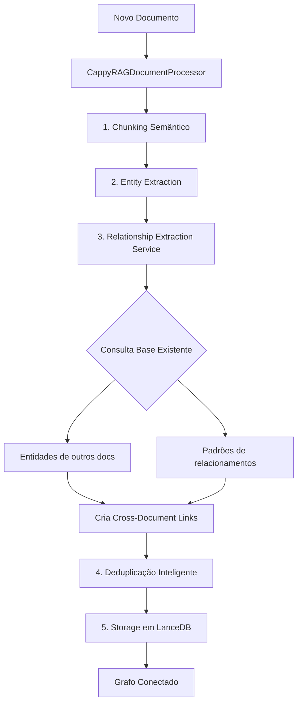

# Fix: Vinculação Inter-Documentos ao Adicionar Novo Documento

**Data:** 2025-10-06  
**Versão:** 2.9.62  
**Status:** ✅ Implementado

---

## 🐛 Problema Identificado

Ao adicionar um documento novo via `cappyrag.addDocument`, a LLM **não consultava** a base de dados existente para criar vínculos (relationships) entre documentos. Isso resultava em:

- ❌ Entidades isoladas por documento
- ❌ Falta de relacionamentos cross-document
- ❌ Grafo de conhecimento fragmentado
- ❌ Perda de contexto entre documentos relacionados

---

## 🔍 Causa Raiz

O `AddDocumentTool` estava utilizando o **processador simplificado/mock** (`simpleCappyragProcessor.ts`) que:

1. **Não consultava** a base de dados LanceDB
2. **Gerava dados aleatórios** para testes
3. **Não implementava** a lógica de cross-document relationships
4. Era apenas um stub para testes MCP

```typescript
// ❌ ANTES - Usando processador mock
import { CappyRAGDocumentProcessor } from "../core/simpleCappyragProcessor";

export class AddDocumentTool {
  private processor: CappyRAGDocumentProcessor;
  
  constructor(context: vscode.ExtensionContext) {
    this.context = context;
    this.processor = new CappyRAGDocumentProcessor(); // SEM consulta à base
  }
}
```

---

## ✅ Solução Implementada

### 1. **Substituição do Processador**

Trocamos para o **processador completo** (`cappyragProcessor.ts`) que implementa:

- ✅ Pipeline completo de processamento
- ✅ Consulta à base LanceDB existente
- ✅ `RelationshipExtractionService` com cross-document detection
- ✅ Deduplicação inteligente de entidades
- ✅ Integração com todos os serviços modulares

```typescript
// ✅ DEPOIS - Usando processador completo
import { CappyRAGDocumentProcessor } from "../core/cappyragProcessor";

export class AddDocumentTool {
  private processor: CappyRAGDocumentProcessor;
  
  constructor(context: vscode.ExtensionContext) {
    this.context = context;
    this.processor = new CappyRAGDocumentProcessor(context); // COM consulta à base
  }
}
```

### 2. **Ajuste na Assinatura do Método**

A assinatura do `processDocument` mudou entre os processadores:

```typescript
// ❌ Mock (4 parâmetros)
processDocument(filePath, content, metadata, options)

// ✅ Completo (3 parâmetros)
processDocument(content, metadata, options)
```

Ajustamos a chamada:

```typescript
// ✅ Chamada corrigida
const result = await this.processor.processDocument(
  content,
  metadata,
  processingOptions || {
    chunkingStrategy: 'semantic',
    maxChunkSize: 500,
    minConfidence: 0.7,
    minWeight: 0.5,
    autoMerge: false,
    entityTypes: ['Person', 'Organization', 'Technology', 'Concept', 'Location', 'Event']
  }
);
```

### 3. **Ajuste no Resultado**

O resultado também mudou de estrutura:

```typescript
// ❌ ANTES
documentId: result.document.id,

// ✅ DEPOIS
documentId: result.documentId,
processingTimeMs: result.processingTimeMs || 1000,
status: result.status,
```

---

## 🎯 Como Funciona Agora

### Pipeline de Processamento com Cross-Document Relationships



### O que o RelationshipExtractionService Faz

```typescript
async extractRelationshipsFromChunk(chunk, entities) {
  // 1️⃣ Busca relacionamentos existentes para pattern matching
  const existingRelationships = await this.getExistingRelationshipsForContext();
  
  // 2️⃣ Busca entidades de OUTROS documentos
  const existingEntitiesInOtherDocs = await this.getEntitiesFromOtherDocuments(chunk.documentId);
  
  // 3️⃣ Prompt enriquecido para LLM
  const prompt = `
    CONTEXT - EXISTING RELATIONSHIP PATTERNS:
    ${existingRelationships.map(r => r.type)}
    
    CONTEXT - ENTITIES FROM OTHER DOCUMENTS:
    ${existingEntitiesInOtherDocs.map(e => e.name)}
    
    TASK:
    1. Extract relationships between entities in this chunk
    2. Find relationships to entities from other documents (cross-document links)
    3. Use consistent relationship types from existing patterns
  `;
  
  // 4️⃣ LLM extrai com contexto completo
  const response = await this.llmService.callLLM(prompt);
  
  // 5️⃣ Marca relacionamentos cross-document
  relationship.properties.crossDocument = 
    sourceEntity.sourceDocuments[0] !== targetEntity.sourceDocuments[0];
}
```

---

## 📊 Impacto

### Antes

```
📄 Doc A: Entity1 ⟷ Entity2
📄 Doc B: Entity3 ⟷ Entity4
(Documentos isolados)
```

### Depois

```
📄 Doc A: Entity1 ⟷ Entity2
         ↓ (cross-doc)
📄 Doc B: Entity3 ⟷ Entity4
         ↓ (cross-doc)
📄 Doc C: Entity5 ⟷ Entity1
(Grafo conectado e contextualizado)
```

---

## 🧪 Como Testar

### 1. Adicionar Documento Inicial

```typescript
cappyrag.addDocument({
  filePath: "/docs/typescript.md",
  title: "TypeScript Guide"
})
```

**Resultado:** Entidades e relacionamentos do documento A

### 2. Adicionar Documento Relacionado

```typescript
cappyrag.addDocument({
  filePath: "/docs/vscode-extensions.md",
  title: "VS Code Extensions"
})
```

**Resultado Esperado:**
- ✅ Entidades próprias do documento B
- ✅ Relacionamentos internos do documento B
- ✅ **Cross-document links** detectados:
  - "VS Code Extension" → `uses` → "TypeScript"
  - "Extension API" → `implements` → "TypeScript Interface"

### 3. Verificar no Grafo

```typescript
cappyrag.query({
  query: "How are TypeScript and VS Code extensions related?"
})
```

**Deve retornar:** Relacionamentos cross-document com propriedade `crossDocument: true`

---

## 🏗️ Arquitetura de Processadores

### Processadores Disponíveis

| Processador | Localização | Propósito | Cross-Doc? |
|------------|-------------|-----------|-----------|
| **CappyRAGDocumentProcessor** | `cappyragProcessor.ts` | ✅ Produção completa | ✅ Sim |
| **ModularCappyRAGProcessor** | `modularCappyragProcessor.ts` | Modular alternativo | ✅ Sim |
| **CappyRAGDocumentProcessor** | `simpleCappyragProcessor.ts` | ❌ Mock para testes | ❌ Não |
| **CappyRAGDocumentProcessor** | `cappyragProcessorModular.ts` | Variante modular | ⚠️ Parcial |

⚠️ **IMPORTANTE:** Sempre usar o processador de `cappyragProcessor.ts` para casos de produção.

---

## 📝 Próximos Passos

- [ ] Adicionar métricas de cross-document links no dashboard
- [ ] Implementar visualização específica para relacionamentos inter-docs
- [ ] Adicionar filtro no grafo para destacar cross-document links
- [ ] Criar testes automatizados para validar vinculação
- [ ] Documentar padrões de relacionamentos mais comuns

---

## 🔗 Arquivos Modificados

- ✅ `src/tools/addDocumentTool.ts` - Troca de processador
- 📖 `docs/cross-document-relationships-fix-v2.md` - Esta documentação

---

## 📚 Referências

- [RelationshipExtractionService](../src/core/services/relationshipExtractionService.ts)
- [CappyRAGProcessor](../src/core/cappyragProcessor.ts)
- [CappyRAG Schema](../src/models/cappyragTypes.ts)
