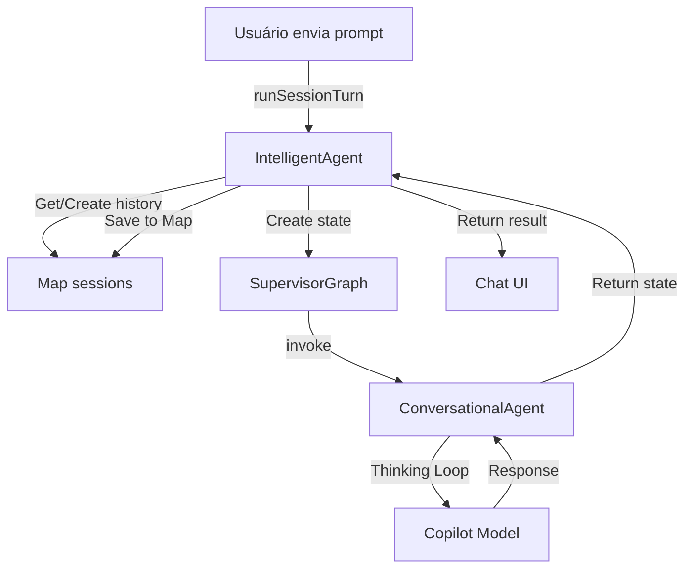

# Gerenciamento de Memória do Sistema Conversacional

## Arquitetura Atual

### Sistema de Sessões Volátil

O sistema atual utiliza uma abordagem simples baseada em `Map` para armazenar histórico de conversas:

| Componente | Responsabilidade |
|------------|------------------|
| `IntelligentAgent` | Orquestra o agente conversacional |
| `Map<string, AgentMessage[]>` | Armazena histórico de mensagens por sessão (volátil) |
| `SupervisorGraph` | Delega para agente conversacional |
| `ConversationalAgent` | Processa mensagens com thinking loop |



### Código Atual

```typescript
export class IntelligentAgent {
  private sessions: Map<string, AgentMessage[]> = new Map();

  async runSessionTurn(request: SessionTurnRequest): Promise<SessionTurnResult> {
    const { sessionId, message } = request;

    // Get or create session history
    let history = this.sessions.get(sessionId);
    if (!history) {
      history = [];
      this.sessions.set(sessionId, history);
    }

    // Add user message to history
    const userMessage: AgentMessage = {
      role: 'user',
      content: message,
      timestamp: new Date()
    };
    history.push(userMessage);

    // Process with supervisor graph...
    const result = await graph.invoke(state);

    // Add assistant response to history
    const assistantMessage: AgentMessage = {
      role: 'assistant',
      content: responseContent,
      timestamp: new Date()
    };
    history.push(assistantMessage);

    return { result, isContinuation: history.length > 2 };
  }
}
```

### Fluxo de Cada Turno

1. Usuário envia mensagem → `runSessionTurn()`
2. Recupera histórico da `Map` (ou cria novo array vazio)
3. Adiciona mensagem do usuário ao histórico
4. Supervisor delega para `ConversationalAgent`
5. Thinking loop processa com LLM
6. Adiciona resposta do assistente ao histórico
7. Salva histórico de volta na `Map`
8. Retorna resultado para VS Code chat

## ⚠️ Limitações Atuais

### 1. **Memória Volátil**
- ❌ Todo histórico é perdido ao reiniciar a extensão
- ❌ Sem persistência em disco ou banco de dados
- ❌ Sessões não sobrevivem a reloads do VS Code

### 2. **Sem Gerenciamento de Contexto**
- ❌ Histórico cresce indefinidamente (risco de estouro de contexto)
- ❌ Nenhuma estratégia de sliding window ou sumarização
- ❌ Conversas longas podem quebrar o modelo LLM

### 3. **Sem Estado Conversacional Rico**
- ❌ Apenas mensagens brutas (role + content)
- ❌ Sem tracking de entidades mencionadas
- ❌ Sem contexto de tópico ou progresso da conversa

### 4. **Falta de Mecanismo de Recuperação**
- ❌ Se um erro ocorre, o contexto pode ficar inconsistente
- ❌ Sem rollback ou checkpoint de estados seguros

## 🔄 Roadmap de Melhorias

### Fase 1: Persistência Básica (Crítico)
- [ ] Migrar para LangGraph + MemorySaver
- [ ] Implementar checkpoint SQLite
- [ ] Adicionar recuperação de sessões após reload
- [ ] Sistema de backup automático de conversas

### Fase 2: Gerenciamento de Contexto (Alta Prioridade)
- [ ] Sliding window com limite de tokens (~4000 tokens)
- [ ] Sumarização automática de histórico antigo
- [ ] Metadata de progresso conversacional
- [ ] Detecção de mudança de tópico

### Fase 3: Estado Conversacional Rico (Média Prioridade)
- [ ] Tracking de entidades (arquivos, funções, conceitos)
- [ ] Resolução de referências ("isso", "anterior", "aquele arquivo")
- [ ] Contexto de decisões tomadas na conversa
- [ ] Memória de longo prazo (aprendizados por projeto)

### Fase 4: Features Avançadas (Baixa Prioridade)
- [ ] Feedback loop (👍/👎)
- [ ] Few-shot learning adaptativo
- [ ] Análise de sentimento e tom conversacional
- [ ] Sugestões proativas baseadas em histórico

## 🎯 Próximos Passos Imediatos

### 1. Implementar LangGraph (Substitui Map)

```typescript
import { StateGraph, Annotation, MemorySaver } from '@langchain/langgraph';

const ChatState = Annotation.Root({
  messages: Annotation<AgentMessage[]>({
    reducer: (left, right) => left.concat(right),
    default: () => []
  }),
  metadata: Annotation<Record<string, unknown>>({
    reducer: (left, right) => ({ ...left, ...right }),
    default: () => ({})
  })
});

const graph = new StateGraph(ChatState)
  .addNode('conversational', runConversationalAgent)
  .addEdge('__start__', 'conversational')
  .addEdge('conversational', '__end__')
  .compile({ checkpointer: new MemorySaver() });
```

### 2. Adicionar Limite de Contexto

```typescript
function limitContextWindow(messages: AgentMessage[], maxTokens: number = 4000): AgentMessage[] {
  // Sempre manter primeira e última mensagem
  if (messages.length <= 2) return messages;
  
  // Calcular tokens aproximados (4 chars = 1 token)
  let totalTokens = 0;
  const selected: AgentMessage[] = [];
  
  // Adicionar de trás pra frente (mensagens mais recentes)
  for (let i = messages.length - 1; i >= 0; i--) {
    const msgTokens = Math.ceil(messages[i].content.length / 4);
    if (totalTokens + msgTokens > maxTokens && selected.length > 2) break;
    selected.unshift(messages[i]);
    totalTokens += msgTokens;
  }
  
  return selected;
}
```

### 3. Adicionar Metadata Conversacional

```typescript
interface ConversationMetadata {
  lastTopic?: string;
  mentionedFiles: string[];
  mentionedEntities: string[];
  conversationStage: 'greeting' | 'discussing' | 'planning' | 'executing' | 'closing';
  taskContext?: string;
}
```

## 📚 Referências

- [VS Code Language Model API](https://code.visualstudio.com/api/extension-guides/language-model)
- [@langchain/langgraph](https://github.com/langchain-ai/langgraph) (para migração futura)
- [Token Management Best Practices](https://platform.openai.com/docs/guides/text-generation)
