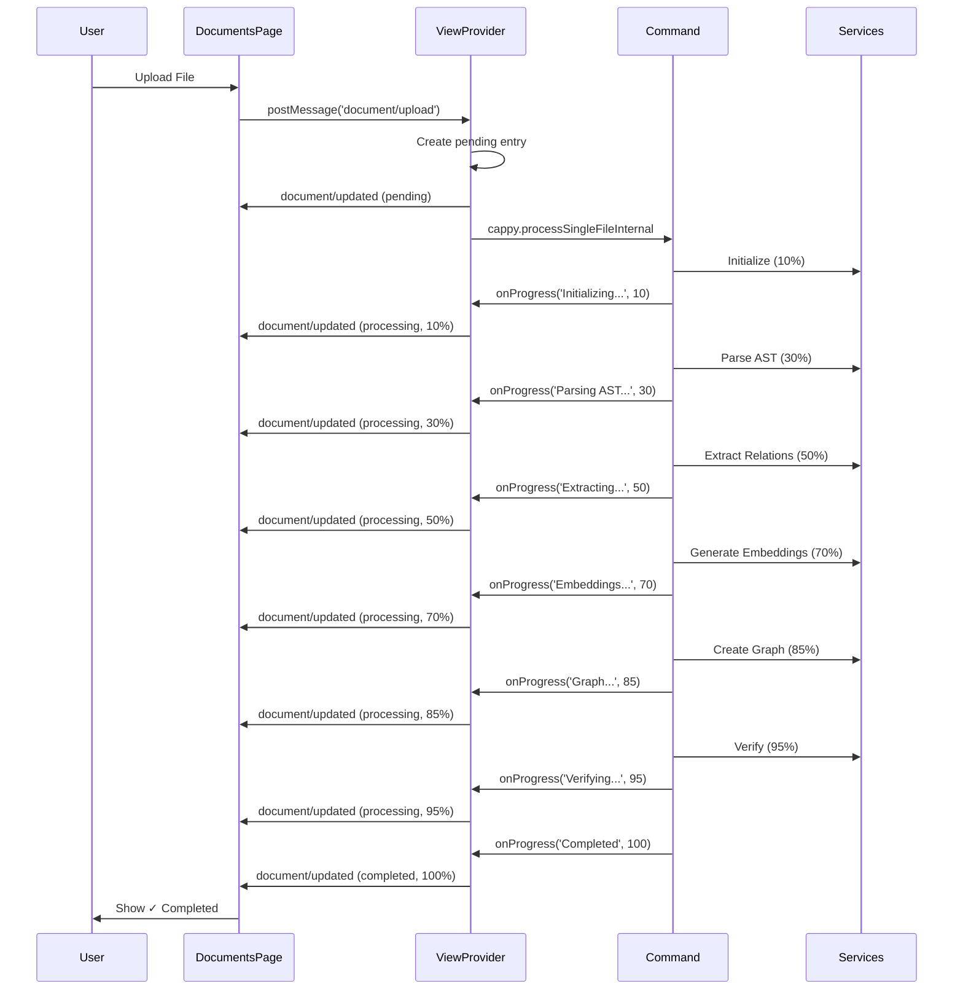

# ✨ Sistema de Processamento com Feedback Visual em Tempo Real

## 🎯 Implementações Realizadas

### 1. **Página Documents com Feedback Visual**

**Arquivo**: `src/components/pages/DocumentsPage.tsx`

#### ✅ Recursos Implementados:

**Cores do VS Code**:
- ✅ Usa variáveis CSS nativas do VS Code (`--vscode-*`)
- ✅ `completed`: Verde (`--vscode-testing-iconPassed`)
- ✅ `processing`: Azul (`--vscode-progressBar-background`)
- ✅ `failed`: Vermelho (`--vscode-testing-iconFailed`)
- ✅ `pending`: Amarelo (`--vscode-list-warningForeground`)
- ✅ `preprocessed`: Azul claro (`--vscode-charts-blue`)

**Spinner Animado**:
- ✅ Componente `Spinner` com animação CSS nativa
- ✅ Aparece automaticamente em status `processing` e `pending`
- ✅ Tamanho configurável (padrão: 14px na tabela)

**Feedback em Tempo Real**:
- ✅ Listener de mensagens do extension host
- ✅ Atualização automática ao receber `document/updated`
- ✅ Suporte para adicionar/remover/limpar documentos
- ✅ Estado sincronizado entre webview e extensão

**Informações de Progresso**:
- ✅ `currentStep`: Mostra passo atual (ex: "Parsing AST...", "Generating embeddings...")
- ✅ `progress`: Percentual de conclusão (0-100%)
- ✅ Exibido no tooltip ao passar o mouse
- ✅ Status visual na segunda linha do status

**Estrutura Visual**:
```tsx
// Status: Processing
┌─────────────────────────┐
│ [Spinner] Processing    │
│ Parsing AST...          │
└─────────────────────────┘

// Status: Completed
┌─────────────────────────┐
│ ✓ Completed             │
└─────────────────────────┘
```

### 2. **DocumentsViewProvider**

**Arquivo**: `src/adapters/primary/vscode/documents/DocumentsViewProvider.ts`

#### Funcionalidades:

**Gerenciamento de Estado**:
- ✅ `Map<string, DocumentItem>` para armazenar documentos
- ✅ `updateDocument()`: Adiciona ou atualiza documento
- ✅ `removeDocument()`: Remove documento específico
- ✅ `clearDocuments()`: Limpa todos

**Processamento de Arquivos**:
- ✅ `handleUpload()`: Abre dialog de seleção
- ✅ `processFile()`: Processa arquivo com feedback progressivo
- ✅ Cria entrada inicial com status `pending`
- ✅ Atualiza status para `processing` com steps
- ✅ Finaliza com status `completed` ou `failed`

**Comunicação Bidirecional**:
```typescript
// Extension → WebView
webview.postMessage({
  type: 'document/updated',
  payload: { document }
});

// WebView → Extension
webview.onDidReceiveMessage(async (data) => {
  switch (data.type) {
    case 'document/upload': ...
    case 'document/scan': ...
  }
});
```

**Integração com Comando**:
- ✅ Chama `cappy.processSingleFileInternal` com callback
- ✅ Recebe atualizações de progresso em tempo real
- ✅ Propaga atualizações para a webview

### 3. **Comando de Processamento Refatorado**

**Arquivo**: `src/commands/process-single-file.ts`

#### Dois Comandos:

**1. `cappy.processSingleFile` (Público)**:
- Dialog de seleção de arquivo
- Progress notification do VS Code
- Mensagem de sucesso/erro

**2. `cappy.processSingleFileInternal` (Programático)**:
- Aceita `filePath` e callback `onProgress`
- Usado pelo DocumentsViewProvider
- Retorna controle fino do progresso

**Steps de Progresso**:
1. **10%**: Initializing services...
2. **30%**: Parsing AST...
3. **50%**: Extracting relationships...
4. **70%**: Generating embeddings...
5. **85%**: Creating graph relationships...
6. **95%**: Verifying indexing...
7. **100%**: Completed

**Callback Signature**:
```typescript
type ProgressCallback = (step: string, progress: number) => void;

onProgress?.('Parsing AST...', 30);
```

### 4. **Fluxo Completo de Processamento**



## 🎨 Estilos e Cores

### CSS do VS Code

As cores se adaptam automaticamente ao tema ativo:

```css
/* Completed - Verde */
color: var(--vscode-testing-iconPassed, #73c991);

/* Processing - Azul */
color: var(--vscode-progressBar-background, #0e70c0);

/* Failed - Vermelho */
color: var(--vscode-testing-iconFailed, #f14c4c);

/* Pending - Amarelo */
color: var(--vscode-list-warningForeground, #cca700);

/* Preprocessed - Azul Claro */
color: var(--vscode-charts-blue, #75beff);
```

### Animações

**Spinner**:
```tsx
<svg className="animate-spin" ...>
  <circle className="opacity-25" ... />
  <path className="opacity-75" ... />
</svg>
```

**Processing Button (Pulse)**:
```tsx
className={`${stats.processing > 0 ? 'animate-pulse' : ''}`}
```

## 📋 Estrutura de Dados

### DocumentItem

```typescript
interface DocumentItem {
  id: string;                    // doc-{timestamp}-{random}
  fileName: string;              // README.md
  filePath: string;              // /path/to/file
  summary: string;               // Descrição ou preview
  status: DocumentStatus;        // completed | processing | pending | failed
  length: number;                // Tamanho em bytes
  chunks: number;                // Quantidade de chunks
  created: string;               // '16/10/2025, 16:03:28'
  updated: string;               // '16/10/2025, 16:05:34'
  trackId?: string;              // process_1697472208000
  processingStartTime?: string;  // Início do processamento
  processingEndTime?: string;    // Fim do processamento
  currentStep?: string;          // 'Parsing AST...'
  progress?: number;             // 0-100
}
```

## 🧪 Como Testar

### Passo 1: Recarregar VS Code
```
Ctrl+Shift+P → Developer: Reload Window
```

### Passo 2: Teste pelo Comando
```
Ctrl+Shift+P → Cappy: Process Single File (Test)
→ Selecionar: test-sample-simple.ts
→ Observar: Progress notification + Debug Console
```

### Passo 3: Teste pela Interface (Futuro)
```
1. Abrir Cappy Sidebar
2. Ir para aba Documents
3. Clicar em "Upload"
4. Selecionar arquivo
5. Observar:
   - Spinner girando
   - Status mudando
   - CurrentStep atualizando
   - Progress aumentando
   - Status final: ✓ Completed
```

## 📊 Estados Visuais

| Status | Ícone | Cor | Animação | Info |
|--------|-------|-----|----------|------|
| **Pending** | 🔄 | Amarelo | Spinner | "Queued" |
| **Processing** | 🔄 | Azul | Spinner + Pulse | Step + % |
| **Completed** | ✅ | Verde | - | Timestamps |
| **Failed** | ❌ | Vermelho | - | Error msg |
| **Preprocessed** | 📋 | Azul claro | - | Ready |

## 🔧 Próximos Passos

1. **Registrar DocumentsViewProvider** no `extension.ts`
2. **Adicionar view "Documents"** no `package.json`
3. **Integrar com workspace scanner** para processar múltiplos arquivos
4. **Adicionar barra de progresso visual** na tabela
5. **Implementar filtros avançados** (por data, tamanho, tipo)
6. **Adicionar ações em lote** (processar selecionados, deletar, etc)

## ✨ Destaques Técnicos

### Performance
- ✅ Usa `Map` para acesso O(1)
- ✅ Memo hooks (`useMemo`) para evitar re-renders
- ✅ Event listeners cleanup no `useEffect`

### UX
- ✅ Feedback visual imediato
- ✅ Cores do tema nativo do VS Code
- ✅ Tooltips informativos
- ✅ Animações suaves
- ✅ Estados claros e distinguíveis

### Arquitetura
- ✅ Separação clara: View → Provider → Command → Services
- ✅ Comunicação bidirecional type-safe
- ✅ Callbacks para progresso
- ✅ Comandos públicos e internos separados

