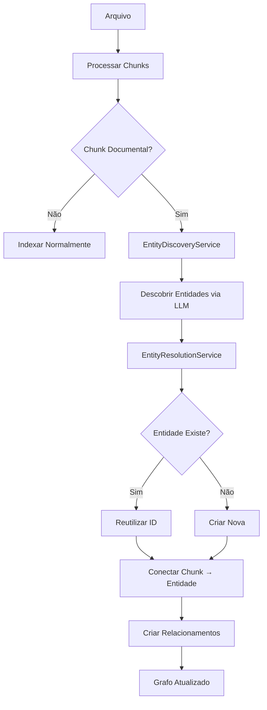

# Implementação: Entity Discovery & Resolution System

## ✅ Status: COMPLETO

Data: 2025-10-23

## 📋 Resumo

Sistema de descoberta e resolução incremental de entidades foi implementado com sucesso, seguindo a arquitetura LightRAG. O sistema agora processa entidades e relacionamentos semânticos durante a indexação de cada arquivo, eliminando a necessidade de fases separadas de processamento.

## 🎯 Problema Resolvido

### Antes
- **Problema**: Indexação em duas fases (processar arquivos → rodar indexador global)
- **Resultado**: Grafo "raso" com apenas relacionamentos sintáticos (imports)
- **Limitação**: Difícil capturar conceitos e relacionamentos semânticos

### Depois
- **Solução**: Descoberta e resolução incremental durante indexação
- **Resultado**: Grafo rico com entidades conceituais e relacionamentos semânticos
- **Benefício**: Processamento arquivo por arquivo, sempre atualizado

## 📦 Arquivos Criados

### 1. EntityResolutionService
**Arquivo**: `src/services/entity-discovery/core/entity-resolution-service.ts`

Responsável por:
- Normalizar nomes de entidades
- Buscar entidades similares no grafo
- Resolver duplicatas
- Criar ou reutilizar entidades
- Conectar relacionamentos

### 2. VSCodeLLMProvider
**Arquivo**: `src/services/entity-discovery/providers/VSCodeLLMProvider.ts`

Adapter que:
- Implementa interface `LLMProvider`
- Usa VS Code Language Model API (Copilot)
- Fornece geração de texto para descoberta de entidades

### 3. Documentação
**Arquivo**: `docs/features/ENTITY_DISCOVERY_RESOLUTION.md`

Documentação completa incluindo:
- Visão geral do sistema
- Fluxo de processamento
- Exemplos de uso
- Schema do banco de dados
- Troubleshooting

### 4. Exemplo de Teste
**Arquivo**: `test/examples/entity-discovery-example.ts`

Exemplos práticos de:
- Descoberta de entidades
- Resolução e normalização
- Criação de relacionamentos

## 🔧 Arquivos Modificados

### 1. GraphStorePort (Interface)
**Arquivo**: `src/domains/dashboard/ports/indexing-port.ts`

**Métodos adicionados**:
```typescript
createEntity(entity): Promise<string>
findEntityByNameAndType(name, type): Promise<{id: string} | null>
linkChunkToEntity(chunkId, entityId): Promise<void>
createRelationship(rel): Promise<void>
```

### 2. SQLiteAdapter (Implementação)
**Arquivo**: `src/adapters/secondary/graph/sqlite-adapter.ts`

**Implementações adicionadas**:
- Todos os 4 métodos do `GraphStorePort`
- Utiliza schema existente (campos `discovered_type`, `discovered_properties`)
- Suporta busca e normalização de entidades

### 3. IndexingService
**Arquivo**: `src/services/indexing-service.ts`

**Mudanças**:
- Adicionado parâmetro `llmProvider` ao construtor
- Adicionado método `discoverAndResolveEntities()`
- Adicionado método `shouldDiscoverEntities()`
- Integração com `EntityDiscoveryService` e `EntityResolutionService`
- Descoberta incremental durante `indexFile()`

### 4. Extension (Ponto de Entrada)
**Arquivo**: `src/extension.ts`

**Mudanças**:
- Inicialização do `VSCodeLLMProvider`
- Passagem do `llmProvider` ao `IndexingService`
- Logging de status de inicialização

### 5. Comandos e Adaptadores
**Arquivos atualizados**:
- `src/commands/process-single-file.ts`
- `src/commands/debug-retrieval.ts`
- `src/adapters/primary/vscode/commands/scan-workspace.ts`
- `src/adapters/primary/vscode/graph/IndexingInitializer.ts`
- `test/services/file-upload-to-graph.test.ts`

**Mudança**: Todos agora aceitam parâmetro opcional `llmProvider`

### 6. Entity Discovery Index
**Arquivo**: `src/services/entity-discovery/index.ts`

**Mudanças**:
- Exporta `EntityResolutionService`
- Exporta `VSCodeLLMProvider`

## 🔄 Fluxo de Processamento



## 📊 Schema do Banco de Dados

### Campos Utilizados (já existentes)

**Tabela `nodes`**:
```sql
discovered_type TEXT           -- Tipo descoberto pela LLM
discovered_properties TEXT     -- Propriedades em JSON
entity_confidence REAL         -- Confiança da descoberta
```

**Tabela `edges`**:
```sql
discovered_relationship_type TEXT  -- Tipo do relacionamento
semantic_context TEXT              -- Contexto semântico
relationship_confidence REAL       -- Confiança
```

## 🧪 Testando

### Teste Manual

1. Abra um workspace no VS Code
2. Adicione um arquivo com JSDoc rico:
```javascript
/**
 * PaymentProcessor handles payment transactions using Stripe API.
 * It depends on OrderRepository for order data and EmailService for notifications.
 */
class PaymentProcessor {
  // ...
}
```
3. Execute "Cappy: Scan Workspace"
4. Verifique o grafo no painel Graph

### Teste Programático

```bash
npm test test/examples/entity-discovery-example.ts
```

## 📈 Melhorias Futuras

1. **Dual-Level Retrieval**
   - Busca combinada: chunks + entidades
   - Ranking baseado em relevância semântica

2. **Entity-Aware Chunking**
   - Chunks que respeitam fronteiras de entidades
   - Melhor contexto para descoberta

3. **Schema Evolution**
   - Ajustar schema dinamicamente
   - Aprender tipos de entidades com uso

4. **Visualização**
   - Mostrar entidades descobertas no Graph Panel
   - Highlight de relacionamentos semânticos

5. **Performance**
   - Cache de entidades descobertas
   - Batch processing de múltiplos chunks
   - Rate limiting de LLM calls

## 🎓 Referências

- **LightRAG**: Sistema de RAG com descoberta incremental de entidades
- **VS Code Language Model API**: API nativa para acesso a LLMs
- **Entity Resolution**: Técnicas de normalização e deduplicação

## ✅ Checklist de Implementação

- [x] Criar `EntityResolutionService`
- [x] Criar `VSCodeLLMProvider`
- [x] Adicionar métodos ao `GraphStorePort`
- [x] Implementar métodos no `SQLiteAdapter`
- [x] Integrar no `IndexingService`
- [x] Atualizar `extension.ts`
- [x] Atualizar comandos e adaptadores
- [x] Criar documentação
- [x] Criar exemplos de teste
- [x] Validar erros de compilação

## 🚀 Como Usar

### Para Usuários

Nada muda! O sistema funciona automaticamente:
1. Abra um workspace
2. Execute "Cappy: Scan Workspace"
3. O sistema descobre entidades automaticamente

### Para Desenvolvedores

```typescript
import { 
  EntityDiscoveryService, 
  EntityResolutionService,
  VSCodeLLMProvider 
} from './services/entity-discovery';

// Inicializar
const llmProvider = new VSCodeLLMProvider();
await llmProvider.initialize();

const discovery = new EntityDiscoveryService(llmProvider);
const resolution = new EntityResolutionService(graphStore);

// Descobrir entidades
const result = await discovery.discoverEntities(content, options);

// Resolver cada entidade
for (const entity of result.entities) {
  const entityId = await resolution.resolveOrCreateEntity(entity);
  await graphStore.linkChunkToEntity(chunkId, entityId);
}
```

## 🎉 Conclusão

Sistema implementado com sucesso! Agora o Cappy pode:
- ✅ Descobrir entidades semânticas de documentação
- ✅ Resolver e normalizar entidades automaticamente
- ✅ Criar relacionamentos conceituais
- ✅ Manter grafo sempre atualizado incrementalmente
- ✅ Funcionar sem quebrar código existente (retrocompatível)

A arquitetura está preparada para evoluir para um sistema completo estilo LightRAG, com busca dual-level e chunking entity-aware.
