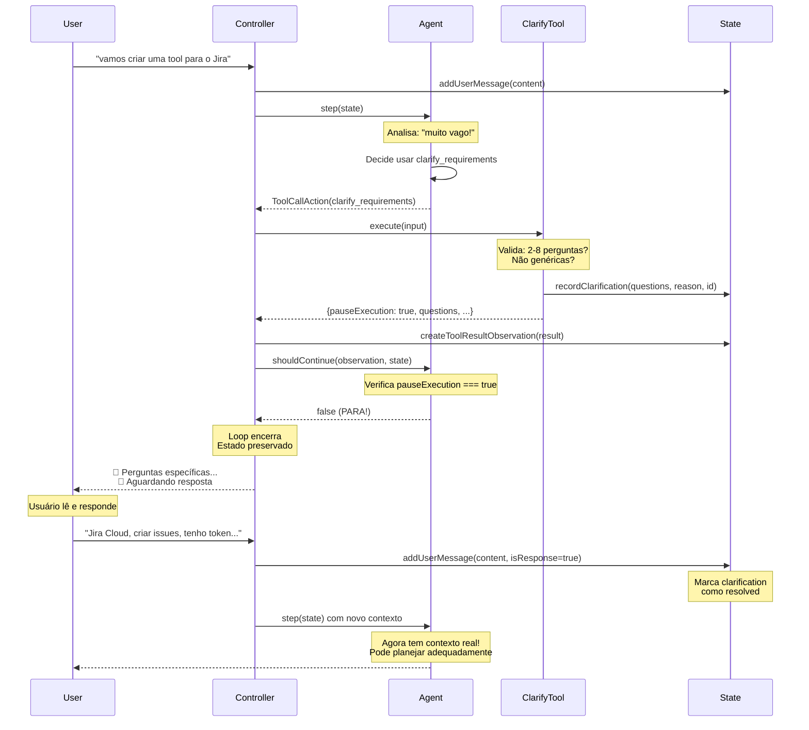

# Fix: Agente Investigativo vs. Gerador de Planos Genéricos

## 🎯 Problema Identificado

O `@cappyplan` estava agindo como um **gerador automático de planos genéricos** em vez de um **assistente de planejamento investigativo**:

❌ **Comportamento Anterior:**
1. Recebe requisição vaga ("crie uma tool para o Jira")
2. Gera plano genérico imediatamente
3. Faz UMA pergunta no final (tarde demais)
4. Não investiga, não critica, não dirige
5. **Não pausava a execução** - continuava o loop mesmo esperando resposta

✅ **Comportamento Novo:**
1. Recebe requisição vaga
2. **PARA e INVESTIGA** - usa `clarify_requirements` tool
3. Faz 3-5 perguntas específicas (validadas)
4. Sugere alternativas e valida premissas
5. **PAUSA EXECUÇÃO DE VERDADE** - aguarda resposta do usuário
6. **SÓ PLANEJA** depois de ter contexto real

---

## 🔧 Mudanças Implementadas

### 1. Nova Tool: `ClarifyRequirementsTool`

**Arquivo:** `src/nivel2/infrastructure/agents/codeact/tools/clarify-tool.ts`

**Propósito:** Forçar o agente a ser proativo e investigativo.

**Funcionalidades:**
- ✅ Permite fazer perguntas específicas ao usuário
- ✅ Explica POR QUE as perguntas são necessárias
- ✅ Sugere abordagens alternativas
- ✅ Lista premissas que precisam ser validadas
- ✅ **PAUSA a execução de verdade** (retorna `pauseExecution: true`)
- ✅ **Valida qualidade das perguntas** (2-8 perguntas, não genéricas)
- ✅ **Contém exemplos concretos** na description

**Exemplo de uso:**
```typescript
{
  "questions": [
    "Essa tool vai fazer parte do Cappy ou ser standalone?",
    "Você quer criar/editar issues, buscar informações, ou ambos?",
    "Tem acesso ao Jira Cloud ou Server? Qual a URL?",
    "Já tem API token configurado?"
  ],
  "reason": "Preciso entender a integração e autenticação antes de planejar a arquitetura",
  "assumptions_to_verify": [
    "Tool integrada no cappy-agent.ts",
    "Jira Cloud com API token"
  ],
  "alternative_approaches": [
    "Sincronizar issues para o knowledge graph (mais rápido, menos API calls)",
    "Webhooks para atualização automática"
  ]
}
```

**Validações implementadas:**
```typescript
// Quantidade: entre 2 e 8 perguntas
if (questions.length < 2) {
  return error('You must ask at least 2 questions')
}
if (questions.length > 8) {
  return error('Too many questions. Ask 2-5 focused questions.')
}

// Qualidade: não aceita perguntas genéricas
const genericPatterns = [
  'what do you want', 'tell me more', 'any preferences', 
  'anything else', 'more details', 'what exactly'
]
if (hasGenericQuestion) {
  return error('Ask SPECIFIC questions, not generic ones')
}
```

**Retorno com pausa:**
```typescript
return this.success({
  message,
  questions,
  reason,
  assumptions,
  alternatives,
  status: 'awaiting_user_response',
  pauseExecution: true  // ← CRÍTICO: Sinaliza pausa real
})
```

---

### 2. Lógica de Pausa Real no `CappyAgent.shouldContinue()`

**Arquivo:** `src/nivel2/infrastructure/agents/codeact/cappy-agent.ts`

**O que foi implementado:**
```typescript
shouldContinue(observation: AnyObservation, state: State): boolean {
  // 1. Check if finish tool was called
  if (observation.observation === 'tool_result') {
    const result = observation as ToolResultObservation
    
    if (result.toolName === 'finish') {
      return false  // Stop after finish
    }
    
    // 🛑 CRITICAL: Check if tool requested pause
    if (typeof result.result === 'object' && result.result !== null) {
      const resultObj = result.result as Record<string, unknown>
      if (resultObj.pauseExecution === true) {
        console.log(`Tool '${result.toolName}' requested pause - stopping`)
        return false  // ← PARA O LOOP DE VERDADE
      }
    }
  }
  // ... resto da lógica
}
```

**Por que isso funciona:**
- `AgentController.run()` chama `agent.shouldContinue(observation, state)`
- Se retornar `false`, o loop para imediatamente
- Estado fica preservado até próxima mensagem do usuário
- Quando usuário responde, controller reconecta o contexto

---

### 3. Tracking de Clarifications no State

**Arquivo:** `src/nivel2/infrastructure/agents/codeact/core/state.ts`

**Nova interface:**
```typescript
export interface ClarificationRecord {
  id: string
  questions: string[]
  reason: string
  assumptions?: string[]
  alternatives?: string[]
  userResponses?: string[]
  timestamp: number
  resolved: boolean
}
```

**Novos métodos:**
```typescript
class State {
  private clarificationHistory: ClarificationRecord[] = []
  
  // Registrar clarification quando tool é executada
  recordClarification(
    questions: string[], 
    reason: string, 
    id: string,
    assumptions?: string[], 
    alternatives?: string[]
  ): ClarificationRecord
  
  // Adicionar respostas do usuário
  addClarificationResponses(id: string, responses: string[]): boolean
  
  // Buscar última clarification não resolvida
  getLastUnresolvedClarification(): ClarificationRecord | null
  
  // Obter todas para contexto
  getAllClarifications(): ClarificationRecord[]
  getResolvedClarifications(): ClarificationRecord[]
}
```

---

### 4. Integração no AgentController

**Arquivo:** `src/nivel2/infrastructure/agents/codeact/agent-controller.ts`

**A) Registrar clarification quando tool executa:**
```typescript
private async executeAction(action: AnyAction): Promise<AnyObservation> {
  if (action.action === 'tool_call') {
    const result = await tool.execute(toolCall.input)
    
    // 🔍 Track clarification requests
    if (toolCall.toolName === 'clarify_requirements' && result.success) {
      const resultObj = result.result as Record<string, unknown>
      this.state.recordClarification(
        resultObj.questions as string[],
        resultObj.reason as string,
        toolCall.callId,
        resultObj.assumptions as string[] | undefined,
        resultObj.alternatives as string[] | undefined
      )
    }
  }
}
```

**B) Reconectar contexto quando usuário responde:**
```typescript
addUserMessage(content: string, isResponseToClarification = false): void {
  const action = createMessageAction(content, 'user')
  
  if (isResponseToClarification) {
    const lastClarification = this.state.getLastUnresolvedClarification()
    if (lastClarification) {
      // Marcar como resolvida
      this.state.addClarificationResponses(lastClarification.id, [content])
      
      // Adicionar metadata para contexto
      action.metadata = {
        respondsTo: lastClarification.id,
        type: 'clarification_response',
        originalQuestions: lastClarification.questions
      }
    }
  }
  
  this.state.addEvent(action)
}
```

**C) Metadata opcional em Actions:**
```typescript
// src/nivel2/infrastructure/agents/codeact/core/actions.ts
export interface Action {
  type: 'action'
  action: string
  timestamp: number
  source: 'user' | 'assistant'
  metadata?: Record<string, unknown>  // ← Novo campo
}
```

---

### 2. System Prompt Atualizado

**Arquivo:** `src/nivel2/infrastructure/agents/codeact/cappy-agent.ts`

**Mudanças principais:**

#### a) Seção CRITICAL_INVESTIGATIVE_BEHAVIOR
```
⚠️ NEVER generate generic plans when context is unclear!

WHEN USER REQUEST IS VAGUE OR AMBIGUOUS:
1. 🛑 STOP - Do NOT generate a plan yet
2. 🤔 INVESTIGATE - Use clarify_requirements tool
3. ⏸️ PAUSE - Wait for user response
4. ✅ PLAN - Only after you have real context
```

#### b) Exemplos de Requisições Vagas
```
- "create a tool for X" → Ask: operations, auth, integration
- "add feature Y" → Ask: where, behavior, edge cases
- "fix the bug" → Ask: which bug, where, expected behavior
```

#### c) O Que Investigar
- Technical details (APIs, auth, formats, protocols)
- Integration points (where does this fit?)
- Use cases (what problem does this solve?)
- Constraints (performance, compatibility, security)
- Better alternatives (is there a simpler/better way?)

---

### 3. Plan Mode Prompt Reforçado

**Antes:**
```
1. If unclear → Ask ONE question → Call finish
2. If clear → Provide plan → Call finish
```

**Depois:**
```
1. **Analyze Request**
   - Is clear? → Proceed
   - Is vague? → Go to 1.1
   
1.1. **INVESTIGATE (Use clarify_requirements)**
   - Missing details?
   - Assumptions to validate?
   - Better approaches?
   - ASK 3-5 questions → STOP
   
2. **Create Plan (ONLY after clear)**
```

---

## 📋 Fluxo Completo Implementado

### Cenário: User pede "vamos criar uma tool para o Jira"



---

## 🧪 Como Testar

### Teste 1: Requisição Vaga (Deve Investigar)

**Input:**
```
@cappyplan vamos criar uma tool para o Jira
```

**Comportamento Esperado:**
```
🤔 Preciso entender melhor antes de planejar

Por que estou perguntando: Jira é uma integração complexa 
e a arquitetura depende muito do use case específico.

Perguntas específicas:
1. Essa tool vai fazer parte do Cappy ou ser standalone?
2. Você quer criar/editar issues, buscar informações, ou ambos?
3. Tem acesso ao Jira Cloud ou Server? Qual a URL?
4. Já tem API token configurado?
5. Qual o use case principal? (ex: criar issues de bugs, 
   sincronizar tasks, etc.)

Abordagens alternativas para considerar:
1. Sincronizar issues importantes para o knowledge graph 
   (mais rápido, menos API calls)
2. Usar webhooks para atualização automática

📌 Aguardando suas respostas para criar um plano adequado...
```

### Teste 2: Requisição Clara (Pode Planejar Direto)

**Input:**
```
@cappyplan adicionar validação JWT no endpoint /api/login 
usando a biblioteca jsonwebtoken, com secret armazenado 
em variável de ambiente JWT_SECRET
```

**Comportamento Esperado:**
```
## Context Summary
Requisição clara com todos os detalhes técnicos necessários.

## Plan
1. Instalar jsonwebtoken: npm install jsonwebtoken @types/jsonwebtoken
2. Criar middleware de validação em src/middlewares/auth.ts
3. Adicionar validação ao endpoint /api/login
...
```

### Teste 3: Requisição com Melhor Abordagem

**Input:**
```
@cappyplan criar um sistema de cache em memória para 
as queries do banco
```

**Comportamento Esperado (Crítica + Investigação):**
```
🤔 Preciso entender melhor antes de planejar

Por que estou perguntando: Cache em memória pode causar 
problemas em ambientes com múltiplas instâncias.

Perguntas:
1. Qual o volume de dados esperado?
2. Aplicação roda em múltiplas instâncias?
3. Qual a tolerância a dados stale?
4. Já considerou Redis ou Memcached?

Abordagens alternativas:
1. Redis (distribuído, persistente, mais robusto)
2. Query result caching no ORM (mais simples)
3. HTTP caching headers (sem código extra)

📌 Aguardando resposta...
```

---

## 📊 Comparação Antes vs. Depois

| Aspecto | Antes ❌ | Depois ✅ |
|---------|---------|-----------|
| **Requisição vaga** | Gera plano genérico | Investiga primeiro |
| **Perguntas** | 1 no final (opcional) | 3-5 antes de planejar |
| **Alternativas** | Não sugere | Sugere melhores abordagens |
| **Premissas** | Assume silenciosamente | Valida explicitamente |
| **Controle** | Passivo | Ativo e crítico |
| **Timing** | Pergunta tarde demais | Pergunta no momento certo |

---

## 🚀 Próximos Passos

1. **Testar em casos reais** com o `@cappyplan`
2. **Coletar feedback** sobre qualidade das perguntas
3. **Ajustar prompt** se necessário baseado no comportamento
4. **Documentar padrões** de boas perguntas investigativas

---

## 💡 Insights

### Por Que Isso Funciona?

1. **Tool Dedicada:** `clarify_requirements` é uma ferramenta específica, não apenas um prompt genérico
2. **Pausar Execução DE VERDADE:** A tool retorna `pauseExecution: true` e `shouldContinue()` verifica isso
3. **Validação Rigorosa:** 2-8 perguntas específicas, não genéricas
4. **Exemplos Concretos:** System prompt e tool description têm exemplos claros
5. **Priorização:** Tool aparece logo após `think` na lista de ferramentas
6. **Reforço Múltiplo:** Tanto SYSTEM_PROMPT quanto PLAN_MODE_PROMPT reforçam o comportamento
7. **Context Tracking:** Estado preserva histórico de clarifications para reconexão
8. **Metadata Linking:** Actions podem ter metadata para linkar respostas a perguntas

### Possíveis Melhorias Futuras

1. **Score de Clareza:** Tool que analisa e dá um score de 0-100 de quão clara é a requisição
2. **Templates de Perguntas:** Base de conhecimento de perguntas comuns por tipo de tarefa
3. **Context Auto-Retrieval:** Buscar contexto relacionado ANTES de perguntar (pode responder sozinho)
4. **Learning Loop:** Registrar quais perguntas levaram aos melhores planos
5. **Multi-turn Clarification:** Permitir múltiplos rounds de perguntas se necessário
6. **Auto-detect Vagueness:** Analisar requisição e decidir automaticamente se precisa clarificar

---

## 🎓 Lições Aprendidas

> "O problema não estava na arquitetura técnica do agente, mas no seu comportamento e senso crítico. 
> Adicionar uma tool + validação rigorosa + pausa real + tracking de contexto foi suficiente para 
> transformar um gerador passivo em um investigador ativo."

**Principais takeaways:**
- Agents precisam de **ferramentas comportamentais**, não apenas técnicas
- **Prompt engineering** é tão importante quanto a arquitetura
- **Exemplos concretos** no prompt funcionam melhor que regras abstratas
- **Pausar para perguntar** é melhor que **agir e errar**
- **Validação rigorosa** previne perguntas genéricas inúteis
- **Context tracking** permite reconectar conversas de forma inteligente
- **Pausa precisa ser real** - verificar `pauseExecution` no `shouldContinue()`

---

## 🔍 Checklist de Implementação Completa

- [x] **ClarifyRequirementsTool criada**
  - [x] Parâmetros: questions, reason, assumptions, alternatives
  - [x] Validação: 2-8 perguntas, não genéricas
  - [x] Retorna: pauseExecution: true
  - [x] Exemplos concretos na description
  
- [x] **Lógica de pausa implementada**
  - [x] shouldContinue() verifica pauseExecution
  - [x] Chama state.waitForUser() para marcar status
  - [x] Retorna false para parar o loop
  - [x] Log de debug detalhado para tracking
  
- [x] **Tracking de clarifications**
  - [x] ClarificationRecord interface
  - [x] State.recordClarification()
  - [x] State.addClarificationResponses()
  - [x] State.getLastUnresolvedClarification()
  - [x] State.isWaitingForClarification() ⭐ NOVO
  - [x] State.getClarificationContext() ⭐ NOVO
  - [x] State.resumeExecution() ⭐ NOVO
  
- [x] **Integração no Controller**
  - [x] executeAction() registra clarifications
  - [x] addUserMessage() reconecta contexto
  - [x] Metadata em Actions para linking
  - [x] Logs detalhados com emoji (⏸️ ✅) ⭐ NOVO
  - [x] resumeExecution() chamado quando user responde ⭐ NOVO
  
- [x] **System Prompt atualizado**
  - [x] Seção CRITICAL_INVESTIGATIVE_BEHAVIOR expandida ⭐ NOVO
  - [x] 5 exemplos completos BAD vs GOOD ⭐ NOVO
  - [x] Triggers específicos listados ⭐ NOVO
  - [x] Instruções pós-clarificação ⭐ NOVO
  
- [x] **Contexto de clarifications no prompt** ⭐ NOVO
  - [x] buildMessages() injeta getClarificationContext()
  - [x] LLM vê perguntas e respostas anteriores
  - [x] Contexto adicionado ao system prompt
  
- [x] **Plan Mode Prompt reforçado**
  - [x] Fluxo claro de análise e investigação
  - [x] Exemplos do que requer investigação
  
- [x] **Tool registrada no Agent**
  - [x] Adicionada em initializeTools()
  - [x] Import correto
  
- [x] **Compilação bem-sucedida**
  - [x] Sem erros TypeScript
  - [x] Todos os arquivos atualizados

---

## 📦 Arquivos Modificados

1. ✅ `src/nivel2/infrastructure/agents/codeact/tools/clarify-tool.ts` - Nova tool
2. ✅ `src/nivel2/infrastructure/agents/codeact/cappy-agent.ts` - System prompt + shouldContinue + initializeTools
3. ✅ `src/nivel2/infrastructure/agents/codeact/core/state.ts` - ClarificationRecord + métodos de tracking
4. ✅ `src/nivel2/infrastructure/agents/codeact/core/actions.ts` - metadata opcional
5. ✅ `src/nivel2/infrastructure/agents/codeact/agent-controller.ts` - executeAction tracking + addUserMessage linking
6. ✅ `docs/fixes/INVESTIGATIVE_AGENT_FIX.md` - Documentação completa
