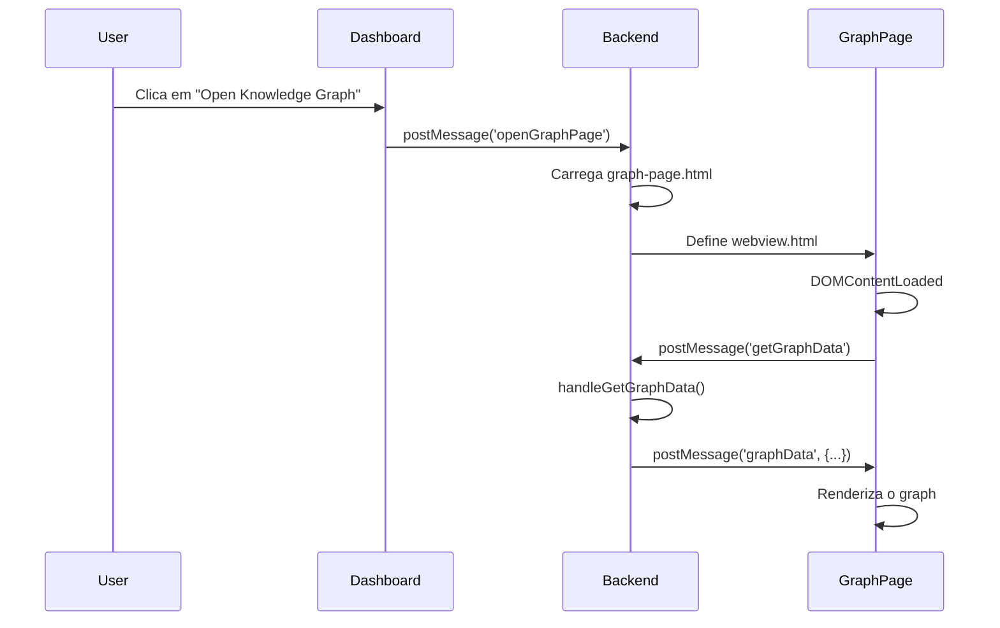

# Correção: Carregamento Duplicado de Dados no Graph

## Problema Identificado

A janela do Knowledge Graph estava carregando os dados **2 vezes** ao ser aberta, causando:
- Chamadas duplicadas ao backend
- Performance reduzida
- Logs confusos no console

## Análise da Causa Raiz

O problema ocorria devido a **duas chamadas simultâneas** para `getGraphData`:

### 1. Chamada do Backend (index.ts)
```typescript
// src/commands/cappyrag/index.ts - linha 138
case 'openGraphPage':
    // ... carrega HTML ...
    panel.webview.html = htmlContent;
    
    // ❌ PROBLEMA: Chamada automática após setar o HTML
    await handleGetGraphData(panel);
```

### 2. Chamada do Frontend (graph-page.html)
```html
<!-- src/webview/graph-page.html - linha 478-485 -->
<script>
    document.addEventListener('DOMContentLoaded', () => {
        console.log('[Graph Page] Initializing...');
        // ❌ PROBLEMA: Chamada automática após DOM carregar
        requestGraphData();
    });
    
    function requestGraphData() {
        vscode.postMessage({ command: 'getGraphData' });
    }
</script>
```

## Solução Implementada

**Removida a chamada duplicada do backend**, mantendo apenas a solicitação do frontend.

### Motivos da escolha:
1. ✅ O frontend tem controle total sobre quando está pronto
2. ✅ O evento `DOMContentLoaded` garante que o webview está completamente inicializado
3. ✅ Mantém a arquitetura "pull" (frontend solicita) ao invés de "push" (backend envia)
4. ✅ Mais confiável em diferentes timings de carregamento

### Código Corrigido
```typescript
// src/commands/cappyrag/index.ts - linha 135
case 'openGraphPage':
    // ... carrega HTML ...
    panel.webview.html = htmlContent;
    console.log('[CappyRAG] Graph page HTML set');
    
    // ✅ CORREÇÃO: Deixa o frontend solicitar quando estiver pronto
    // Note: Graph data will be requested automatically by the webview via DOMContentLoaded event
    // No need to call handleGetGraphData here to avoid duplicate loading
```

## Fluxo Correto Após a Correção



## Arquivos Modificados

- ✅ `src/commands/cappyrag/index.ts` - Removida chamada duplicada em `openGraphPage`

## Arquivos Verificados (sem alteração)

- ✅ `src/webview/graph-page.html` - Mantém solicitação via DOMContentLoaded
- ✅ `src/commands/cappyrag/handlers/graphHandlers.ts` - Handler permanece inalterado
- ✅ `src/commands/cappyrag/templates/dashboard.js` - Sem chamadas duplicadas

## Proteções Adicionais Implementadas

### 1. Flag de Proteção no Frontend
```javascript
// src/webview/graph-page.html
let isInitialized = false;
let dataRequested = false;

// Previne múltiplas requisições
if (!dataRequested) {
    dataRequested = true;
    requestGraphData();
}

// Previne múltiplas inicializações
if (isInitialized) {
    console.warn('[Graph Page] Already initialized, skipping duplicate data');
    return;
}
```

### 2. Logs de Rastreamento no Backend
```typescript
// src/commands/cappyrag/handlers/graphHandlers.ts
console.log('[Backend] ⚡ handleGetGraphData called - Stack trace:', new Error().stack);
```

## Testes Recomendados

1. ✅ Abrir o Dashboard do CappyRAG
2. ✅ Clicar na aba "Knowledge Graph"
3. ✅ Clicar no botão "Open Knowledge Graph"
4. ✅ Verificar no console que `getGraphData` é chamado **apenas 1 vez**
5. ✅ Verificar que os logs mostram:
   - `[Graph Page] Requesting graph data...` - **1x**
   - `[Backend] ⚡ handleGetGraphData called` - **1x**
   - `[Graph Page] Received graph data` - **1x**
   - Nenhum warning de `Already initialized`
6. ✅ Confirmar que o graph carrega corretamente

## Resultado Esperado

- ✅ Apenas **1 chamada** para `handleGetGraphData`
- ✅ Apenas **1 inicialização** do graph D3.js
- ✅ Logs limpos no console com stack trace para debugging
- ✅ Performance melhorada
- ✅ Comportamento consistente
- ✅ Proteção contra race conditions

## Data da Correção

06 de outubro de 2025
