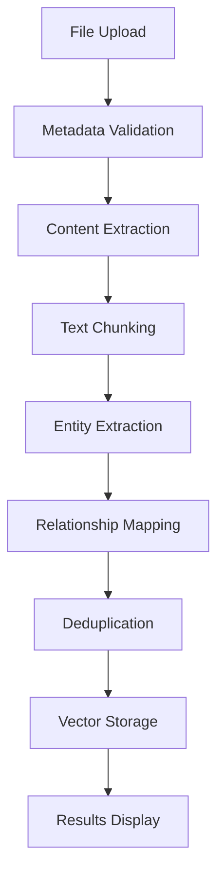

# LightRAG Document Upload System

## Overview

The LightRAG Document Upload System provides a modern, intuitive interface for adding documents to your knowledge graph with entity extraction and relationship mapping capabilities.

## Features

### 🎯 **Intuitive UI Design**
- Modern gradient interface matching LightRAG WebUI aesthetics
- Drag & drop file selection (with fallback to file picker)
- Real-time file validation and metadata preview
- Progress tracking with visual step indicators

### 📄 **Supported File Formats**
- **PDF** - Portable Document Format
- **DOCX** - Microsoft Word documents  
- **TXT** - Plain text files
- **MD** - Markdown documents

### 🏷️ **Smart Metadata Management**
- **Title**: Document title with validation (min 3 characters)
- **Description**: Detailed content description (min 10 characters)
- **Category**: Predefined categories (research, documentation, manual, report, article, other)
- **Tags**: Custom tags with visual management (max 10 tags)

### ⚙️ **Processing Options**
- **Extract Entities**: Find people, places, organizations using LLM
- **Map Relationships**: Discover connections between entities
- **Generate Summary**: Create key insights summary
- **Smart Chunking**: Break content into semantic segments

## Usage

### Opening the Upload Interface

```bash
# Via Command Palette
Ctrl+Shift+P > "LightRAG: Upload Documents"
```

### Upload Workflow

1. **File Selection**
   - Click upload zone or use drag & drop
   - Validate file type and size
   - Preview file information

2. **Metadata Entry**
   - Enter required title and description
   - Select optional category
   - Add custom tags by typing and pressing Enter

3. **Processing Configuration**
   - Choose processing options (entities, relationships, summary, chunking)
   - Review estimated processing time

4. **Document Processing**
   - Real-time progress updates
   - Step-by-step visual feedback
   - Error handling with detailed messages

5. **Results Summary**
   - Statistics on extracted entities and relationships
   - Generated chunks and key insights count
   - Success confirmation with metrics

## Technical Architecture

### Frontend Components
- **Upload Zone**: Drag & drop interface with visual feedback
- **File Info Panel**: File metadata and validation display  
- **Metadata Form**: Title, description, category, and tags input
- **Options Grid**: Processing configuration selection
- **Progress Tracker**: Real-time processing steps visualization
- **Results Display**: Final statistics and success confirmation

### Backend Integration
- **MCP Tools**: Document processing via Model Context Protocol
- **LLM Services**: Entity extraction and relationship mapping
- **LanceDB Storage**: Vector database for entity and relationship storage
- **File Processing**: Multi-format document parsing and chunking

### Processing Pipeline



## File Size Limits

- **Maximum file size**: 50MB
- **Recommended size**: Under 10MB for optimal processing
- **Processing time**: ~1 second per 100KB

## Error Handling

### Validation Errors
- File type not supported
- File size exceeds limit
- Missing required metadata fields
- Tag limit exceeded (10 tags max)

### Processing Errors
- File parsing failures
- LLM service unavailable
- Storage connection issues
- Network timeouts

## Configuration

The upload system respects VS Code extension settings:

```json
{
  "cappy.lightrag.maxFileSize": 52428800,
  "cappy.lightrag.supportedFormats": ["pdf", "docx", "txt", "md"],
  "cappy.lightrag.autoExtractEntities": true,
  "cappy.lightrag.autoMapRelationships": true
}
```

## API Integration

### MCP Commands

```typescript
// Add document via MCP
vscode.commands.executeCommand('cappy.lightrag.addDocument', {
  filePath: '/path/to/document.pdf',
  metadata: {
    title: 'Research Paper',
    description: 'AI research findings',
    category: 'research',
    tags: ['ai', 'research', 'machine-learning']
  },
  options: {
    extractEntities: true,
    extractRelationships: true,
    generateSummary: true,
    chunkText: true
  }
});
```

### WebView Messages

```typescript
// File selection result
{
  command: 'fileSelected',
  data: {
    filePath: string,
    fileName: string,
    fileSize: number,
    fileExtension: string,
    lastModified: Date
  }
}

// Processing complete
{
  command: 'processingComplete',
  data: {
    entities: Entity[],
    relationships: Relationship[],
    chunks: TextChunk[],
    keyValues: KeyValuePair[]
  }
}
```

## Testing

### Manual Testing Checklist

- [ ] File selection via click
- [ ] Drag & drop functionality (with graceful fallback)
- [ ] File type validation
- [ ] File size validation
- [ ] Metadata form validation
- [ ] Tag management (add/remove)
- [ ] Processing options selection
- [ ] Progress visualization
- [ ] Error message display
- [ ] Success results display

### Sample Test Files

Create test documents in `test-documents/`:
- `sample.pdf` - Research paper (2MB)
- `manual.docx` - User guide (500KB)
- `notes.txt` - Plain text notes (50KB)
- `readme.md` - Markdown documentation (10KB)

## Performance Considerations

### Optimization Strategies
- **Lazy Loading**: Load UI components on demand
- **File Streaming**: Process large files in chunks
- **Progress Feedback**: Keep user informed during long operations
- **Error Recovery**: Graceful handling of processing failures

### Memory Management
- Clear file references after processing
- Dispose webview resources when closed
- Limit concurrent processing operations

## Future Enhancements

### Planned Features
- **Batch Upload**: Multiple file processing
- **Resume Capability**: Continue interrupted uploads
- **Preview Generation**: Document thumbnails and previews
- **Advanced Search**: Filter uploaded documents
- **Version Control**: Track document updates and changes

### Integration Roadmap
- **Cloud Storage**: Direct upload from cloud services
- **OCR Support**: Scan and process image-based documents
- **Real-time Collaboration**: Multi-user document processing
- **API Extensions**: REST API for programmatic uploads

## Troubleshooting

### Common Issues

**Upload fails with "File not supported"**
- Check file extension matches supported formats
- Verify file is not corrupted
- Try with a smaller file first

**Processing hangs at entity extraction**
- Check LLM service availability
- Verify network connection
- Restart VS Code if needed

**UI not responding**
- Close and reopen upload panel
- Check VS Code developer console for errors
- Reload window if necessary

### Debug Mode

Enable debug logging in VS Code settings:

```json
{
  "cappy.debug": true,
  "cappy.lightrag.verboseLogging": true
}
```

## Contributing

When contributing to the upload system:

1. Follow TypeScript strict mode guidelines
2. Add comprehensive error handling
3. Include progress feedback for long operations
4. Test with various file types and sizes
5. Update documentation for new features

## License

This component is part of the Cappy Framework and follows the same licensing terms.