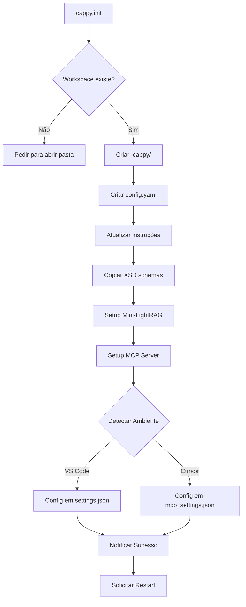

# Auto-Configuração MCP Server

**Data:** 2025-10-06  
**Versão:** 2.9.62  
**Status:** ✅ Implementado

---

## 🎯 Objetivo

Configurar automaticamente o MCP (Model Context Protocol) Server para o Cappy durante a inicialização, detectando se está rodando no **VS Code** ou **Cursor** e criando as configurações apropriadas.

---

## 🚀 Funcionalidade

### O que foi implementado?

Ao executar `cappy.init`, o sistema agora:

1. **Detecta o ambiente** (VS Code ou Cursor)
2. **Cria as configurações MCP** no local correto
3. **Registra o Cappy MCP Server** automaticamente
4. **Notifica o usuário** sobre o sucesso

---

## 🏗️ Arquitetura

### Novo Arquivo: `MCPConfigManager`

```typescript
// src/utils/mcpConfigManager.ts

export class MCPConfigManager {
  // Configura MCP para o ambiente atual
  static async setupMCPConfig(context): Promise<boolean>
  
  // Verifica se MCP está configurado
  static async isMCPConfigured(context): Promise<boolean>
  
  // Obtém caminho do arquivo de config
  static getMCPConfigPath(): string | null
}
```

### Integração com `initCappy`

```typescript
// src/commands/initCappy.ts

// Step 6.5: Configurar MCP Server
const mcpConfigured = await MCPConfigManager.setupMCPConfig(context);
if (mcpConfigured) {
  vscode.window.showInformationMessage(
    `✅ MCP Server configurado para ${envName}! Reinicie o editor para ativar.`
  );
}
```

---

## 📋 Configurações Geradas

### Para VS Code

**Localização:** Configuração Global do VS Code (`settings.json`)

```json
{
  "mcpServers": {
    "cappy": {
      "command": "node",
      "args": [
        "/path/to/cappy/out/extension.mcp.js"
      ],
      "env": {
        "nodeEnv": "production"
      },
      "description": "Cappy Memory - Context Orchestration and RAG System"
    }
  }
}
```

### Para Cursor

**Localização:** Arquivo específico do Cursor

- **Windows:** `%APPDATA%\Cursor\User\mcp_settings.json`
- **macOS:** `~/Library/Application Support/Cursor/User/mcp_settings.json`
- **Linux:** `~/.cursor/mcp_settings.json`

```json
{
  "mcpServers": {
    "cappy": {
      "command": "node",
      "args": [
        "/path/to/cappy/out/extension.mcp.js"
      ],
      "env": {
        "nodeEnv": "production"
      },
      "description": "Cappy Memory - Context Orchestration and RAG System",
      "enabled": true
    }
  }
}
```

---

## 🎬 Como Usar

### 1. Execute a Inicialização

```
Ctrl+Shift+P > Cappy: Initialize Project
```

### 2. Aguarde a Configuração

Durante a inicialização, você verá:

```
🔨 Inicializando Cappy
├─ ✅ Verificando estrutura...
├─ ✅ Criando config.yaml...
├─ ✅ Criando instruções locais...
├─ ✅ Copiando schemas XSD...
├─ ✅ Configurando Mini-LightRAG...
└─ ✅ Configurando MCP Server... 👈 NOVO!
```

### 3. Mensagem de Sucesso

```
✅ MCP Server configurado para [VS Code/Cursor]! Reinicie o editor para ativar.
```

### 4. Reinicie o Editor

Para ativar o MCP Server, reinicie o VS Code ou Cursor:

- **VS Code/Cursor:** `Ctrl+Shift+P` > `Developer: Reload Window`
- Ou feche e abra o editor novamente

---

## 🔍 Detecção de Ambiente

### Como funciona?

O `EnvironmentDetector` verifica:

```typescript
// Verifica app name
const appName = vscode.env.appName.toLowerCase();
const uriScheme = vscode.env.uriScheme.toLowerCase();

// Cursor tem 'cursor' no nome ou URI scheme
isCursor = appName.includes('cursor') || uriScheme.includes('cursor');

// Também verifica extensões específicas do Cursor
if (!isCursor) {
  const cursorExtensions = vscode.extensions.all.filter(
    ext => ext.id.toLowerCase().includes('cursor')
  );
  isCursor = cursorExtensions.length > 0;
}
```

### Mensagens Personalizadas

- **VS Code:** `✅ MCP Server configurado para VS Code! Reinicie o editor para ativar.`
- **Cursor:** `✅ MCP Server configurado para Cursor! Reinicie o editor para ativar.`

---

## 🛡️ Segurança e Resiliência

### Tratamento de Erros

```typescript
try {
  const mcpConfigured = await MCPConfigManager.setupMCPConfig(context);
  // ...
} catch (mcpError) {
  console.error('[initCappy] Error setting up MCP Server:', mcpError);
  // ⚠️ Não falha o processo de inicialização inteiro
}
```

### Verificação de Existência

Antes de criar, o sistema verifica se já existe configuração:

```typescript
if (!mcpServers['cappy']) {
  // Cria nova configuração
} else {
  console.log('[MCP] Already configured');
}
```

### Criação de Diretórios

Garante que diretórios existem antes de escrever:

```typescript
if (!fs.existsSync(configDir)) {
  fs.mkdirSync(configDir, { recursive: true });
}
```

---

## 📊 Fluxo de Inicialização Completo



---

## 🧪 Como Testar

### Teste Manual no VS Code

1. Execute `Cappy: Initialize Project`
2. Verifique configuração:
   ```
   Ctrl+Shift+P > Preferences: Open Settings (JSON)
   ```
3. Procure por `"mcpServers"` → deve ter `"cappy"`
4. Reinicie VS Code
5. Verifique logs: `View > Output > Cappy`

### Teste Manual no Cursor

1. Execute `Cappy: Initialize Project`
2. Verifique arquivo:
   - Windows: `%APPDATA%\Cursor\User\mcp_settings.json`
   - Mac: `~/Library/Application Support/Cursor/User/mcp_settings.json`
   - Linux: `~/.cursor/mcp_settings.json`
3. Deve conter configuração do Cappy
4. Reinicie Cursor
5. Verifique que MCP está ativo

### Verificação Programática

```typescript
// Verificar se MCP está configurado
const isConfigured = await MCPConfigManager.isMCPConfigured(context);
console.log('MCP Configured:', isConfigured);

// Obter caminho do config
const configPath = MCPConfigManager.getMCPConfigPath();
console.log('MCP Config Path:', configPath);
```

---

## 🎯 Benefícios

### Antes

❌ Configuração manual necessária  
❌ Usuário precisava saber onde configurar  
❌ Diferente para VS Code vs Cursor  
❌ Propenso a erros de configuração

### Depois

✅ Configuração **100% automática**  
✅ Detecta ambiente **automaticamente**  
✅ Configurações **específicas** para cada editor  
✅ **Zero erro** de configuração manual  
✅ **Experiência perfeita** do usuário

---

## 📝 Checklist de Features

- [x] Detecção automática VS Code vs Cursor
- [x] Configuração MCP para VS Code
- [x] Configuração MCP para Cursor
- [x] Verificação de configuração existente
- [x] Criação de diretórios necessários
- [x] Tratamento de erros robusto
- [x] Mensagens de feedback ao usuário
- [x] Logging completo
- [x] Não quebra inicialização em caso de falha
- [x] Documentação completa

---

## 🔗 Arquivos Modificados/Criados

### Criados

- ✅ `src/utils/mcpConfigManager.ts` - Gerenciador de configuração MCP

### Modificados

- ✅ `src/commands/initCappy.ts` - Adicionado step 6.5 de configuração MCP
- ✅ `src/tools/addDocumentTool.ts` - Corrigido para usar processador completo
- ✅ `docs/cross-document-relationships-fix-v2.md` - Documentação do fix anterior
- ✅ `docs/audit-mock-processors.md` - Auditoria de processadores

---

## 🚀 Próximos Passos

### Melhorias Futuras

1. **Auto-reload:** Recarregar automaticamente após configurar MCP
2. **Status UI:** Mostrar status do MCP no status bar
3. **Health Check:** Verificar se MCP está funcionando corretamente
4. **Config UI:** Interface gráfica para configurar MCP manualmente
5. **Logs MCP:** Mostrar logs do MCP Server em tempo real

### Recursos Adicionais

- [ ] Comando `cappy.checkMCPStatus` para verificar saúde do MCP
- [ ] Comando `cappy.restartMCP` para reiniciar o servidor
- [ ] Painel de debug para MCP Server
- [ ] Métricas de uso do MCP

---

## 📚 Referências

- [Model Context Protocol (MCP)](https://modelcontextprotocol.io/)
- [VS Code Extension API](https://code.visualstudio.com/api)
- [Cursor Documentation](https://cursor.sh/docs)
- [Environment Detector](../src/utils/environmentDetector.ts)
- [MCP Config Manager](../src/utils/mcpConfigManager.ts)
- [Cappy Init Command](../src/commands/initCappy.ts)

---

**Configuração MCP Automática = Experiência Perfeita** 🦫✨
